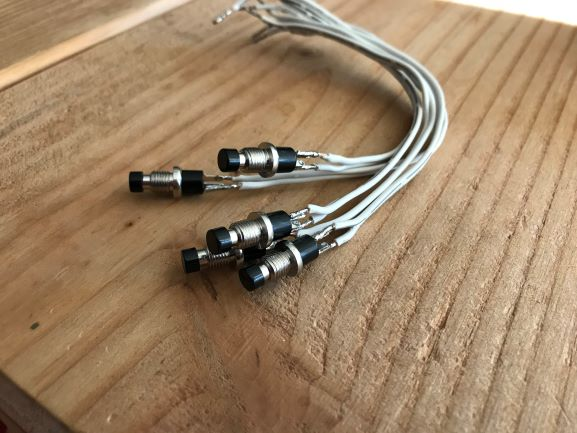

### [Blog Homepage](https://github.com/ckuzma/blog) | [About the Author](https://ckuzma.github.io/) | [Posts Archive](/posts)
# The Blog of Christopher Kuzma

#### 30.03.2020
### RGB Wall Display Board, Part 3: Finished!

> The finished board, mounted above my sofa.  (Ignore the messiness of the spare lumber in the background!)

It's been a long time coming but the light board project is finally complete.  Taking advantage of my newfound time spent sheltering indoors as the world battles the infectious spread of COVID-19, I managed to dedicate three days' worth of full-time attention to the final assembly of my _"RGB Light Board Mk.2"_.  At long last it is mounted proudly in my living room above my couch, ready to run whatever visualization algorithms I can imagine.

But first, a quick recap of how we got to this point:
- Part 1: [The Project Begins](https://github.com/ckuzma/blog/blob/master/posts/2020/2020-02-05-rgb-wall-display-board-part-1.md)
- Part 2: [Cutting and Wiring](https://github.com/ckuzma/blog/blob/master/posts/2020/2020-02-09-rgb-wall-display-board-part-2.md)
- Part 2.5: [Ported Code](https://github.com/ckuzma/blog/blob/master/posts/2020/2020-03-22-ported-code.md)
- Part 3: [Finished!](https://github.com/ckuzma/blog/blob/master/posts/2020/2020-03-30-rgb-wall-display-board-part-3.md) (This post.)

Finishing the board wound up being a lot more labor- and time-intensive than expected.  To start with, I had to create some board/box reinforcement pieces out of a large piece of 2x2.  In an attempt to cut down on the amount of sawdust created (and to hopefully make a cleaner cut), I opted to use my Japanese razor saw for this.

**[Click here to continue...](posts/2020/2020-03-30-rgb-wall-display-board-part-3.md)**

#### 22.03.2020
### Ported Code for RGB Wall Display Board, Wired Up Buttons

As I fast approach the point of permanently encapsulating a microcontroller into my LED board, I decided to do some tests to see if I could utilize the [FastLED](https://github.com/FastLED/FastLED) Arduino library running on a NodeMCU v0.9 board.  The desire to do so was based on the number of existing projects that use this library, thereby giving me a lot more examples on which to base my own visualization code.  (Or, temporarily, to simply use another's code while I focus on finishing the assembly of my project.)

However my attempts to control my WS2812b LEDs was unsuccessful using FastLED and I wound up using the [Adafruit NeoMatrix](https://github.com/adafruit/Adafruit_NeoMatrix) library instead, just as I did with my [original light board](https://github.com/ckuzma/blog/blob/master/posts/2017/2017-12-30-rgb-led-matrix-board-litebrite.md) ([code](https://github.com/ckuzma/nodemcu-as-arduino/tree/master/Sketches/LED%20Board)).  Thankfully, Adafruit's libraries also enjoy a great deal of employment by other Arduino developers.  And seeing as one of the original goals of this project was to properly open-source [the original project that had caught my eye](https://github.com/ckuzma/blog/blob/master/posts/2020/2020-02-05-rgb-wall-display-board-part-1.md), this is probably for the best.

I also found some time this weekend to solder some wire leads to the buttons I'm hoping to use in my project.  As you can tell from the above photo things got a little messy, but the buttons seem to work just fine and the wires themselves will be hidden inside the project anyway.

### [View older posts...](/posts)