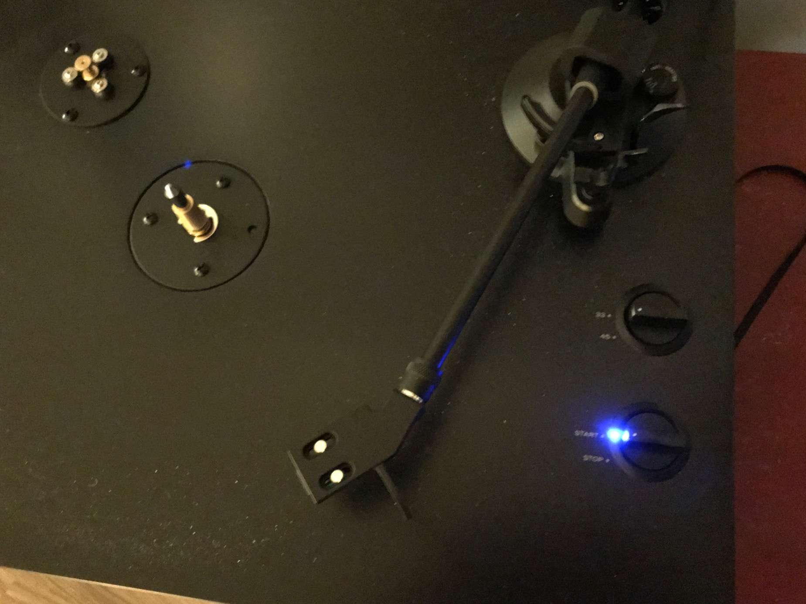
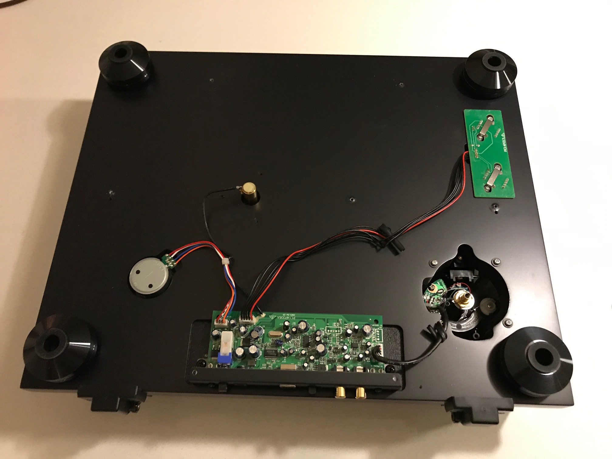
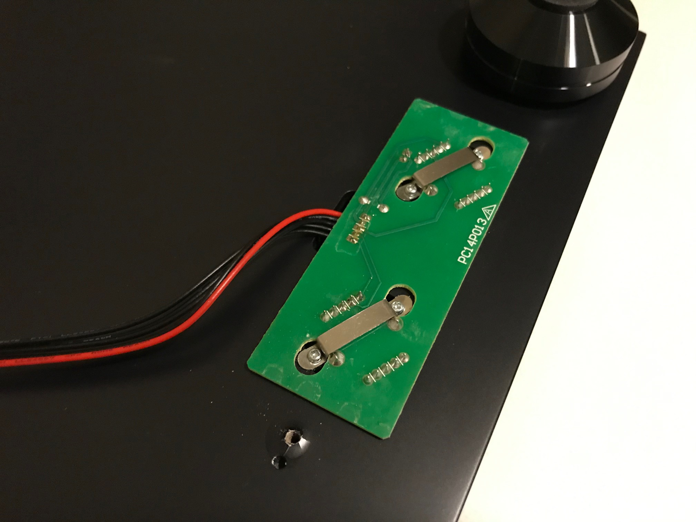
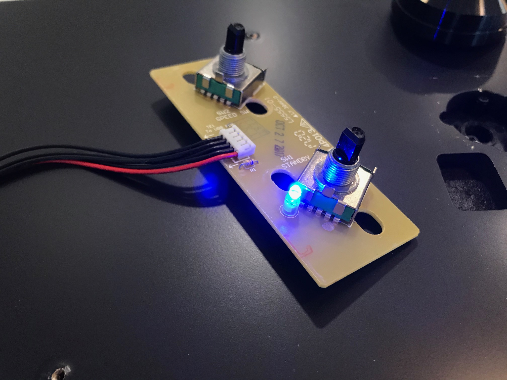
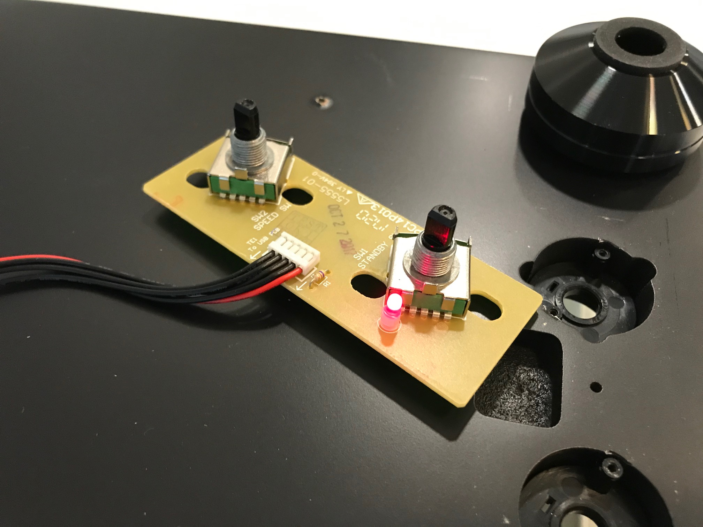
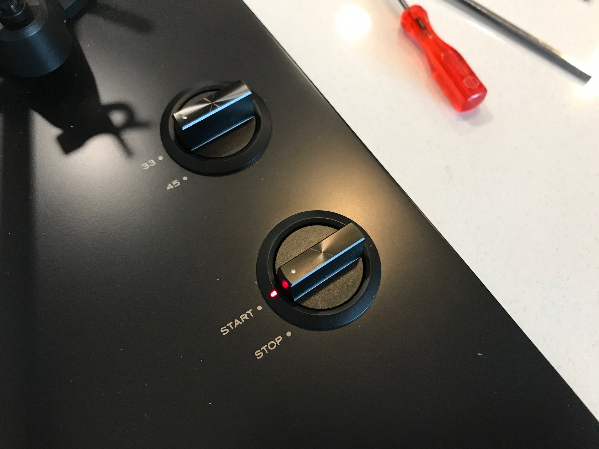

### [Blog Homepage](https://github.com/ckuzma/blog) | [About the Author](https://ckuzma.github.io/) | [Posts Archive](/posts)
# The Blog of Christopher Kuzma

#### 10.03.2020
### Turntable Mod: Replacing LED on Teac TN-300SE

See that bright blue, glaring LED indicator light on the record player above?  That tiny little thing has been driving me up the wall for months now.  The problem with it occurs at night: when I attempt to listen to some records when living room is dimly lit, accurately dropping the tonearm on the lead-in groove of a record is nearly impossible thanks to the blinding glare of the power status light.

After months of attempting to block out the light with my thumb while I'm cueing up a new disk (or giving up and employing a flashlight to counteract the glare), I decided to take matters into my own hands and address the issue.  Expecting to find a SMD-type LED soldered to a control board, I cracked open my Teac TN-300SE with the intention of somehow diffusing the light output of the diode itself.

With the bottom panel removed, I am glad to see that the part I'm interested in is indeed an independent control board.  (Read: if I were to break it, I wouldn't have to replace the entire record player.)

The bottom of the control board hinted that it might be possible for me to bypass the LED by shorting its two connection terminals with some solder.  The plan at this point was still to scribble a bit of Sharpie or scratch up the diode a bit and see if that accomplished enough of a dimming effect.

Turned over, the LED makes itself immediately obvious compared to the two spring-loaded pot switches.  Realizing that I might actually be able to (messily) remove the diode entirely and replace it with a much less annoying red one, despite not having access to a solder remover, I plugged in my soldering iron and fished out some solder.

Somehow, despite almost completely ruining a solder pad on the circuit board, I managed to successfully replace the blue diode with a red LED.  At this point I put everything back together again, testing everything intermittently as I did so.

And there's the finished result!  Though not immediately obvious in this well-lit photograph, the glare emitted by the red LED is virtually non-existent compared to its predecessor.  The end result is a much more pleasant experience of playing and changing records at night in a room illuminated by candles or dim lights.  I'd call that a success.

### [View older posts...](/posts)