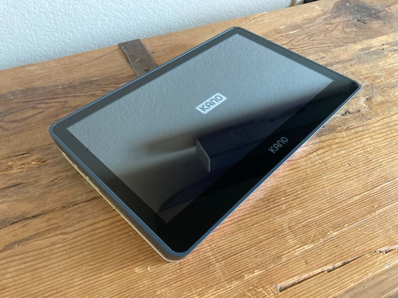
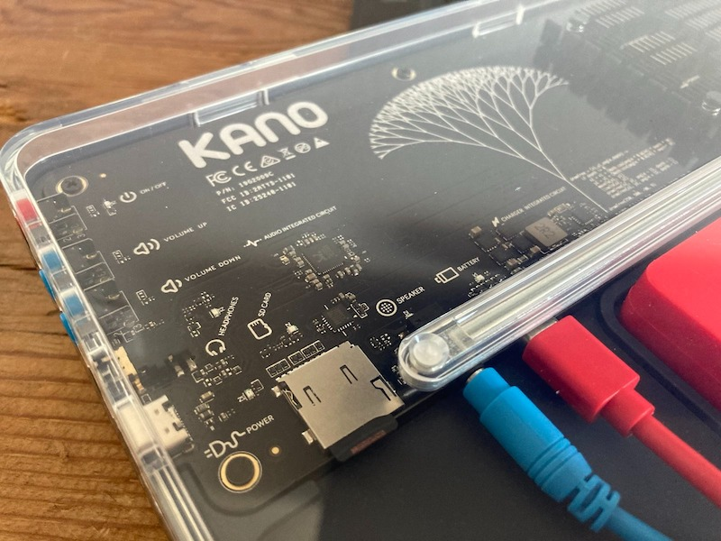
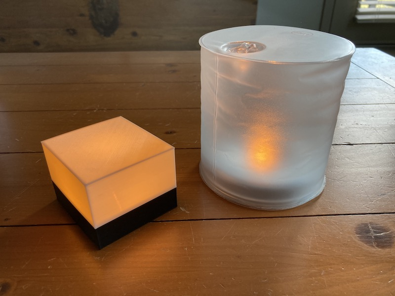

### [Blog Homepage](https://github.com/ckuzma/blog) | [About the Author](https://ckuzma.github.io/) | [Posts Archive](/posts)
# The Blog of Christopher Kuzma

----

#### 27.12.2021
### Kano PC Review

# Introduction

The Kano PC is perhaps best described as a full-fledged modular Windows tablet-computer designed for kids.  It features an Intel Celeron CPU, 4GB of RAM, 64GB of eMMC solid-state storage, an 11.6" touchscreen and a case that doubles as a keyboard reminiscent of a Microsoft Surface device.  But far more important than the device's hardware specifications is its purpose: to inspire curious minds.

# Unboxing and Assembly

That just-mentioned important purpose makes itself known immediately in that the Kano PC ships unassembled.  That is to say, partly unassembled.  Compared to the previous Raspberry Pi-based computers released under the Kano name, the Kano PC is not quite as demanding when it comes to its assembly procedure.  Perhaps that's a good thing, as Kano's previous offerings were potentially too complicated and fragile even for the parents of the target age audience.

The gist of the assembly experience this time around is: unpack all of the components from the product packaging, connect the blue loudspeaker to the computer's exposed motherboard via an internal 2.5mm audio jack, plug in the red lithium-ion battery via a neighboring USB-C port, and then snap on the clear plastic housing to keep everything protected.  That's it.  No miniscule Micro SD cards to lose under the couch, no RAM cards to install, no fiddly ribbon cables or power lines to mess with this go around.

**[Continue reading --->](posts/2021/2021-12-27-kano-pc-review.md)**

----

#### 17.07.2021
### Adventures in 3D Printing: Dipole Antenna

> The completed dipole antenna and railing bracket / arms mounted to the railing of my apartment's balcony.

During the winter of 2020 I decided to jump into a new hobby: amateur radio.  My first contacts were made with a Baofeng UV-5R, the same handheld transceiver that many HAMs get started with these days.  However it wasn't long until I began to lament the inconveniences of using an HT ("Handy Talkie" in HAM parlance).  Standing in just the right spot to transmit and receive successfully meant I rarely attempted a simplex conversation with my licensed coworker just down the road, and partaking in the evenings nets on the local repeater was usually limited to an in-and-out check-in.

The obvious solution to me at the time was to fit a better antenna on my radio.  While this did seem to help marginally, the almost-a-faraday-cage that was my apartment rendered the upgrade mostly moot.  What I thus decided I needed was a more powerful radio transceiver and a fixed external antenna.  While the former would require significant work to build myself, I decided that I was handy enough to design and create the latter with ease.

**[Continue reading --->](posts/2021/2021-07-17-dipole.md)**

----

#### 16.02.2021
### Adventures in 3D Printing: Nixie Clock Stands

> The completed stand running my own [slightly modified version](https://github.com/ckuzma/NixieTubesShieldNCS314) of the [official stock firmware](https://github.com/afch/NixeTubesShieldNCS314).  (Most notably the blinking neon digit indicators have been disabled.)

Despite investing a not-insignificant amount of time and energy into [the woden case I built for my nixie tube clock last year](../2020/2020-04-18-nixie-tube-box-case-part-2.md), I could never shake the feeling that it was just temporary.  Be it the lack of access to the control buttons, the horrendously abrasive sound that would be emitted by the lone tilt screw when dragged across a surface, or the somewhat poor appearance of the wood finish itself, I just never loved it.

**[Continue reading --->](posts/2021/2021-02-16-nixie-stands.md)**

----

#### 16.02.2021
### Adventures in 3D Printing: MPowerd Luci Candle Housing

> Above we see a possible desired outcome on the left, and the starting point for the project on the right.

My first encounter with an MPowerd product involved the Luci, now known as the [Luci Original](https://mpowerd.com/products/luci-original-f2017) (and also sporting a few small design tweaks).  A potential lifesaver for the outdoors afficionado, I still have at least one of those packed away with my camping gear and emergency supplies.  The basic design involves an LED lantern combined with a solar charging circuit enclosed in a soft inflatable plastic structure similar to a beach ball, rendering the whole thing both waterproof as well as bouyant.

Unfortunately, as a diffuser, the soft plastic shell leaves something to be desired.  After I picked up a couple of [Luci Candle](https://mpowerd.com/products/luci-candle) lanterns for use around the home-- what can I say, I'm a sucker for eco-friendly tech-- I decided to create my own modern and minimalist housing for the internal circuitry of the lamp with the goal of designing something a bit more appropriate for a domestic environment.  I think I succeeded, but first let's dive into how I arrived at my solution.

**[Continue reading --->](posts/2021/2021-02-16-luci-housing.md)**

----

## [View older posts --->](/posts)