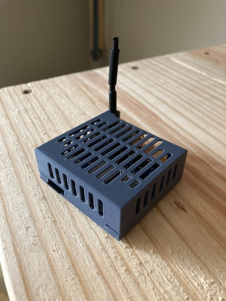
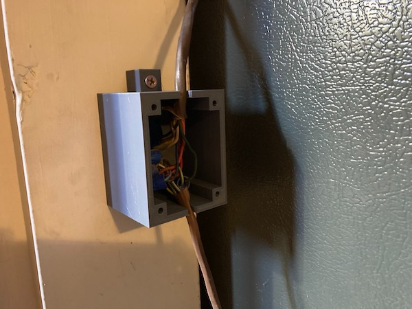
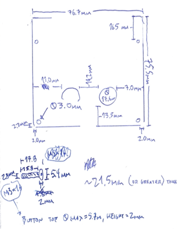

### [Blog Homepage](https://github.com/ckuzma/blog) | [About the Author](https://ckuzma.github.io/) | [Posts Archive](/posts)
# The Blog of Christopher Kuzma

----

#### 21.11.2023
### [3D Printed Projects](./posts/2023/2023-11-21-3d-printed-projects.md)

The past year has been a busy time for me.  (This despite having been laid off from my shuttered company back in June.)  From making technical contributions to the tech stack behind the MVP of my brother's startup company to wrapping up my private pilot's license training in a more expedient manner, my daily routine has been anything but a vacation.  However now that the weather has turned for the season I find myself with a bit of free time to pursue the completion of existing and the exploration of new projects.

To that end I have once again found myself in need of custom housings, the latest of which I feel compelled to talk about in a more casual manner than was found in each project's repository README file.

> https://github.com/ckuzma/opi-zero-3-case

I picked up an Orange Pi Zero 3 board with the intention of loading Batocera OS on it and utilizing it as a retro gaming system.  Unfortunately my dream of casually replaying Super Mario Bros 3 with my now-retired neighbors wwas put on hold due to support not (yet) being out for the Zero 3 board.  However in the meantime I decided to set up the computer with Ubuntu on a spare monitor for guests to use, and this case was needed to keep the computer's electrical components free from harm.

> https://github.com/ckuzma/3d-electrical-box

As stated in the project description, "From the very first moment I toured the house in which I currently live, I was annoyed by the eyesore that was the rat's nest of electrical twist ties holding together the HVAC system's low-voltage control lines."  This project was long overdue in terms of tidying up odds and ends around my aging house, especially before any potential showings were to happen should I find myself needing to move for my next work gig.

----

#### 26.07.2022
### [Tube Amplifier Project](./posts/2022/2022-07-26-tube-amplifier-project.md)

One of the projects I've been carrying around with me for the past few months, waiting for the day when I was reunited with my [very cool PINECIL soldering iron](https://pine64.com/product/pinecil-smart-mini-portable-soldering-iron/), has been a cheap tube-based(-ish) audio preamplifier kit.  Why would someone want such a thing when arguably much better solid-state versions exist nowadays?  Not sure.  But I thought it looked neat, so I ordered myself one and then it waited until two months ago when I was finally able to sit down and solder all of the components into place.

However, there was no housing included with the kit and I had intentionally opted against purchasing the made-to-fit acrylic housing sold by the manufacturer, instead desiring to design and print something of my own creation.  And that's what can be found in my latest 3D printing project here on GitHub:

- [tube-preamp-housing](https://github.com/ckuzma/tube-preamp-housing)

----

#### 18.07.2022
### [3D Printed Odds and Ends](./posts/2022/2022-07-18-3d-printed-odds-ends.md)

/media/3d_printed_odds_ends/IMG_1920.jpeg
Back in November, as I was packing my apartment in prep for a move across the country, I stumbled across my box of 3D printed odds and ends.  Due largely in part to my reluctance to purchase even the cheapest of measurement calipers, I relied heavily on part "test fits" to make sure everything would come together as expected.  This was especially handy in the case of the [dipole antenna project](./posts/2021/2021-07-17-dipole.md) which incorporated slotted parts, plastic "dowels", and a custom fit railing clamp as part of the full design.

However, as a result, I wound up with a bunch of small 3D printed objects that aren't especially useful for anything anymore besides to serve as a memento.  What follows are pictures of some of the items I found in that box of mementos, along with links to the projects from which they came to be.

**[Continue reading --->](./posts/2022/2022-07-18-3d-printed-odds-ends.md)**

----

#### 19.03.2022
### [Current State of the 3D-Printed Carriage Clock](./posts/2022/2022-03-19-carriage-clock-currently.md)

Building on [the last installment of my writeup about the 3D printed carriage clock project](./posts/2022/2022-01-24-carriage-clock-pt3.md), I thought I'd share some photos of the current state of of the project for anyone who is curious to see some of the finer details.  What follows is a simple gallery of the clock as it existed before being packed into storage as part of my move across the country.  Fingers crossed that it will be in the same state when I unpack it within the next month or two!

**[Continue reading --->](./posts/2022/2022-03-19-carriage-clock-currently.md)**

----

## [View older posts --->](/posts)