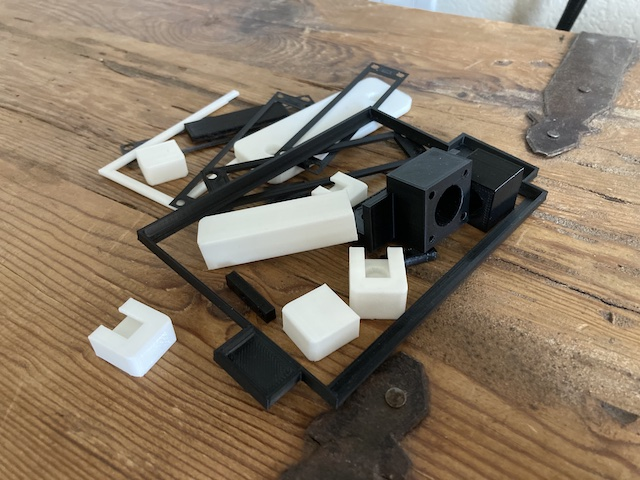
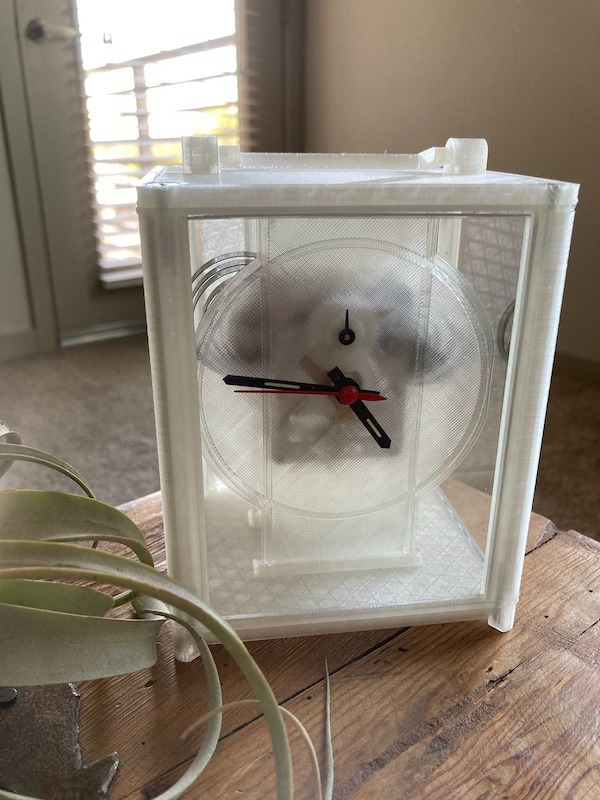
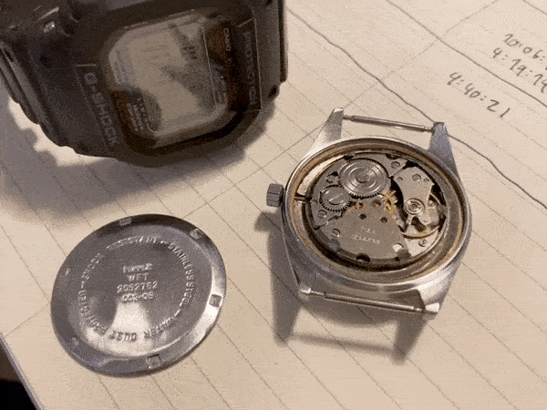
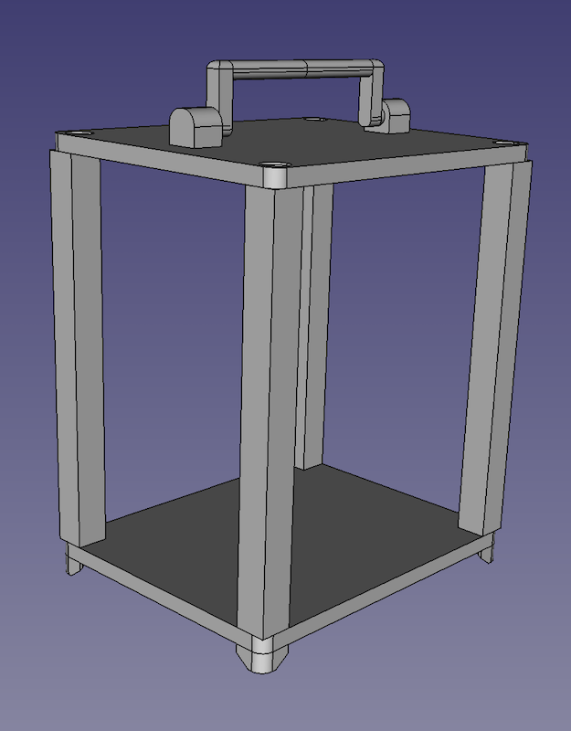

### [Blog Homepage](https://github.com/ckuzma/blog) | [About the Author](https://ckuzma.github.io/) | [Posts Archive](/posts)
# The Blog of Christopher Kuzma

----

#### 18.07.2022
### [3D Printed Odds and Ends](./posts/2022/2022-07-18-3d-printed-odds-ends.md)

/media/3d_printed_odds_ends/IMG_1920.jpeg
Back in November, as I was packing my apartment in prep for a move across the country, I stumbled across my box of 3D printed odds and ends.  Due largely in part to my reluctance to purchase even the cheapest of measurement calipers, I relied heavily on part "test fits" to make sure everything would come together as expected.  This was especially handy in the case of the [dipole antenna project](./posts/2021/2021-07-17-dipole.md) which incorporated slotted parts, plastic "dowels", and a custom fit railing clamp as part of the full design.

However, as a result, I wound up with a bunch of small 3D printed objects that aren't especially useful for anything anymore besides to serve as a memento.  What follows are pictures of some of the items I found in that box of mementos, along with links to the projects from which they came to be.

**[Continue reading --->](./posts/2022/2022-07-18-3d-printed-odds-ends.md)**

----

#### 19.03.2022
### [Current State of the 3D-Printed Carriage Clock](./posts/2022/2022-03-19-carriage-clock-currently.md)

Building on [the last installment of my writeup about the 3D printed carriage clock project](./posts/2022/2022-01-24-carriage-clock-pt3.md), I thought I'd share some photos of the current state of of the project for anyone who is curious to see some of the finer details.  What follows is a simple gallery of the clock as it existed before being packed into storage as part of my move across the country.  Fingers crossed that it will be in the same state when I unpack it within the next month or two!

**[Continue reading --->](./posts/2022/2022-03-19-carriage-clock-currently.md)**

----

#### 18.03.2022
### [Afternoon Project: HMT Watch Regulation](posts/2022/2022-03-18-hmt-tuning.md)

Perhaps against my better judgement I ordered myself a "refurbished" HMT wristwatch on eBay about two months ago.  A hand-wound, 17-jewel, Indian-made watch for less than $15 shipped?  I couldn't resist.

As it turns out, you get what you pay for.  My particular watch's case turned out not to be water or dust resistant in the slightest, the crystal has a habit of popping off if it is knocked just right, the hour hand doesn't exactly line up with the dial's indices and the movement in mine was running worryingly slow.  Removing the screwdown caseback revealed a surprisingly corroded movement spacer but an otherwise okay-looking movement.  A few days and some fine adjustments of the regulator and I had the watch keeping acceptable time.  (Meaning, for me, a few seconds fast per day.)

Unfortunately I don't think I'll be wearing this watch very often.  While it is quite thin and comfortable I simply can't help but worry about it in ways that never even cross my mind when I'm wearing the G-Shock from the picture above.  So for now, this little hand-wound piece is relegated to the watch case where it stands as the only HMT in my collection.

----

#### 24.01.2022
### [3D Printed Carriage Clock Part 3](posts/2022/2022-01-24-carriage-clock-pt3.md)

[_3D Printed Carriage Clock Part 2_](posts/2022/2022-01-17-carriage-clock-pt2.md)

In the [last installment of my 3D printed carriage clock project](posts/2022/2022-01-17-carriage-clock-pt2.md) I discovered that there were a number of fitment issues with my design and had decided to start with a clean slate and a focus on refinement.  To that end it was no longer acceptable for the clock to simply look like a box; it needed to actually resemble the carriage clocks of old once it was put together.  Additionally I wanted each major component to be easily replaced in case any of my prints failed or the part itself broke during assembly.

**[Continue reading --->](posts/2022/2022-01-24-carriage-clock-pt3.md)**

----

## [View older posts --->](/posts)