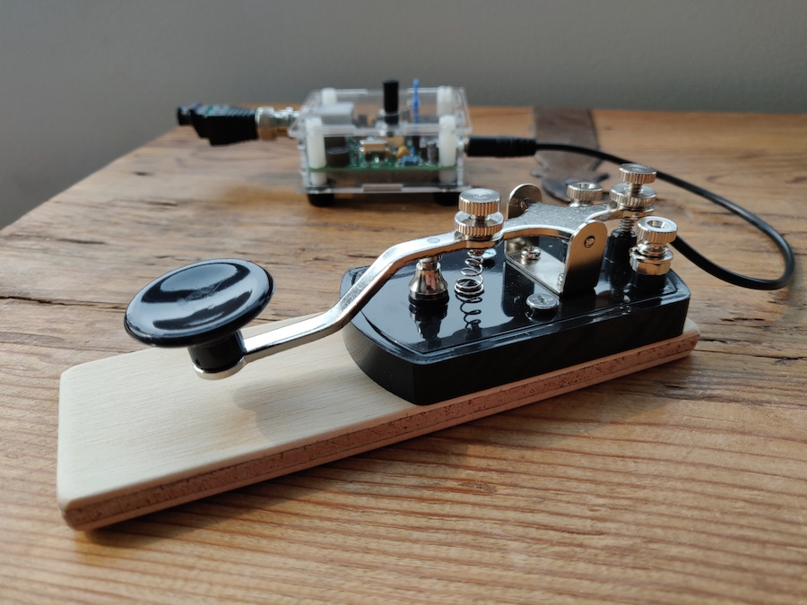

### [Blog Homepage](https://github.com/ckuzma/blog) | [About the Author](https://ckuzma.github.io/) | [Posts Archive](/posts)
# The Blog of Christopher Kuzma

----

#### 16.02.2021
### Adventures in 3D Printing: Nixie Clock Stands

> The completed stand running my own [slightly modified version](https://github.com/ckuzma/NixieTubesShieldNCS314) of the [official stock firmware](https://github.com/afch/NixeTubesShieldNCS314).  (Most notably the blinking neon digit indicators have been disabled.)

Despite investing a not-insignificant amount of time and energy into [the woden case I built for my nixie tube clock last year](../2020/2020-04-18-nixie-tube-box-case-part-2.md), I could never shake the feeling that it was just temporary.  Be it the lack of access to the control buttons, the horrendously abrasive sound that would be emitted by the lone tilt screw when dragged across a surface, or the somewhat poor appearance of the wood finish itself, I just never loved it.

**[Continue reading --->](posts/2021/2021-02-16-nixie-stands.md)**

----

#### 16.02.2021
### Adventures in 3D Printing: MPowerd Luci Candle Housing

> Above we see a possible desired outcome on the left, and the starting point for the project on the right.

My first encounter with an MPowerd product involved the Luci, now known as the [Luci Original](https://mpowerd.com/products/luci-original-f2017) (and also sporting a few small design tweaks).  A potential lifesaver for the outdoors afficionado, I still have at least one of those packed away with my camping gear and emergency supplies.  The basic design involves an LED lantern combined with a solar charging circuit enclosed in a soft inflatable plastic structure similar to a beach ball, rendering the whole thing both waterproof as well as bouyant.

Unfortunately, as a diffuser, the soft plastic shell leaves something to be desired.  After I picked up a couple of [Luci Candle](https://mpowerd.com/products/luci-candle) lanterns for use around the home-- what can I say, I'm a sucker for eco-friendly tech-- I decided to create my own modern and minimalist housing for the internal circuitry of the lamp with the goal of designing something a bit more appropriate for a domestic environment.  I think I succeeded, but first let's dive into how I arrived at my solution.

**[Continue reading --->](posts/2021/2021-02-16-luci-housing.md)**

----

#### 21.11.2020
### Second S-Pixie Radio Built

> The bare components laid out for inspection while the soldering iron got up to temperature.

_This is part of an ongoing series of documentation for my entry into [Hackster and NXP's HoverGames Challenge 2](https://www.hackster.io/contests/hovergames2) contest.  Links to the related blog posts can be found below:_
- _[Part 1: Pixie QRP Transceiver Assembly (Part 1)](./2020-07-12-pixie-transciever-pt1.md)_
- _[Part 2: Pixie QRP Transceiver Assembly (Part 2)](./2020-07-13-pixie-transciever-pt2.md)_
- _[Part 3: Building a Morse key](./2020-09-21-morse-key.md)_

A few days ago I finally managed to carve out some time to build the second of the two S-Pixie radio transceiver kits that I had ordered.  Perhaps it shouldn't have been surprising, but it only took me a fraction of the amount of time to complete compared to my first build.  Being able to make use of my father's not-budget-bin soldering iron was a big help as well.  I hope [the Pinecil](https://pine64.com/product-category/soldering-irons/?v=0446c16e2e66) is released for sale soon...

**[Continue reading --->](posts/2020/2020-11-22-second-pixie-built.md)**

----

#### 21.09.2020
### S-Pixie Morse Key

> Mounted Morse key connected to the S-Pixie radio transceiver.  Connected in lieu of an antenna is a 50Ω dummy-load for testing purposes.

As part of my ongoing participation in [Hackster and NXP's HoverGames Challenge 2](https://www.hackster.io/contests/hovergames2) contest, I previously built an S-Pixie [QRP](http://www.arrl.org/why-qrp) 40-meter band (7.030 MHz) CW (Morse) radio transceiver (see [Part 1](./2020-07-12-pixie-transciever-pt1.md) and [Part 2](./2020-07-13-pixie-transciever-pt2.md)).  This small pocket-sized device radio can be used by any licensed amateur radio operator, so long as it is hooked up to a source of power, antenna, headphones, and some sort of tool for creating the dits and dahs that make up Morse code.  While just any tool capable of succinctly opening and closing an electrical circuit will be sufficient for use with the S-Pixie, I decided to pick up a MFJ-550 straight key [from Gigaparts](https://www.gigaparts.com/mfj-550.html).

**[Continue reading --->](posts/2020/2020-09-21-morse-key.md)**

----

## [View older posts --->](/posts)