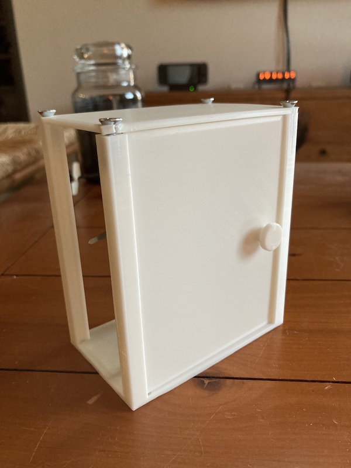
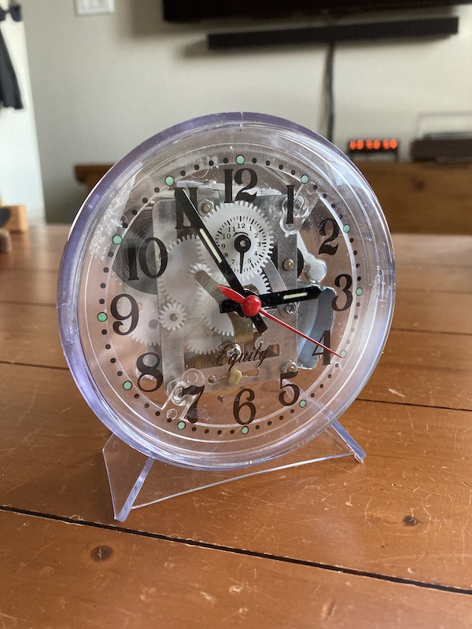

### [Blog Homepage](https://github.com/ckuzma/blog) | [About the Author](https://ckuzma.github.io/) | [Posts Archive](/posts)
# The Blog of Christopher Kuzma

----

#### 24.01.2022
### 3D Printed Carriage Clock Part 3

[_3D Printed Carriage Clock Part 2_](posts/2022/2022-01-17-carriage-clock-pt2.md)

In the [last installment of my 3D printed carriage clock project](posts/2022/2022-01-17-carriage-clock-pt2.md) I discovered that there were a number of fitment issues with my design and had decided to start with a clean slate and a focus on refinement.  To that end it was no longer acceptable for the clock to simply look like a box; it needed to actually resemble the carriage clocks of old once it was put together.  Additionally I wanted each major component to be easily replaced in case any of my prints failed or the part itself broke during assembly.

**[Continue reading --->](posts/2022/2022-01-24-carriage-clock-pt3.md)**

----

#### 17.01.2022
### 3D Printed Carriage Clock Part 2

Having previously [designed and printed a functional movement mount and interlocking system](posts/2022/2022-01-16-carriage-clock-pt1.md) to attach it to the rest of the clock, I was ready to move forward with the rest of the clock body.  Namely the housing/case with its windows and access door.  I happened to have some "spare" white PLA filament and knowing the likelihood that components would have to be printed twice due to unaccounted-for stresses and tolerance variances, I decided to print out my work-in-progress CAD model to see how everything fit together.

**[Continue reading --->](posts/2022/2022-01-17-carriage-clock-pt2.md)**

----

#### 16.01.2022
### 3D Printed Carriage Clock Part 1

Have I ever mentioned before that I really like [timekeeping devices](2022-01-15-vfd-clock-frame.md)?  Even though my first ever wristwatch was, if I remember correctly, a Timex with a digital display, I have always been absolutely enamored by the purely mechanical variety.  That's not to say I can't appreciate a decent [digital](../2020/2020-09-08-casio-pro-trek-prw-3100-review.md), [quartz](../2011/2011-12-30-invicta-3449-review.md), or mecha-quartz timepiece, mind you.  I just love the history, intricacy, and rythmic ticking of a mechanical watch or clock.  Even though they lag in accuracy and must be wound up daily (or worn, in the case of an automatic), I enjoy them immensely.

One can ~~blame~~ credit my parents for this love affair of mine.  From the ancient grandfather clock adjacent to the not-so-ancient grand piano in the living room of their house to the assortment of antique wall clocks forming an ensemble in the main hallway, I've always been surrounded by mechanical wonders.  While not all of them worked, I found myself drawn to my father's surprisingly-functional brass Waterbury carriage clock.  Small enough to be held in one hand yet dense enough to sit solidly atop a stack of papers, I remember spending a full week regulating its escapement to be more or less accurate, MacGyvering a non-permanent paperclip-based fix for the sheared-off pins of the rear door, and generally spending hours staring at the little movement ticking away when I should have been focused on my math homework instead.

Now, as an adult, armed with a 3D printer and mechanical clock movement, I think you can see where this is going.

**[Continue reading --->](posts/2022/2022-01-16-carriage-clock-pt1.md)**

----

#### 16.01.2022
### Teardown: HackRF One Portapack H2

In [a recent previous post documenting the assembly of an amateur radio transceiver kit](2022-01-16-cricket-80a-soldering.md), I shared a picture depicting the functional operation of the completed radio.  Specifically, I utilized the display on a a HackRF One in a Portpack H2 housing to demonstrate the transceiver's transmission within the expected frequency band, as well as functioning on/off pulses as is required for CW mode communication.

What I neglected to do at the time was hint that the assembled Cricket was not the only radio transceiver in the photo that had required a bit of DIY handiwork.  For, you see, the HackRF device itself had required a bit of repair/improvement, too.  Namely: when I received it, I was rather stunned by what sounded like a loose battery rattling around inside.  Given the propensity of Lithium batteries to do alarming things when damaged or even looked at for too long, I decided to rip apart my (preassembled) Portapack H2 to figure out some way to protect its heart.

**[Continue reading --->](posts/2022/2022-01-16-portapack-fix.md)**

----

## [View older posts --->](/posts)