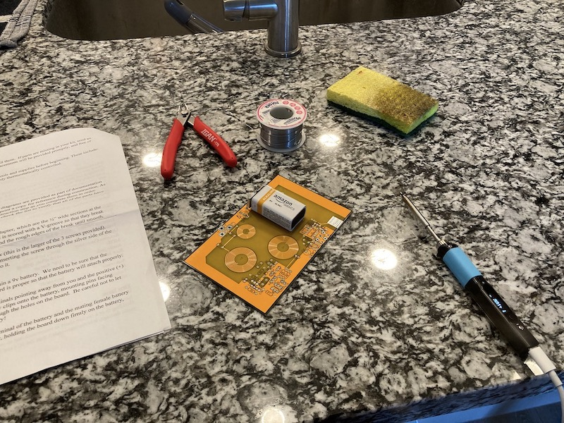

### [Blog Homepage](https://github.com/ckuzma/blog) | [About the Author](https://ckuzma.github.io/) | [Posts Archive](/posts)
# The Blog of Christopher Kuzma

----

#### 16.01.2022
### 3D Printed Carriage Clock Part 1

Have I ever mentioned before that I really like [timekeeping devices](2022-01-15-vfd-clock-frame.md)?  Even though my first ever wristwatch was, if I remember correctly, a Timex with a digital display, I have always been absolutely enamored by the purely mechanical variety.  That's not to say I can't appreciate a decent [digital](../2020/2020-09-08-casio-pro-trek-prw-3100-review.md), [quartz](../2011/2011-12-30-invicta-3449-review.md), or mecha-quartz timepiece, mind you.  I just love the history, intricacy, and rythmic ticking of a mechanical watch or clock.  Even though they lag in accuracy and must be wound up daily (or worn, in the case of an automatic), I enjoy them immensely.

One can ~~blame~~ credit my parents for this love affair of mine.  From the ancient grandfather clock adjacent to the not-so-ancient grand piano in the living room of their house to the assortment of antique wall clocks forming an ensemble in the main hallway, I've always been surrounded by mechanical wonders.  While not all of them worked, I found myself drawn to my father's surprisingly-functional brass Waterbury carriage clock.  Small enough to be held in one hand yet dense enough to sit solidly atop a stack of papers, I remember spending a full week regulating its escapement to be more or less accurate, MacGyvering a non-permanent paperclip-based fix for the sheared-off pins of the rear door, and generally spending hours staring at the little movement ticking away when I should have been focused on my math homework instead.

Now, as an adult, armed with a 3D printer and mechanical clock movement, I think you can see where this is going.

**[Continue reading --->](posts/2022/2022-01-16-carriage-clock-pt1.md)**

----

#### 16.01.2022
### Teardown: HackRF One Portapack H2

In [a recent previous post documenting the assembly of an amateur radio transceiver kit](2022-01-16-cricket-80a-soldering.md), I shared a picture depicting the functional operation of the completed radio.  Specifically, I utilized the display on a a HackRF One in a Portpack H2 housing to demonstrate the transceiver's transmission within the expected frequency band, as well as functioning on/off pulses as is required for CW mode communication.

What I neglected to do at the time was hint that the assembled Cricket was not the only radio transceiver in the photo that had required a bit of DIY handiwork.  For, you see, the HackRF device itself had required a bit of repair/improvement, too.  Namely: when I received it, I was rather stunned by what sounded like a loose battery rattling around inside.  Given the propensity of Lithium batteries to do alarming things when damaged or even looked at for too long, I decided to rip apart my (preassembled) Portapack H2 to figure out some way to protect its heart.

**[Continue reading --->](posts/2022/2022-01-16-portapack-fix.md)**

----

#### 16.01.2022
### Adventures in 3D Printing: Garage Remote Fob Holder

Partially as an experiment, and partially because I was fed up of my apartment building's garage door remote fob working itself into hard-to-reach places, I decided to make [a project out of designing and printing a clip for the darn thing](https://github.com/ckuzma/garage-door-keyfob-holder) that would enable me to attach it somewhere convenient in my car and trust it to remain there.

One of the requirements I placed on myself was to somehow mimic a "traditional" garage door remote-- those non-descript black boxes with flexible steel clips attached to them-- while also using as little print material as possible.  I also wanted to give some of these away to friends of mine in the building so it also needed to look refined enough that they would actually use it and not just chuck it in the trash.

**[Continue reading --->](posts/2022/2022-01-16-garage-fob-holder.md)**

----

#### 16.01.2022
### Photos: Cricket 80A Soldering Project

There's not much of a story to go with this post, I just thought it would be fun to share some photos.  As a result of my participation in a Hackster contest, I found myself sitting upon some [Tindie](https://www.tindie.com) store credit and decided to put it towards a [Cricket 80A, a ham radio transceiver designed by "NMØS"](http://4sqrp.com/cricket.php) for CW (read: Morse) operation.  What follows are some photos taken while I was soldering components to the board as well as a final one showing the board in operation with its signal being picked up by my HackRF One.

**[Continue reading --->](posts/2022/2022-01-16-cricket-80a-soldering.md)**

----

## [View older posts --->](/posts)