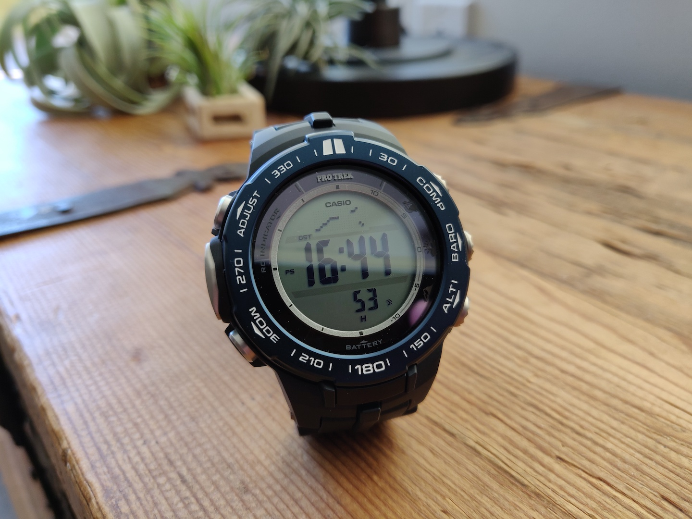

### [Blog Homepage](https://github.com/ckuzma/blog) | [About the Author](https://ckuzma.github.io/) | [Posts Archive](/posts)
# The Blog of Christopher Kuzma

---

#### 08.09.2020
### Casio Pro Trek PRW-3100 Review

**Introduction**

Let's cut straight to the chase: the Casio Pro Trek PRW-3100 is is _not_ a member of high-brow [haute horology](https://www.watch-wiki.net/index.php?title=Haute_Horlogerie).  Nothing about it resembles those meticulously-polished, might-as-well-be-bespoke timepieces with their eye-watering price tags and tuxedoed brand representatives.  Where those _other_ watches might hope to find themselves adorning the wrists of VIPs while they're being photographed by paparazzi, the Casio being reviewed today has the more humble goal of simply returning home in one piece after an adventure.

So who, then, is the PRW-3100 targeted at?  If it's not trying to weasel itself into what one might think of as the typical watch enthusiast's collection, then who is buying it?  And why?  In this review we'll hopefully figure that out.

**[Continue reading --->](posts/2020/2020-09-08-casio-pro-trek-prw-3100-review.md)**

----

#### 02.09.2020
### Start of HoverGames 2 Project

Cameras?  Ribbon cables?  Wires?  Serial adapters?  Embedded linux?  That spells only one thing: another hackathon project!  This time around it's not an altogether new contest as it builds upon the back of the [first NXP HoverGames](https://www.hackster.io/contests/hovergames) hackathon.  Different this time around is a little more freedom; whereas the first HoverGames was bound around the task of fighting fires, [HoverGames Challenge 2](https://www.hackster.io/contests/hovergames2) is a lot more open ended.  If it fits the challenge's top-level description of "_Help Drones, Help Others During Pandemics_" then it qualifies as an entry.

...So long as it also adheres to the hardware requirements, ayway.  And new this time around is an [NXP i.MX 8M Mini](https://emcraft.com/products/1097#starter-kit) System-On-Module computer with a few additional goodies.  And yes, before you ask, I do think that this is a horribly complicated name to give to a ~~single-board~~ sandwich computer system.  But let's not digress too far, because the point of this post is to show off the hardware and what I've done to it so far.

**[Continue reading --->](posts/2020/2020-09-02-hovergames-start.md)**

----

#### 31.08.2020
### Nintendo Switch Pro Controller Joystick Drift Repair

Alas, my Nintendo Switch Pro Controller finally fell victim to the surprisingly-common [joystick drift issue](https://en-americas-support.nintendo.com/app/social/questions/detail/qid/78176/~/pro-controller-drifting), for which the internet has thankfully already come up with [some easy fixes](https://www.nintendolife.com/news/2020/08/guide_how_to_fix_a_drifting_nintendo_switch_pro_controller).  Armed with a small screwdriver, plastic pry tool, and [a repair guide from iFixit](https://www.ifixit.com/Device/Switch_Pro_Controller), I sat down to solve my newfound pet peeve.  What follows are a few photos that I took along the way along with a small bit of an explanation of what I was doing.

**[Continue reading --->](posts/2020/2020-08-31-switch-controller-drift-fix.md)**

----

#### 13.07.2020

### Pixie QRP Transceiver Assembly (Part 2)

[_(See Part 1 here.)_](2020-07-12-pixie-transciever-pt1.md)

**Assembly**

The wire cutters arrived!  And while the pair I ordered isn't the most precise tool in the world, they'll work for my purposes.  With forest of component leads dealt with, I continued to mount parts onto the circuit board.

**[Continue reading --->](posts/2020/2020-07-13-pixie-transciever-pt2.md)**

---

## [View older posts --->](/posts)