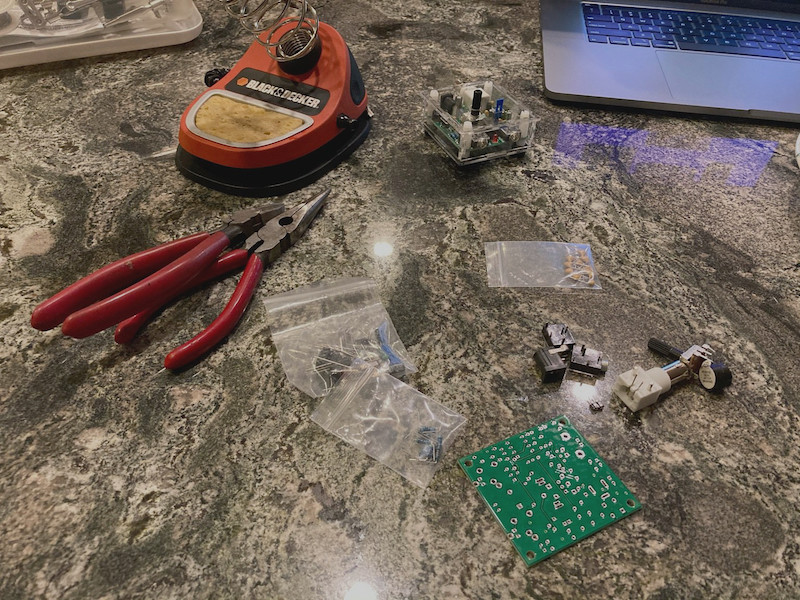

### [Blog Homepage](https://github.com/ckuzma/blog) | [About the Author](https://ckuzma.github.io/) | [Posts Archive](/posts)
# The Blog of Christopher Kuzma

----

#### 21.11.2020
### Second S-Pixie Radio Built

> The bare components laid out for inspection while the soldering iron got up to temperature.

_This is part of an ongoing series of documentation for my entry into [Hackster and NXP's HoverGames Challenge 2](https://www.hackster.io/contests/hovergames2) contest.  Links to the related blog posts can be found below:_
- _[Part 1: Pixie QRP Transceiver Assembly (Part 1)](./2020-07-12-pixie-transciever-pt1.md)_
- _[Part 2: Pixie QRP Transceiver Assembly (Part 2)](./2020-07-13-pixie-transciever-pt2.md)_
- _[Part 3: Building a Morse key](./2020-09-21-morse-key.md)_

A few days ago I finally managed to carve out some time to build the second of the two S-Pixie radio transceiver kits that I had ordered.  Perhaps it shouldn't have been surprising, but it only took me a fraction of the amount of time to complete compared to my first build.  Being able to make use of my father's not-budget-bin soldering iron was a big help as well.  I hope [the Pinecil](https://pine64.com/product-category/soldering-irons/?v=0446c16e2e66) is released for sale soon...

**[Continue reading --->](posts/2020/2020-11-22-second-pixie-built.md)**

----

#### 21.09.2020
### S-Pixie Morse Key

> Mounted Morse key connected to the S-Pixie radio transceiver.  Connected in lieu of an antenna is a 50Ω dummy-load for testing purposes.

As part of my ongoing participation in [Hackster and NXP's HoverGames Challenge 2](https://www.hackster.io/contests/hovergames2) contest, I previously built an S-Pixie [QRP](http://www.arrl.org/why-qrp) 40-meter band (7.030 MHz) CW (Morse) radio transceiver (see [Part 1](./2020-07-12-pixie-transciever-pt1.md) and [Part 2](./2020-07-13-pixie-transciever-pt2.md)).  This small pocket-sized device radio can be used by any licensed amateur radio operator, so long as it is hooked up to a source of power, antenna, headphones, and some sort of tool for creating the dits and dahs that make up Morse code.  While just any tool capable of succinctly opening and closing an electrical circuit will be sufficient for use with the S-Pixie, I decided to pick up a MFJ-550 straight key [from Gigaparts](https://www.gigaparts.com/mfj-550.html).

**[Continue reading --->](posts/2020/2020-09-21-morse-key.md)**

----

#### 08.09.2020
### Casio Pro Trek PRW-3100 Review

**Introduction**

Let's cut straight to the chase: the Casio Pro Trek PRW-3100 is is _not_ a member of high-brow [haute horology](https://www.watch-wiki.net/index.php?title=Haute_Horlogerie).  Nothing about it resembles those meticulously-polished, might-as-well-be-bespoke timepieces with their eye-watering price tags and tuxedoed brand representatives.  Where those _other_ watches might hope to find themselves adorning the wrists of VIPs while they're being photographed by paparazzi, the Casio being reviewed today has the more humble goal of simply returning home in one piece after an adventure.

So who, then, is the PRW-3100 targeted at?  If it's not trying to weasel itself into what one might think of as the typical watch enthusiast's collection, then who is buying it?  And why?  In this review we'll hopefully figure that out.

**[Continue reading --->](posts/2020/2020-09-08-casio-pro-trek-prw-3100-review.md)**

----

#### 02.09.2020
### Start of HoverGames 2 Project

Cameras?  Ribbon cables?  Wires?  Serial adapters?  Embedded linux?  That spells only one thing: another hackathon project!  This time around it's not an altogether new contest as it builds upon the back of the [first NXP HoverGames](https://www.hackster.io/contests/hovergames) hackathon.  Different this time around is a little more freedom; whereas the first HoverGames was bound around the task of fighting fires, [HoverGames Challenge 2](https://www.hackster.io/contests/hovergames2) is a lot more open ended.  If it fits the challenge's top-level description of "_Help Drones, Help Others During Pandemics_" then it qualifies as an entry.

...So long as it also adheres to the hardware requirements, ayway.  And new this time around is an [NXP i.MX 8M Mini](https://emcraft.com/products/1097#starter-kit) System-On-Module computer with a few additional goodies.  And yes, before you ask, I do think that this is a horribly complicated name to give to a ~~single-board~~ sandwich computer system.  But let's not digress too far, because the point of this post is to show off the hardware and what I've done to it so far.

**[Continue reading --->](posts/2020/2020-09-02-hovergames-start.md)**

----

## [View older posts --->](/posts)