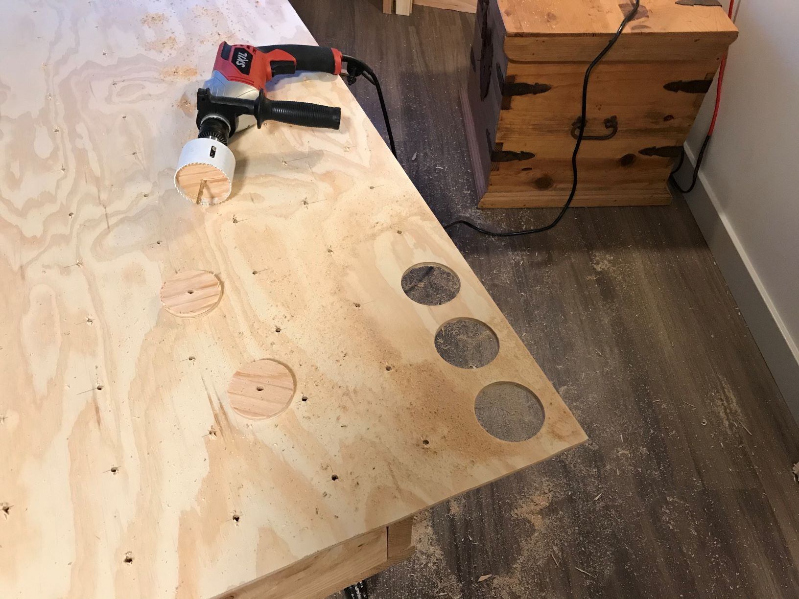
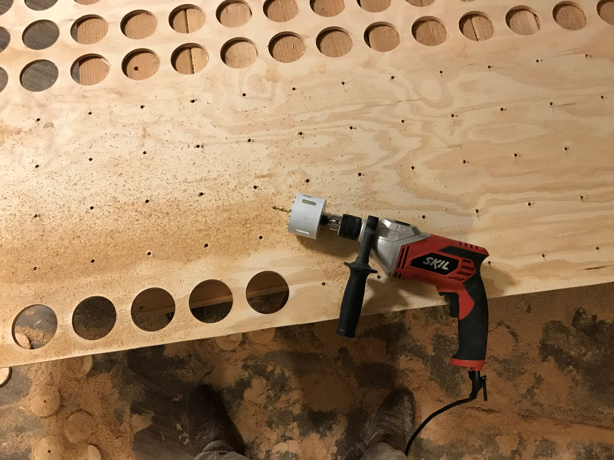
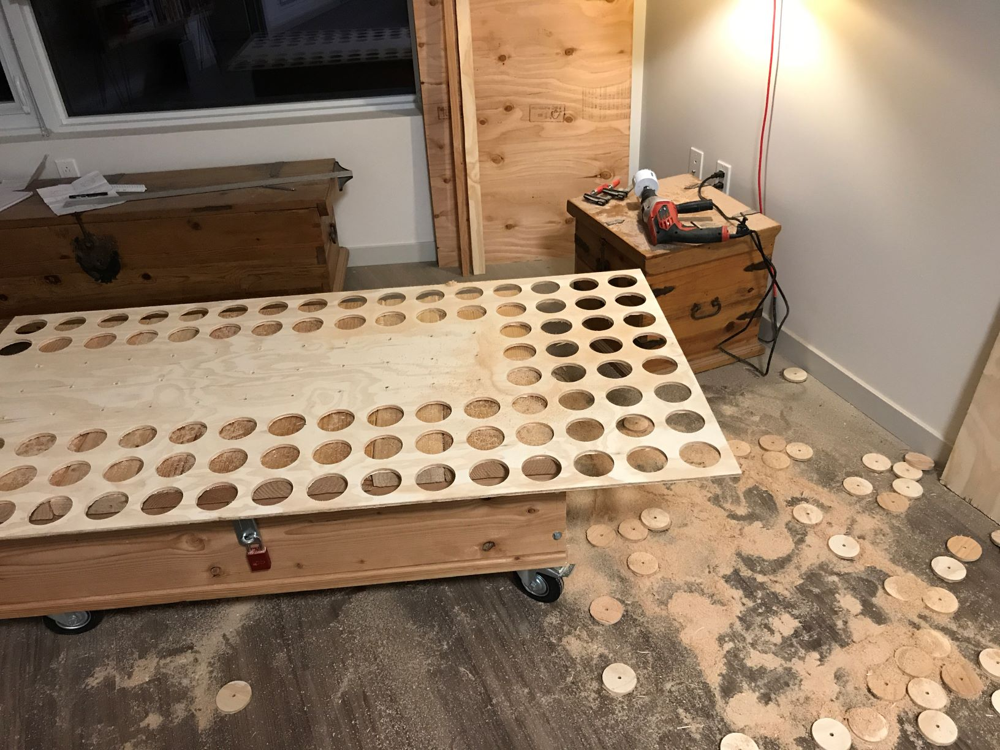

### [Blog Homepage](https://github.com/ckuzma/blog) | [About the Author](https://ckuzma.github.io/) | [Posts Archive](/posts)
# The Blog of Christopher Kuzma

#### 09.02.2020
### RGB Wall Display Board, Part 2: Cutting and Wiring

_[NOTE: This post is incomplete and will be finished when time allows.  For now I just wanted to make sure to share these photos.]_

#### 05.02.2020
### RGB Wall Display Board, Part 1: The Project Begins

A few months ago I came across the following image while I was scouring the internet for ideas of what I might build using a bunch of WS2812B RGB LED strips that I had laying around:

The [photo itself](https://www.instagram.com/p/BEGS5bxqdYy/) was hosted by Instagram and was associated with an account belonging to someone with the name of Johan Schmetzer.  On [their Instagram](https://www.instagram.com/johanschmetzer/) page I was able to find a few more pictures of this RGB LED display and some basic details as to how it was made, but alas there existed no step-by-step build instructions.

Additional searching for more information turned up [a video](https://www.youtube.com/watch?v=1Q3tJyEbz8U) on [the official Arduino YouTube channel](https://www.youtube.com/channel/UCxbE0GWroHEsB7hRLmwISAw), though oddly enough no links to additional information or source code.  Ignoring the irony that whoever runs the Arduino account appears to be promoting a closed-source project running on open-source hardware, my interest was captured.  I decided that attempting to re-create the project would be a fun weekend project.

Of course "weekend" turned out to be quite the understatement.  You would think that after the lessons I'd learned from [the first RGB LED array display I'd built](posts/2017/2017-12-30-rgb-led-matrix-board-litebrite.md), I would have known that wiring things together (correctly) often takes longer than expected.  But alas, hindsight is always 20/20.  Not knowing what exactly I was getting myself into I did some math on a sheet of scrap paper and headed off to Home Depot with the intention of getting some plywood cut that way my project would have a nice Pacific Northwest-flair in the form of being made out of wood.