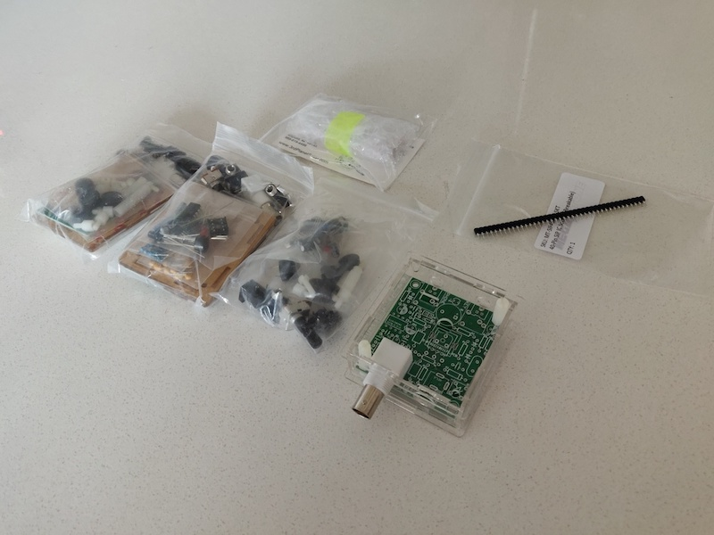

### [Blog Homepage](https://github.com/ckuzma/blog) | [About the Author](https://ckuzma.github.io/) | [Posts Archive](/posts)
# The Blog of Christopher Kuzma

---

#### 31.08.2020
### Nintendo Switch Pro Controller Joystick Drift Repair

Alas, my Nintendo Switch Pro Controller finally fell victim to the surprisingly-common [joystick drift issue](https://en-americas-support.nintendo.com/app/social/questions/detail/qid/78176/~/pro-controller-drifting), for which the internet has thankfully already come up with [some easy fixes](https://www.nintendolife.com/news/2020/08/guide_how_to_fix_a_drifting_nintendo_switch_pro_controller).  Armed with a small screwdriver, plastic pry tool, and [a repair guide from iFixit](https://www.ifixit.com/Device/Switch_Pro_Controller), I sat down to solve my newfound pet peeve.  What follows are a few photos that I took along the way along with a small bit of an explanation of what I was doing.

**[Continue reading --->](posts/2020/2020-08-31-switch-controller-drift-fix.md)**

----

#### 13.07.2020

### Pixie QRP Transceiver Assembly (Part 2)

[_(See Part 1 here.)_](2020-07-12-pixie-transciever-pt1.md)

**Assembly**

The wire cutters arrived!  And while the pair I ordered isn't the most precise tool in the world, they'll work for my purposes.  With forest of component leads dealt with, I continued to mount parts onto the circuit board.

A modification I made was to install SIP sockets where the crystal would otherwise be affixed.  This allows me to swap out the crystal oscillator included with the kit for one of my own choosing.  Seeing how the included crystal oscillates at 7.023 MHz, sticking with that would only allow me to tune within the range of about 7.016 to 7.030 MHz.  Given that a Technician is [only allowed to operate](http://www.arrl.org/graphical-frequency-allocations) CW stations within the 7.025 to 7.125 MHz range, the included crystal would limit me to a very narrow couple of transmit frequencies.

With the polycarbonate case assembled and the board secured inside, my transceiver was complete!  A quick power test resulted in no "magical smoke"– a good sign– and I was able to hear faint background static on the phone jack using a pair of headphones.  Shorting the key jack with a pin resulted in an audible tone from the onboard buzzer in addition to lighting up the LED, indicating that it, too, was functional.

**[Continue reading --->](posts/2020/2020-07-13-pixie-transciever-pt2.md)**

----

#### 12.07.2020

### Pixie QRP Transceiver Assembly (Part 1)

**Background**

One of my accomplishments during the COVID-19 lockdown was to study for, take, and pass the Technician-class amateur radio license exam.  Once my call sign was officially assigned by the FCC a few hours later, I immediately began making voice contacts on the local VHF radio repeater.  After all, being able to do so was the predominant reason for why I'd bothered to get licensed in the first place; I'd been listening to the local nets for a couple of months by that point using an RTL-SDR device connected to my computer.

However I was not satisfied to rest on my laurels, and the door to the vast world of radio communications hadbeen thrown wide open.  Well, or so I thought at first.  I quickly noticed via the [ARRL Frequency Charts](http://www.arrl.org/graphical-frequency-allocations) that I was limited in scope to what bands I could use with my Technician license, especially in the HF (high frequency) bands.  (This was the moment that I realized I should have at least attempted the General-class exam immdiately following my success with the Technician exam.)  Not to be dissuaded, I identified the section of the 40-meter bands where I was allowed to operate a CW (Morse code) station.

Why 40-meters?  The answer to that is quite simple: because that's the frequency range supported by the Pixie radio transceiver.  That's important for one very simple reason: it's extremely budget friendly.  More specifically, the Pixie kits I purchased cost a whopping $7.40 including tax and shipping.  That's undoubtedly one of– if not _the_– cheapest ways to get into amateur radio communications from HF all the way to UHF.  Of course, it is a CW-only radio, but hey... I needed something else to study anyway.

With that in mind I placed an order for three Pixie kits on eBay.  I figured it couldn't hurt to have a spare, plus hoped one of my local friends would decide to try their hand (literally) at CW radio with me.  The kits arrived a couple of weeks later and I immediately got to work assembling one of them.

**[Continue reading --->](posts/2020/2020-07-12-pixie-transciever-pt1.md)**

---

## [View older posts --->](/posts)