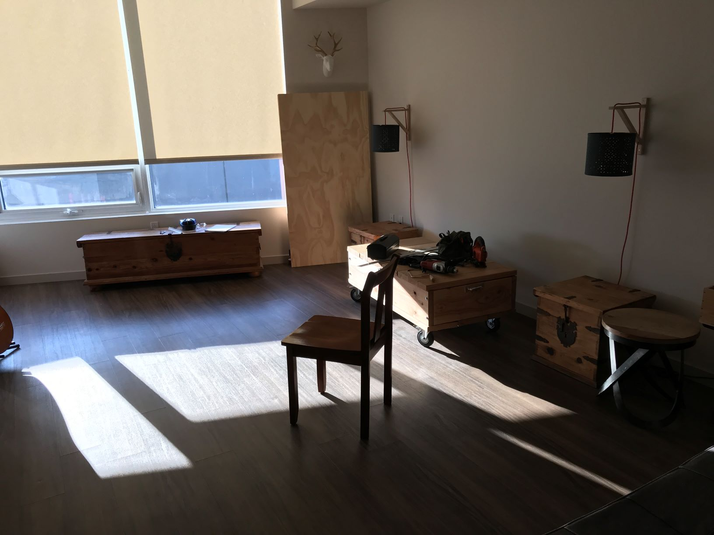
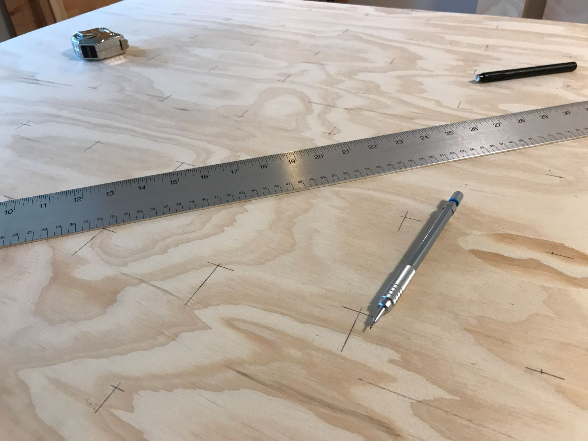
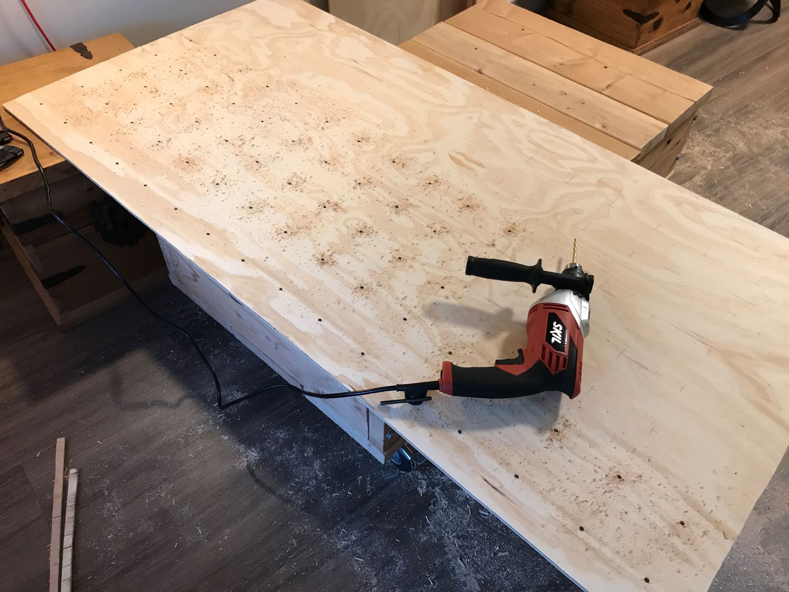
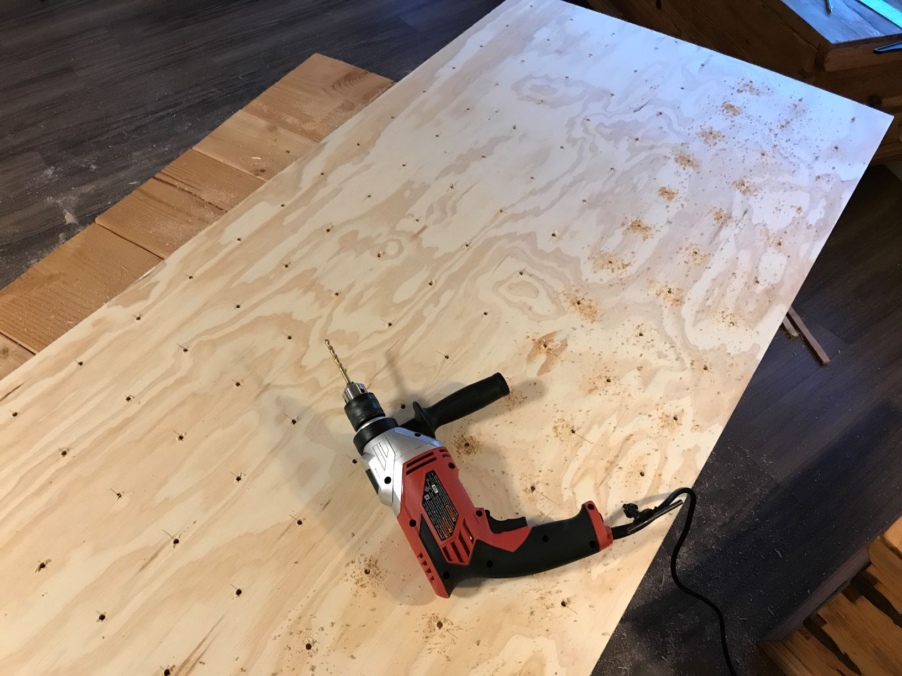
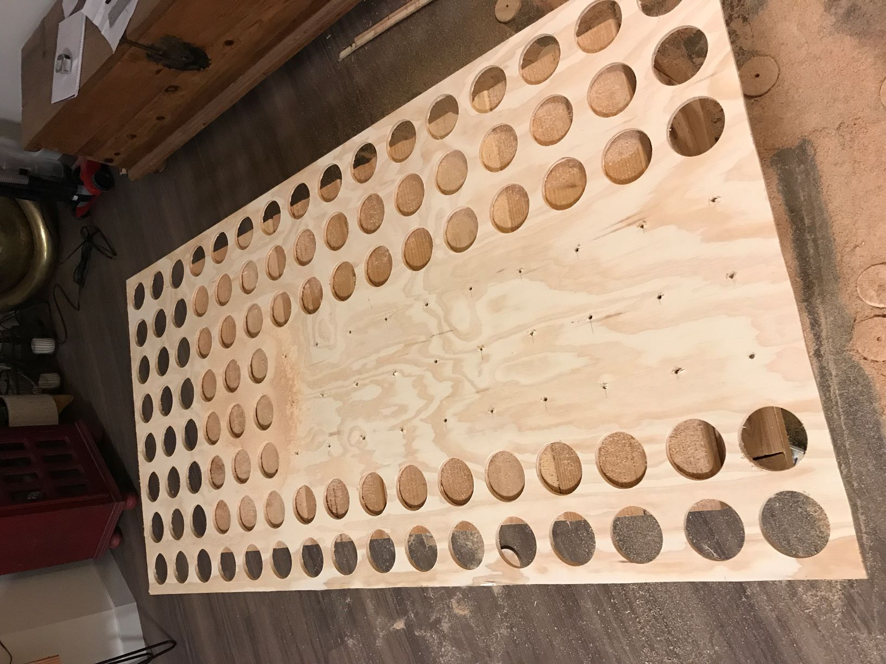

### [Blog Homepage](https://github.com/ckuzma/blog) | [About the Author](https://ckuzma.github.io/) | [Posts Archive](/posts)
# The Blog of Christopher Kuzma

#### 09.02.2020
### RGB Wall Display Board, Part 2: Cutting and Wiring

#### 09.02.2020
### RGB Wall Display Board, Part 2: Cutting and Wiring

In my [previous post](2020-02-05-rgb-wall-display-board-part-1.md) on the subject, I described the inspiration and goal for my new project.  After knowing _what_ I wanted to build, it was time to focus on _how_ I was going to make it.  After I made a few basic sketches of how everything would have to fit together I then generated some measurements for each of the wooden components and headed to Home Depot with my father for a bit of shopping.

Knowing that the equipment I own isn't capable of making the large straight cuts that my project would require, I had one of the reps at the store make two major cuts for me.  The end result was that I had identical and perfectly square front and back panels around which everything else could be fitted by hand.  I took my new boards (and hole saw) home and began clearing away some space to work.

#### Wood Cutting

In the above picture you can see my new plywood boards leaning against the far wall.  My sofa, rug, and various other items had been moved out of camera so as to prevent them from accumulating sawdust.

My first line of business was to cut side pieces from the remaining spare wood.  For this I used two clamps and my jig saw.  The end result isn't pretty but that can be solved later with some sanding.

Then I began one of the most tedious processes: identifying and marking where each of my lights would shine through on the board.  The next step was to drill pilot holes in order to prevent any walking of the hole saw later on, which you can see happening the photos below.

Once all of the pilow holes were complete it was time to follow up with the 3-inch hole saw.  This was a very slow process as I needed to remove the plywood circle chunks from the bit by hand, and there was no rhyme or reason for why some circles would remain stubbornly in the bit and others would fall out without my intervention.

Finally I started to see light at the end of the tunnel.  This is also when I realized that I should probably look into purchasing a shop vacuum at some point.

Nearing the end!  At this point I had to be careful to not apply too much stress to the board for fear of it cracking.

Finally done!  I somehow managed to accidentally over-drill into my coffee table.  Seeing as I built it myself for use as temporary storage, I wasn't too bothered.

This required about 2 hours to completely clean.  Part of that is my own fault: I found a fine layer of sawdust all over most horizontal surfaces in the room, necessitating a rather thorough bit of dusting.

#### Electronics

With the boards cut and my apartment finally clean, I set aside a few hours for the laborious task of gluing my array of RGB LEDs to their new home on the back board.

Between each row of lights I had to add short bits of wire extensions which I soldered together and insulated with heat shrink.  Slight overkill but it made me feel better knowing that I don't have to worry about making the whole project enclosure open up for maintenance and troubleshooting down the line.

Once all of the LEDs were on the board I loaded up a simple Arduino program that renders Conway's Game of Life to make sure everything was working.  Unfortunately the both the photo and video I took of the board at this point were lost, so you'll have to take my word for it.

Next time: finishing the enclosure and adding some control buttons!

#### 05.02.2020
### RGB Wall Display Board, Part 1: The Project Begins

A few months ago I came across the following image while I was scouring the internet for ideas of what I might build using a bunch of WS2812B RGB LED strips that I had laying around:

The [photo itself](https://www.instagram.com/p/BEGS5bxqdYy/) was hosted by Instagram and was associated with an account belonging to someone with the name of Johan Schmetzer.  On [their Instagram](https://www.instagram.com/johanschmetzer/) page I was able to find a few more pictures of this RGB LED display and some basic details as to how it was made, but alas there existed no step-by-step build instructions.

Additional searching for more information turned up [a video](https://www.youtube.com/watch?v=1Q3tJyEbz8U) on [the official Arduino YouTube channel](https://www.youtube.com/channel/UCxbE0GWroHEsB7hRLmwISAw), though oddly enough no links to additional information or source code.  Ignoring the irony that whoever runs the Arduino account appears to be promoting a closed-source project running on open-source hardware, my interest was captured.  I decided that attempting to re-create the project would be a fun weekend project.

Of course "weekend" turned out to be quite the understatement.  You would think that after the lessons I'd learned from [the first RGB LED array display I'd built](posts/2017/2017-12-30-rgb-led-matrix-board-litebrite.md), I would have known that wiring things together (correctly) often takes longer than expected.  But alas, hindsight is always 20/20.  Not knowing what exactly I was getting myself into I did some math on a sheet of scrap paper and headed off to Home Depot with the intention of getting some plywood cut that way my project would have a nice Pacific Northwest-flair in the form of being made out of wood.