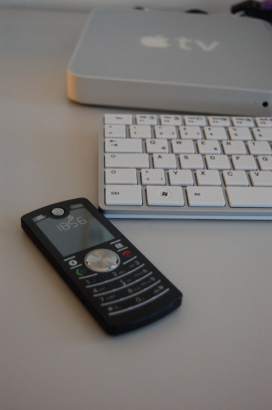

### 23.08.2010

# Motorola F3 Thoughts

<!-- _(First, I apologize for the rather cruddy quality of the image- once again, another ip4 shot taken in low-light conditions. I really should stop allowing myself to use that as an excuse, seeing how my d40 is a short walk across the room and would plug into my computer pretty much effortlessly, but for now I'll allow my laziness to reign supreme.)_ -->

Having used the Motorola F3 for more than 24hrs, I feel it might be rather interesting to compare my thoughts about the phone now to my thoughts in a couple weeks when my time with it is complete.  I feel I should begin with the part I find most different from other phones: the UI. I've read reviews where the interface is either bashed for being too minimalistic or is praised for being so intuitive it only appears difficult at first because we've all become accustomed to unintuitive interfaces. I'd have to put my opinion somewhere in the middle of these two standpoints. On one hand, I have extreme admiration for those who are responsible for the interface, as it manages to accomplish an astoundingly large amount of  features without requiring any fancy graphics or even a dot-matrix display. On the other, I've run into a few occasions where a bit more complexity might have been a good thing and I can't help but feel like the only times I might select the F3 out of a phone lineup are situations with very specific requirements. Texting is a bit slower than normal, because the phone has no key that can be pressed to signify the end of a certain key's input. For example, if I want to type "apple", the P's become the slowest part of the word to type. I must tap the 7 key once, then wait for the phone cursor to move before I can tap the 7 again for the second P. There is no way to toggle over early, as pressing the right arrow key inserts a space, and no other key has the function I'm looking for. In addition, the phone likes to revert to the inverse black-white display with the time on-screen whenever I leave a menu. Since this is an E-Ink display (probably coupled with a slow processor), this switch ends up robbing me of a couple of seconds between responding to multiple text messages. (The screen does refresh faster than my Kindle did, though, so it's not all bad.) However where the phone excels is in making phone calls, which does make me very happy since it seems most phone manufacturers have forgotten about this function. The phonebook I find to be simple but very usable (I have under 100 contacts, FYI), and dialing is simple and straightforward with large numbers that are easy to read. All of the icons used on the phone (mostly) make sense, which is more than can be said of many other handsets.

Where I find the F3 to excel most is in the hardware. I have yet to find myself without signal anywhere- in fact, I've rarely found myself anywhere that the phone didn't have a reportedly full signal strength. I charged the phone last night, 24 hours ago to be exact, and have yet to lose one of the phone's 5 battery-status bars. (It is rumored to have a 22-day standby life, something I'm willing to test.) Call quality is excellent, which was unexpected since the phone has a mere dual-band radio. (Although the extra two bands wouldn't actually do anything, I have trouble trusting anything that isn't quad-band anymore.) The phone itself is a candybar, which means it holds to the side of my head quite well. It doesn't seal to my ear exceptionally well, but it does work better than many- no, most- other handsets I've owned or used. And, unlike any other handset I've used before, this one is equipped with the aforementioned E-Ink display. Kind of bizarre, if you think about it, that this is the cheapest way to take home an E-Ink display (if you're nerdy like me and collect such things). The next most expensive product with E-Ink would be a Lexar JumpDrive USB stick, which does considerably less than the F3. (I got the F3 for $15 + $5 shipping, brand new.) After that come the much more expensive E-Ink ebook readers. Odd. But the odd thing here is that Motorola realized they needed to enable night-time use of the phone, and so they threw on side-illumination for the display. Sounds cruddy, but that's only because chances are anyone who knows what side-illumination is last saw it on an old LCD wristwatch. E-Ink technology actually allows this illumination technique to work quite well. (The keypad is also LED lit, and while not the most even spread of illuminated keys it still is more than usable in the dark.) The phone itself is also quite thin, light, and quite rugged (from what I've read, and believe). While it seems to me that it is the same thickness as an ip4, the phone manages to feel thinner in-hand and on-face. This is pretty amazing considering the phone has a standard pop-off battery door and replaceable battery. In short, the build of this device is uncannily good, and there really isn't any reason for its tactile appeal.

At the moment, I could see the F3 actually becoming my main phone, but with a few mods which would probably boot the phone out of its current target audience and into the $100-200 range. First I would give the device a more capable e-ink display and some better processing power. I'm thinking something like the Nokia E51 in terms of computing power would be a perfect fit. Then I would upgrade the keyboard a bit, maybe give it a keypad more akin to the Nokia N82. Then I'd call it quits- I don't require a camera, I don't want a touchscreen. That combination right there would be enough to kill a lot of other phones, and the tactile feel would be such that I might even sacrifice (a lot of) functionality that my ip4 gives me in order to use it. As-is, the F3 makes an excellent backup phone (my current plan for it), and would make an even more excellent prepaid phone. In fact, I'm almost surprised nobody (in the States) has already done so- if I, as an end-consumer, can purchase one of these for $20 to my door brand new, imagine what a bulk-buying retailer could pick these up for. Yes, I realize that with the availability of $10 phones being sold 24/7 at 7-Eleven with more functionality it'd be a hard sell, but I could imagine the F3 being sold for the same price or even less, and beating the others for the mere reason of better design. But who knows? Maybe someone is about to do that, and we'll see this (or a similar) phone on store shelves in the very near future.