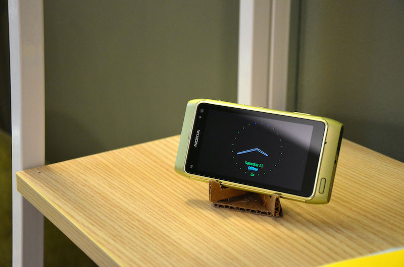
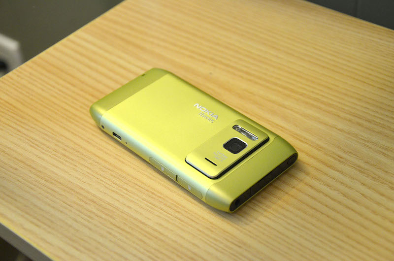
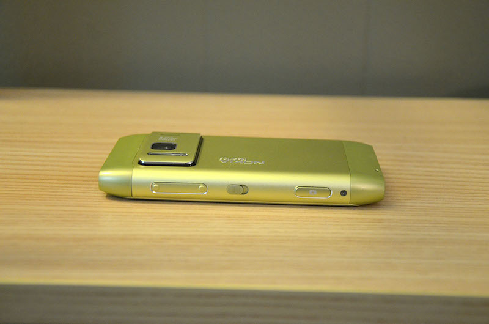
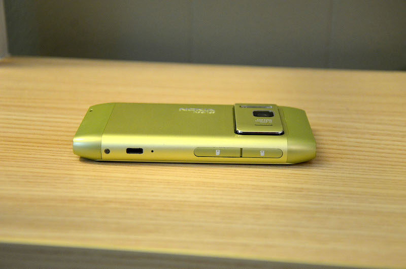
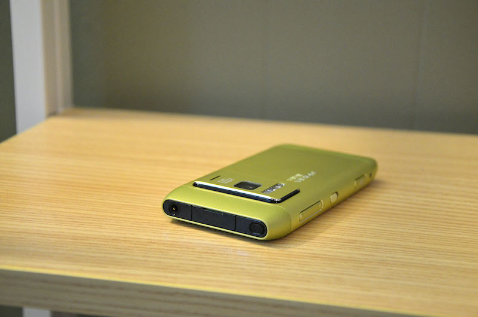
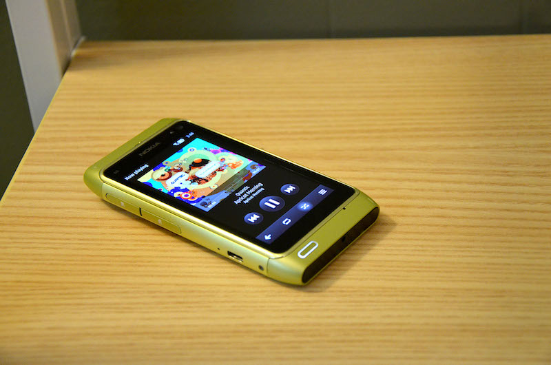
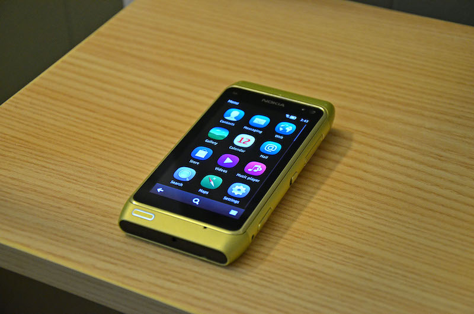
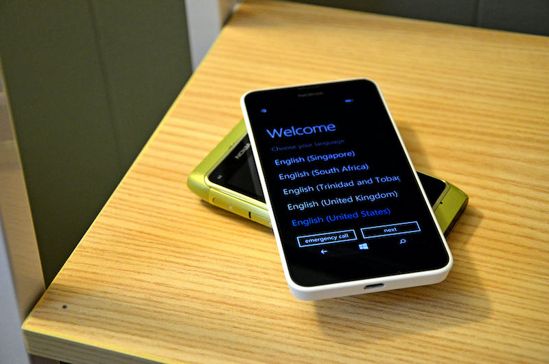

### 18.03.2011

# Nokia N8 Review

## Introduction

Admittedly a bit late on the scene in terms of reviewing this phone, since there have been newer handsets released in the interim in addition to the announcement of a partnership with Microsoft to put Windows Phone onto Nokia phones, this review is questionable in value to anyone who might be looking to have the latest and greatest gadget. That being said, I still feel that there is value to be had in sharing my opinion of this handset, especially since it is still only one of three Symbian^3 handsets available on the market today, which is an operating system generally regarded as being the latest and greatest from the Finnish handset manufacturer. The Nokia N8 was released as something of a flagship device and is still in many ways worthy of that title even though the behemoth E7 has an admittedly more lust-worthy 4” display coupled with a roomy QWERTY keypad. I therefore feel that, before I begin this review, it is important to claim and angle from which I shall attempt to wrestle some sort of verdict about the device.

Being equipped with a 12 megapixel camera, pentaband 3G radio, AMOLED display, HDMI-out and the latest operating system to roll out of Espoo, the N8 rolled off of the assembly line ready to wrestle with the latest and greatest that Google and Apple had to pit against it. Unfortunately, the device was very slow to get to market and thus had a disability before it even entered the arena: core hardware specs. With dual-core 1GHz processors and gigabytes of RAM right around the corner, the N8 was judged before a single soul had even managed a hands-on… the one “stolen” N8 in Russia excepted, of course. 680MHz coupled with 256MB of RAM had people dismissing the N8 before it had chance to even hit shelves. I myself was one of the early few who wasn’t exactly blown away by the N8 announcement, especially when it seemed apparent that Symbian^3 was just Symbian S60v5 in a new set of clothes. The 12mp camera that had been thrown into the mix actually ended up infuriating me… why was Nokia combining great technology with subpar software and seemingly never-fast-enough processing power? (S60 has had a long reputation of never being equipped with quite enough RAM, at least in the N-Series lineup.)The N8 came to market, and I did not bother to give it much of a look other than to poke at a demo handset I came across while getting a cell phone plan. When I saw a classmate with a bright blue N8 one day, I casually asked how they liked it, and they told me a dramatic story about how they waited a full month for this to ship to them and how they were so happy they waited for it instead of getting an iPhone 4, which happened to be the device I was using at that moment. I smiled, thinking that they must not be a power user otherwise they would surely be asking me to trade devices. Admittedly, their N8 looked very cool perched upon the desk but I could not get myself to want one, apart from the lure of a great performing camera. Then again, the N86 I owned was also a great camera, excluding the slight green tint on the lens, and it had variable aperture, something lacking on the N8.

WOMWorld then gave me the opportunity to test out the N8 (and a pair of BH-905i headphones)… who was I to say no?

## Design

To say that the N8 was designed cheaply would be a massive understatement. Although Nokia flagship devices since the N95 have often been “plagued” with inferior software, one thing has always been certain, and that is design. The N8 is a solid winner here, as it feels great in-hand and looks unbelievably cool as well. In fact, one of the only problems with the design is the fact that multiple color options are available… how is one to choose when they all look good in their own way? But more on that later.

For starters, the N8 is a candybar. Admittedly that name is becoming increasingly harder to label touchscreen devices, since they no longer exhibit the candybar dimensions of their button-blessed predecessors, so perhaps “bar” or “slate” is a better fit here. If I were to describe the N8 dimensions in terms of something edible, I would choose a poptart packet (two poptarts in a packet), that got beat up a little bit so that everything is a lot more rounded and streamlined around the edges. (I had to make a breakfast reference sometime, since that is the name of this blog afterall.) The dimensions and thickness of this device are just-right for a phone. I admit that there is something appealing about phones which are thinner and feature display sizes almost too big to hold in the hand, yet I cannot say their size is right as a result. It is like taking a perfectly good crotch-rocket motorcycle, cool enough as is, and then removing all the fairings to make it a naked streetfighter. The latter is extremely cool, if you can appreciate it, but it only serves a couple of limited purposes and beyond that it is actually worse. Less wind-protection on a highway (to make a metaphor for durability in the long-run), accomplishes nothing other than look (the few extra times a giant screen is worth more than a “big” screen as found here), and to top it all off not everybody likes or even wants it apart from following the bigger-is-better mentality when we are on the cell-phone side of things.

So since the size is just-right, it is time to take the phone apart (not literally). This is the first handset from Nokia with a battery that is (mostly) non-user-accessible. As a result of the tradeoff, the phone wears a jacket of anodized aluminum. Sadly, the top and bottom tapered ends are actually made of plastic, shielding the antennas, and if they hadn’t then this phone would have been a tactile explosion of aluminum construction. The front is where the LCD AMOLED window is and it also houses a front-facing camera, proximity, and light sensor, in addition to the AMOLED display. I wish that the window for the display was smaller, as it manages to make the AMOLED appear smaller in this device and that is sad. (Devices like the Nokia C7, with an identical display panel, do a much better job of making the AMOLED appear its proper size.) Round the back is the raised plane of aluminum, a protrusion which was necessary for the spacing required by the massive imaging sensor found in the N8. A small speaker grill, nothing more than a simple sharp line cut into the metal, is also on the protrusion as is, naturally, the flash: a xenon version this go around.

Ports are pretty much standard for a smartphone these days, with one minor exception. While the phone is equipped with a mini-HDMI, 3.5mm audio, and microUSB port, the phone also sees a return of the mini-barrel Nokia charger jack. I understand the logic behind including the extra charging option, especially when the N8 has the ability to replace a camera in many situations and thus might be in remote situations where a microUSB charger cannot be located but a mini-barrel can, it still appears out of place to me. The N85, N86, N97, N97 Mini were equipped with only microUSB, so I scratched my head at that a bit. However my inspection of the microUSB port and and mini-HDMI plug didn’t prompt questioning but rather a nod of approval in Nokia’s general direction. In-the-box with the N8 come a mini-to-normal-HDMI adapter plug as well as a microUSB-to-regular-host-USB adapter. While the former is not so much of a deal, I can imagine the second being the type of accessory that many manufacturers might leave out, with the logic being that only a select handful of users will actually gain any benefit from its inclusion. In fact, such an inclusion and the potential abilities which go along with it, make me wonder why Nokia didn’t decide to throw the microSD card away all together like they did with the E7. That is not to say I wouldn’t prefer to keep the microSD, but I certainly wouldn’t make a fuss over it if it wasn’t there.

To sum up design a bit, the N8 just sort of looks cool. The home-button placement below the display is a bit farther to the left than I would have preferred, but I can deal with it. The back of the device looks quite cool and camera-like as well. Really the only problem with design is, like I said, what color to pick. Personally I would want to snag myself a black version, like the one that was sent to me, because of how great the back of the phone looks in that color scheme combined with how discrete the phone is while on a bus or out walking. The phone is as comfortable being held in one hand as it is in a landscape position cradled by two hands on either end. I like it.

## Usage

This was the section I was originally dreading writing, because, as stated earlier, I had already dismissed Symbian^3 based upon what I had read. I saw pictures of an interface which had essentially been unmodified since Symbian S60v5, and assumed that there was nothing more to be discussed. Granted, I learned to enjoy my N97 quite a bit, especially with the rather capable keyboard, and overall it was a great package once I became used to the operating system. However, the jump to the N8 was literally like a breath of fresh air. Side-by-side with the N8, the only other Nokia handset I own at the moment, it was hard to see how the two had any similarities besides some similar icons and menus.

The capacitive screen on the N8 was probably the first sign to me that I was using a phone which was better equipped for touch than the N97 had ever been. When I owned an N97 and an N86, I could seamlessly switch between the two without thinking twice, but the N8 required me to rethink things a little. For starters, there are certain connectivity options which can be accessed by clicking on the top-right corner of the screen, making the act of toggling WiFi and Bluetooth an absolute piece of cake.

But hold on a second, I haven’t said the best part about the display. This is the first AMOLED panel I have ever had the opportunity to actually use while in the sunlight, and let me tell you, whatever Nokia did to upgrade it from the N85 and N86… actually worked! I can read, watch, and see everything on the display, even in the brightest of direct sunlight. The N85 used to wash out whenever one even dared to step outside on a cloudy day, making photo-taking an absolutely hilarious adventure of pretending to know what was actually in the viewfinder. The N86 managed to hold itself together until almost-direct sunlight hit the display. The N8 does not even care. It may look more like an LCD while in sunlight, but at least it is legible. Once brought into a darker situation, the colors pop with vibrance and tone like every OLED display is capable of, giving the screen a very appealing demeanor.

Back to the software… some say that the CPU is too slow. Others say that the RAM is too little. Yet more say both are true. Agreed, in a market with 1GHz dual-core processors coupled with gigabytes of RAM the N8 is a nobody. But there really is no lag anywhere except for in the built-in web browser (but when better alternatives, such as Opera Mobile, are available, this isn’t an issue). Hook it up to an HDMI set, connect a bluetooth mouse and keyboard (or use the USB host ability), play Angry Birds, and then what happens? Nothing special. The phone keeps chuggling along without any lag. That is the beauty of Symbian… it is too sad that is has an end-of-life already announced.

## Conclusion

You may have noticed that I neglected to write about the camera. The reason for this omission is simple: the camera on the N8 is such a prominent feature, that I figured it deserved a post on this blog dedicated to it and it alone. With some sample pictures as well. The N8 is coming with me on Monday to Barcelona, where I will be for a few days on vacation. When I return, I shall write some words about how the device fared and that is when I shall have some better image samples to share.

However, as-is, I have to give my impression about the N8 at this point. Put simply, my impression of the device has improved so tremendously that, since I was already in the market for a new phone to own of my own, the N8 is currently the phone to beat. Sure, there are cheaper and “better” android devices out there, but do they have as good of a camera, AMOLED displays, HDMI-out, and free turn-by-turn navigation for life? No, and that is why the N8, with software that is leaps ahead of what I had thought it to have, has gone from the phone I hated for having good features but incorrectly assumed also a poor UI to the phone where, no matter how many times I compare a different phone, it always comes out on top in my book. I just wish I didn’t have a nagging feeling about picking the wrong color whenever I finally order one.

NOTE: Since writing this review prior to my recent trip to Barcelona, Spain, a few things worth mentioning in terms of usage have come to light which any buyer should probably be aware of. Please see the post which shall shortly be following this one for these extra points of information.