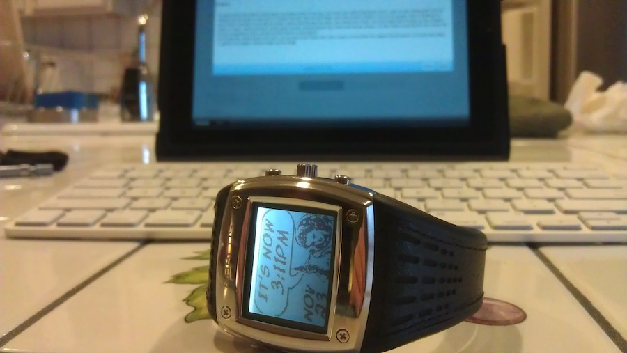

### 19.02.2013

# More Closet Treasures: Fossil Abacus

Growing up, I was a nerdy kid. I was such a nerd that, during family vacations, I'd actually ask my parents to scribble out math problems for me to solve for entertainment. I'd then ask them to correct my answers and would chide myself for making mistakes. However as nerd-stereotypical as that was, my fascination with wristwatches was able to trump it for absolute nerdiness. I used to wear not one, not two or even three watches; I would at times wear as many as four beastly watches on my little arm, all of which would be synchronized to within a second of one another at the beginning of each day.

I soon realized that, apart from being somewhat uncomfortable, wearing so many wristwatches on a daily basis was utterly impractical, and I downsized to wearing just one watch, 24/7. I eventually learned that cloth and leather bands need to breathe now and then to avoid locking in sweat, at which point I switched over to only steel-bands for my timepieces. A couple of years later I began carrying a cell phone everywhere and stopped wearing a wristwatch altogether.

About the same time as what I'll simply title the cell phone revolution came a stream of new features to digital wristwatches. Cameras, atmospheric sensors and GPS antennae were embedded into little wearable computers that one wore around their wrist for use at any time, anywhere. I remember being gifted a Casio wrist camera for one of my birthdays and loving the fact that I now owned a piece of my own spy-literature lore. Nevermind the fact that the tiny CMOS sensor was, at best, only capable of capturing blurry pictures which were barely of high enough pixel resolution to be usable on a postage stamp... it was cool.

A strange thing occurred a couple of years later. Whereas digital watches had struck me as being extremely cool for a while, I was suddenly fascinated by the intricacies of a mechanical timepiece. I just had to get my hands on an automatic watch of some sort, and I was rewarded with a Swatch skeleton-type automatic wristwatch from my grandparents a short while after as a present. I spent hours pouring over the gears, escapement, rotor and hands, attempting to form a visual concept of exactly how the whole thing worked. I still own that watch, and it remains one of the favorites of my small collection.

While browsing eBay a few years later I noticed a great price on a Fossil Abacus Spot watch. I'd always wanted a Fossil Abacus Wrist PDA, but never gotten one as I couldn't really figure out if I had a real use for it. But an MSN-powered Spot watch was something else entirely; the system allowed for one to receive snippits of email, news and calendar events wirelessly and in more-or-less realtime on the watch all for a small monthly fee. Without the fee, one was limited to just the news snippits, weather and self-setting time. For about twenty bucks for a brand new watch, I couldn't resist. Nevermind the fact that the Spot watch had just been given and end-of-life date... I still had a couple of years before that deadline.

In total, I think the watch has gone out and about with me a grand total of fifty times. I found the band, in which the antenna is hidden, to be a bit uncomfortable and stiff, causing the clasp to frequently pop open unexpectedly. The backlight itself appeared to be more or less an afterthought by the engineers, though in its defense it did work. Having news and weather updates arrive on my watch throughout the day turned out to be a real boredom cure during boring class lectures, as it allowed my mind to wander elsewhere in the world. It also allowed me to pack appropriately for the day's weather without ever having to boot up my computer (back then, I didn't have a smartphone or tablet). Lastly, I found the multitude of changeable full-screen clocks to pick from to be quite a bit of fun, as I could express my own taste in a manner that fit me at that exact moment.

Ultimately, the Spot service was shutdown due to competition from smartphones. I can't say that I'm surprised. However, as today was the first day that I've powered up this watch (using it's nifty induction charger) in probably a couple of years, it is a bit sad to see that it cannot get any radio reception as- and this shouldn't surprise me- those radio transmitters are no longer operational. Time to put it back in its storage box, I suppose.