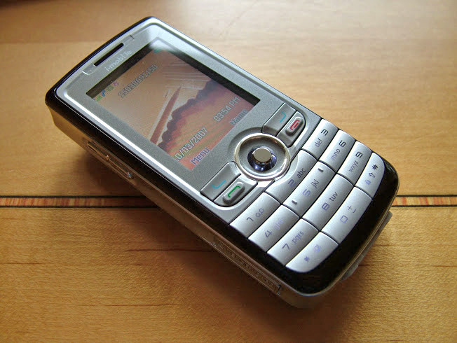

### 21.03.2013

# My First True Camera Phone: i-Mobile 902

While sorting through some photos on my hard-drive (after having realized that I accidentally deleted the full-size originals from my Rome trip and only saved the downgraded edits), I came across a picture of one of my first true camera-phones: the Samart i-Mobile 902. It was capable of producing 8.0 megapixel images (via interpolation) but could shoot at an impressive (for the time) 5.0 megapixels natively.

Here's an interesting tidbit: my 902 shipped with a Sony Ericsson headset. Now, the image sensor built into this phone is the same as that found in Sony's similar offerings of the time (if memory serves me right, the K850i was one of them), but that doesn't explain the inclusion of Sony Ericsson earbuds. These earbuds even turned out to be surprisingly good, both in the build-quality and sound departments. In fact, they became my go-to set of earbuds against which I compared everything- right up until the moment of a tragic accident involving and office chair commissioned them to the trash bin.

Would I buy another one of these phones? Probably not. The N93 and N82 I owned before and after (respectively) were both better phones and, in their own way, better cameras. But the 902 was a great deal and definitely a fun phone to have.