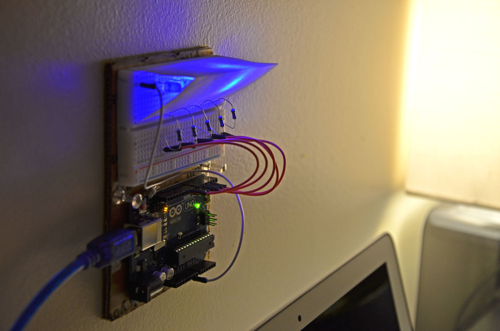

#### 17.03.2014
### Learning Arduino on the Cheap

As someone who finds himself perpetually tinkering and hacking things together, the concept of a programmable circuit board that directly interfaces with the physical world around me has always drawn me in. While the concept of building something and controlling it remotely isn't foreign to me, building a truly autonomous creation is something that I've never quite managed to find the time to pursue. Sure, there are a number of consumer products employing some sort of automation- quadcopters come to mind- but in the big scheme of things, the level of autonomy there is rather limited.

That's where the Arduino board comes in. A quick search of the web yields countless uses of the diverse platform: from artsy newsreaders to Twitter-powered coffee machines, the web is awash with the products of creativity and skill. While it lacks the sheer processing grunt of, say, a Raspberry Pi, the Arduino platform's forte is to directly interface with the physical world as opposed to driving GUIs or hosting web servers. That's not to say that it can't directly interface with the web and become part of the internet of things- it can- its just that most versions of Arduino are stripped to their core functionality and require add-ons to do so.

It wasn't until I was idly reading news on the web when mention of just how cheap Arduino boards had become caught my eye. A quick web search unveiled numerous Arduino boards in dozens of styles, all much cheaper than expected. I was suddenly determined to acquire one for myself to tinker with. While the smaller Nano-sized boards seemed to be the cheapest Arduinos out there, I made up my mind to go with a full-sized Uno just to leave open the option of experimenting with the various shields designed to interface with it.

Eventually I found the perfect package at a great price, including both an Uno R3 and a breadboard in conjunction with a handful of LEDs and resistors. Order submitted, I sat back and waited for it to arrive. It wasn't long before I came home to a package sitting on my doorstep. What follows is a small documentation of what I received.

Part of why I picked this package was because of the tidiness of the kit. In addition to including everything one needs to build some simple circuits, the usefulness of a hard plastic box to tote it all around was not lost on me. It's just large enough to hold everything without any of it being squeezed.

Included with the kit is the following:
- Arduino Uno R3
- USB cable
- Breadboard
- Connecting wires
- 220-Ohm resistors
- LEDs in 3 different colors

Of course, the real star of the show is that Uno board. It comes packed in its own brightly-colored box that, combined with the hard plastic case that everything came in, does a more than adequate job of protecting the board during shipping.

The keen-eyed observers out there will, at this point, immediately recognize that this board does not appear to be a genuine Arduino Uno R3. That's not to say it won't function exactly like one- the schematics for the original are freely available on the web, after all- but it is worth noting.

Flipping the circuit board over reveals the markings and labels that are printed directly on the board itself. Once again, certain things here indicate this to be a non-genuine Uno posing as an original. That being said, all of the solder joints seem solid and no shortcuts seem to have been taken in production.

Having unpacked everything, it was time to build a circuit, write a sketch (Arduino-speak for "program"), and test the thing out. With in the scope of about an hour I had my first test circuit completed and running a few light-show routines that I put together in a few minutes. It's not much to be proud of, but here it is anyway:

