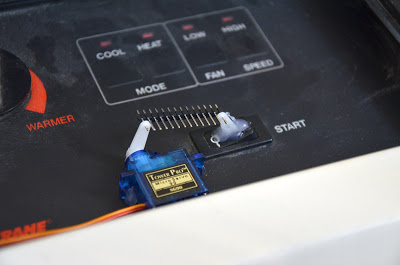

#### 08.03.2016
### Project: Automatic Apartment Heating/Cooling Control

> Version 1.0 (Doesn't look janky at all!)

_[Update (May 1, 2016): Over a couple of hours this evening I managed to hack together most everything within the Arduino IDE, negating the need to use Lua at all. The temperature and heater status is additionally broadcasted to the IBM Internet of Things Foundation service, awaiting use. That latest code can be found here, and will be updated to give all contributing parties their due share of credit once I have time to do so.]_

This past May I finished my studies in Computational Linguistics and began to prepare for my next adventure: living and working in New York City. Having previously lived in places where housing was available in abundance, finding an apartment turned out to be a much bigger ordeal than I ever could have imagined. But once all was said and done, I found myself comfortably situated in a relatively new building surrounded by a cozy neighborhood. Most importantly-- at least for someone who grew up in the Pacific NW-- the built-in air conditioning unit was fully functional and more than up to the task of keeping the sweltering NYC afternoons from reducing me to a sweaty mess.

While I am without a doubt grateful for my air conditioner, its default behavior left a lot to be desired. For a start, the fan ran constantly when the unit was turned on. That meant it was constantly making noise even when the compressor pump wasn't actively engaged. Another side effect is warm-- albeit fresh-- air being drawn inside whenever the pump wasn't running. And when winter rolled in a similar problem occurred, although obviously in a very different direction on the temperature scale. Not exactly a model of efficiency.

That's when I decided to take matters into my own hands. Armed with a NodeMCU, BMP180, and a spare servo, I set out to take control of my HVAC unit without violating any of the terms of my lease agreement. (Read: I wasn't going to break anything.) As if that wasn't enough, I also wanted to connect it to the internet so that I might monitor and control the temperature of my apartment from anywhere on the planet.

The result? Version 1.0 of my project involves three different programming languages, two circuit boards, and one cloud app. Future versions will simplify this, it does work as described here. This post, therefore, should serve as a nice bit of documentation should anyone wish to follow in my stead.

I was first confronted with the problem of how to power on/off my heater unit. As tempting as it was, taking the whole thing apart in order to wire in a relay switch seemed very ill-advised. (Plus I wasn't sure my relay switches could handle that much current, and they're rather permanently installed into another project right now.)The finished control assembly. (Mounted on a very dusty HVAC unit.)Having worked quite favorably with hot glue in the past, I recognized that it's ability to form both adhesive bonds as well as create structure might just be the solution to my problem. I grabbed a spare servo horn and proceeded to glue it on top of the heater's power switch, knowing that the glue could be easily be peeled off of the switch in the future when my lease is up.

My next step was to test whether or not I could use an ESP8266/NodeMCU to both read the temperature from the BMP180 sensor and then trigger the power switch accordingly using the servo I'd mounted to the heater unit's control plate. I whipped together a a Lua script (the "default" programming option for the NodeMCU), wired everything together and gave it a whirl. Success!A short while later I'd hot glued a servo onto my heater's control panel, established the correct angles for activating the power switch, and then connected the two using a spare strip of header pins I had lying around. (I was unable to find a paperclip.) I then wired everything together and let the program do its thing for a few hours as a test before leaving the setup running for a couple of days until I had time to return to the project.

> (Photo is unfortunately missing) The NodeMCU (v0.9) board, awkwardly too wide for only one breadboard.

When I eventually did have time to work on this again, I unfortunately hit an issue when I tried to re-flash the NodeMCU as preparation before I started working on the internet-enabled version of my control script. After the mis-flash, I was unable to properly connect using the Lua-friendly ESPlorer IDE. I therefore had to change gears and write new code for the ESP8266 using the Arduino IDE compiled natively for the ESP. (Thanks, Adafruit, for the instructions!) The original, non-internet-enabled scripts do work, however, and you can find them in this directory of the big Github project:NodeMCU-Lua-Offline (on GitHub)Attempting to finish my project as quickly as possible at that point meant that I took the liberty of removing the BMP180 from the NodeMCU and instead chose to rely on a cloud-based REST API serving up binary instructions: on/off. I chose to run my software on IBM's Bluemix platform with the intent of someday upgrading my code to make use their IoT-specific offerings. (Or, at the very least, switch from REST to the MQTT messaging protocol.)

How, then, was I going to get live temperature data into my system? The answer was staring me right in the face: my home server. While not exactly designed specifically for this task, I'd set up a BeagleBone Black to act as my personal server. Given how the BB has been used for anything from giving vision to robots to running an espresso machine, finding a Python library compatible with the BMP180 was only a web search away. (Thanks again, Adafruit!)BeagleBone Black (Rev. C) and the BMP180 Temp/Pressure sensor.

A few lines of Python later and my project was finished. A local machine (BeagleBone Black) gets the temperature (from a BMP180) once a minute and decides whether or not the HVAC unit needs to do something. It then sends that command to the cloud (which in this case is Bluemix) which then serves up that command when the NodeMCU initiates a GET request.

A lot of this can obviously be simplified, but at this point I'm going to take another break until some more parts arrive in the mail. In the meantime, feel free to contribute to or fork my project on Github:apartment-internet-heater (on GitHub)