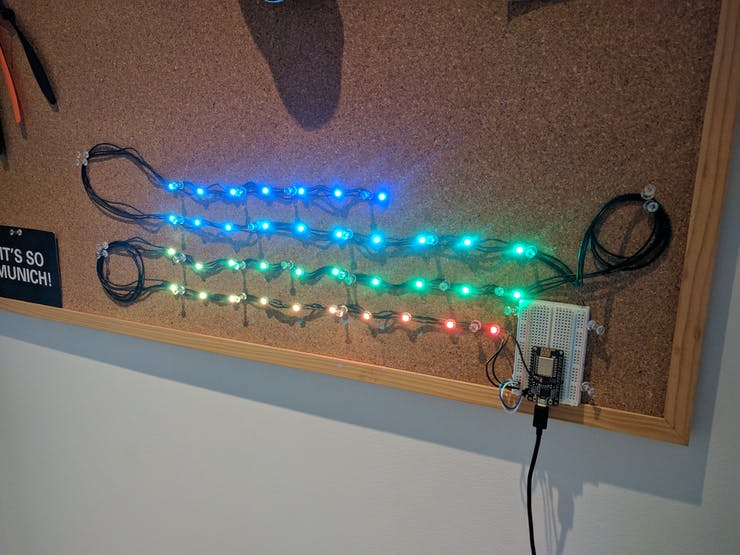
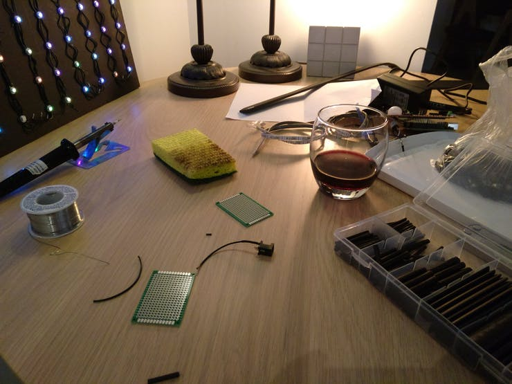
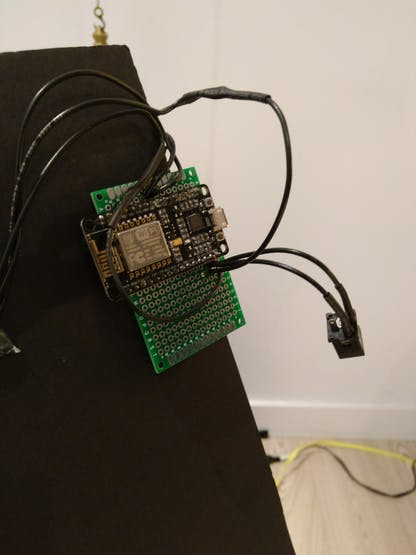
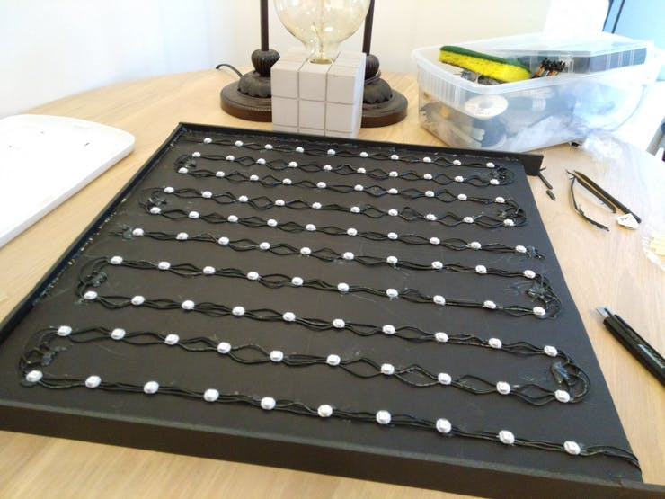
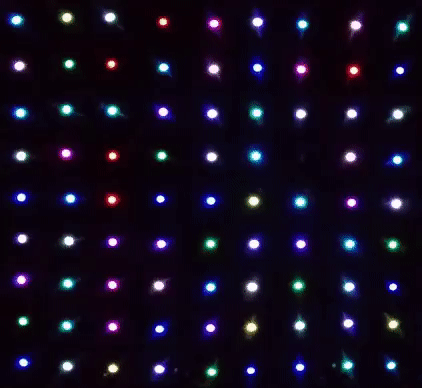
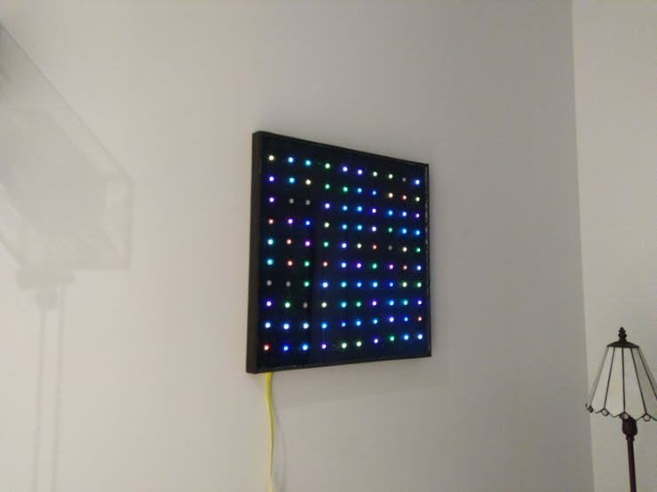

#### 30.12.2017
### RGB LED Matrix Board - "The Litebrite"

> _**5/26/2021 Update**: Added lost photos to project after having recovered them from old documentation.  For the newer version of this project, check out [the post I wrote about the new, larger, and improved board](../2020/2020-02-05-rgb-wall-display-board-part-1.md)._

A little over a year ago, back when I was still in New York, I decided to build an Alexa-enabled low-resolution RGB LED display. What I thought would be a quick project wound up taking a couple of months from start to finish, and even then the final product was not at all what I had been hoping to create. But I learned a lot along the way! Below are photos I took during the process.

I also published the final code (for that board, anyway) to [a GitHub repository](https://github.com/ckuzma/nodemcu-as-arduino/tree/master/Sketches/LED%20Board) I created for NodeMCU+Arduino sketches.

Due to my poor judgement of just how time-consuming and tedious the individual wiring of each individual WS2812 RGB LED module would be, the project took me about three months in total to complete as I would sit down about once a week with a soldering iron to get everything connected together.

However, the the finished product was undeniably fun to look at and watch run through its routines:

