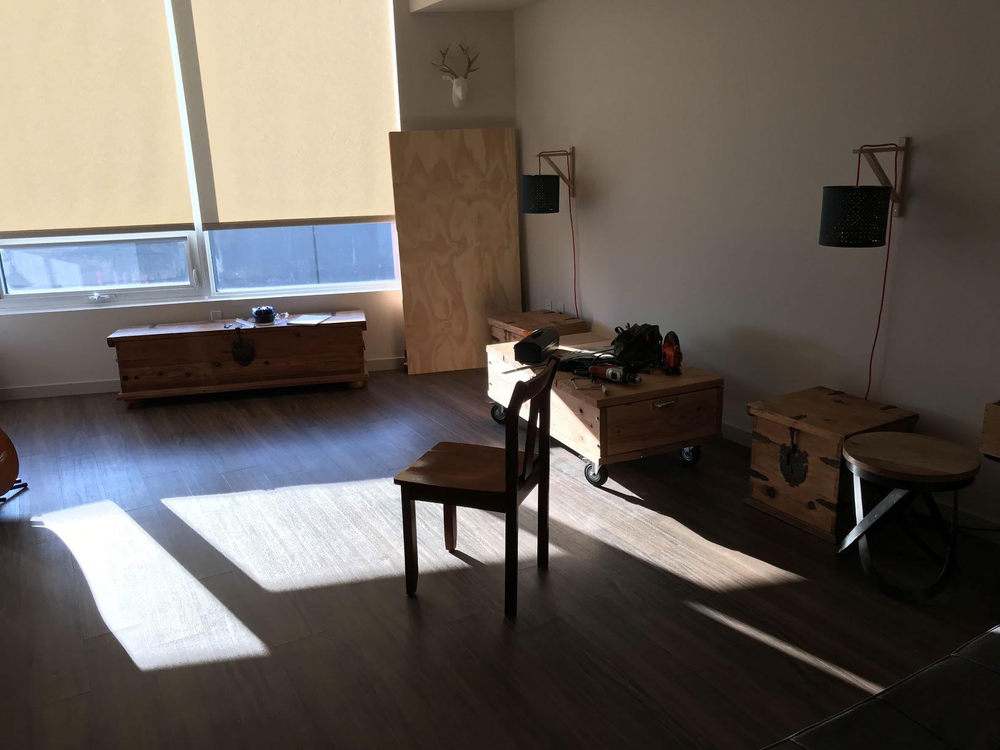
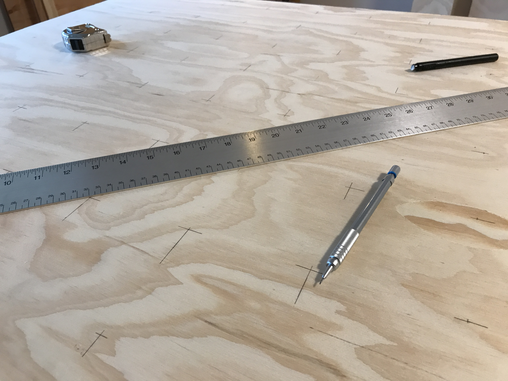
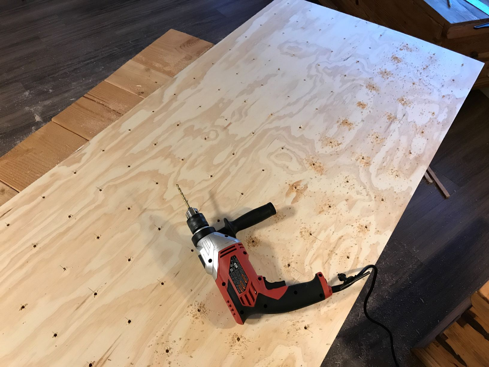
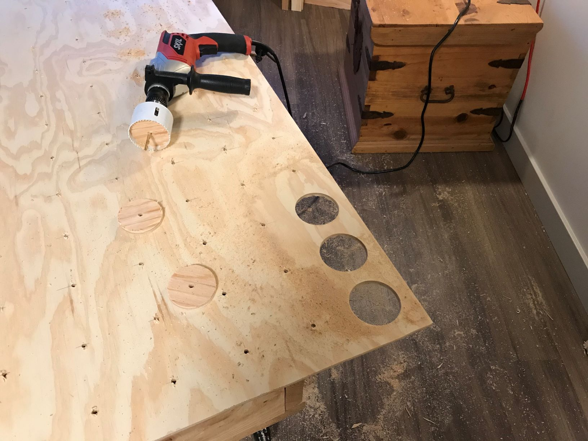
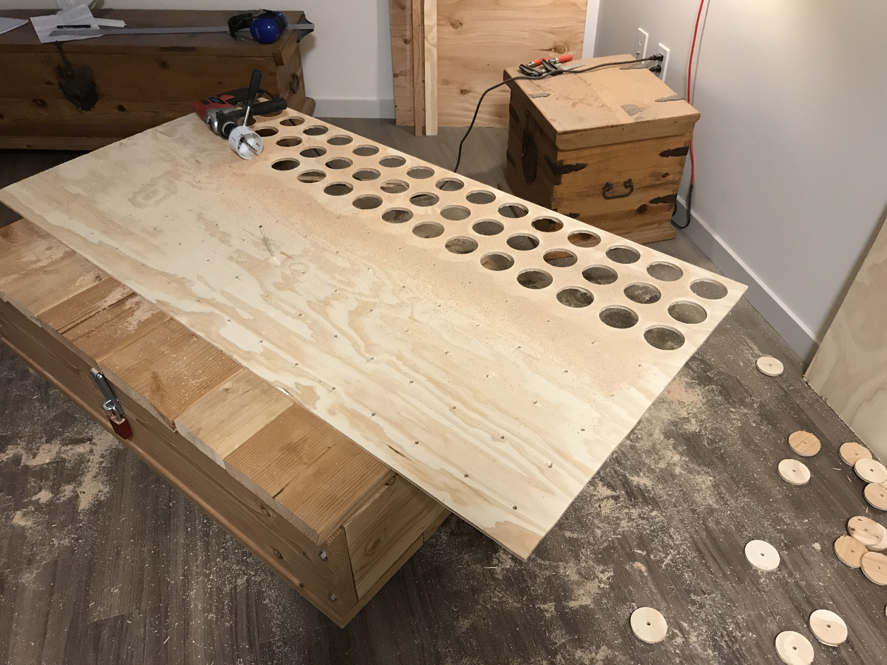
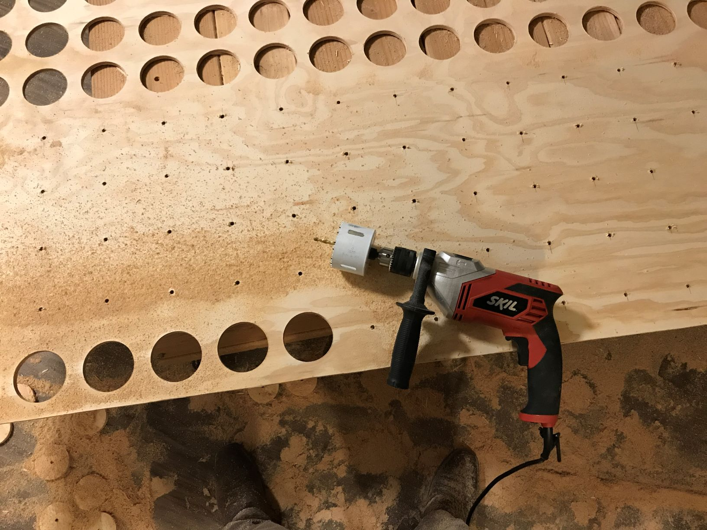
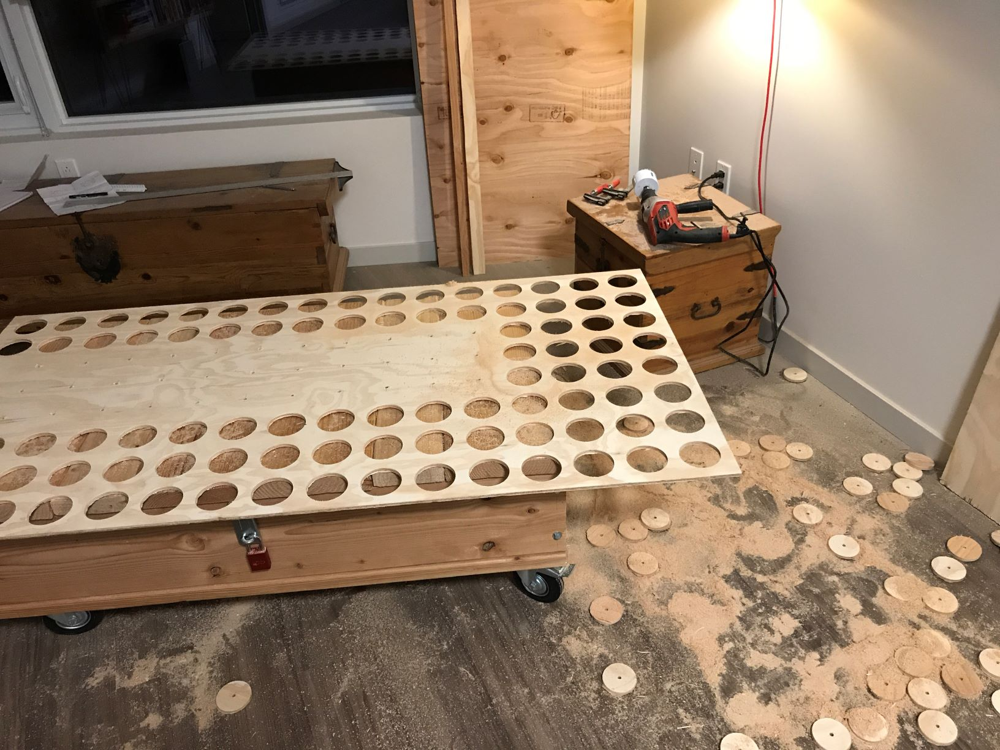
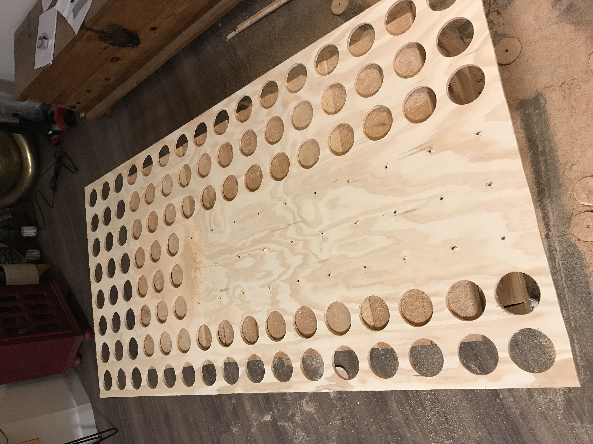
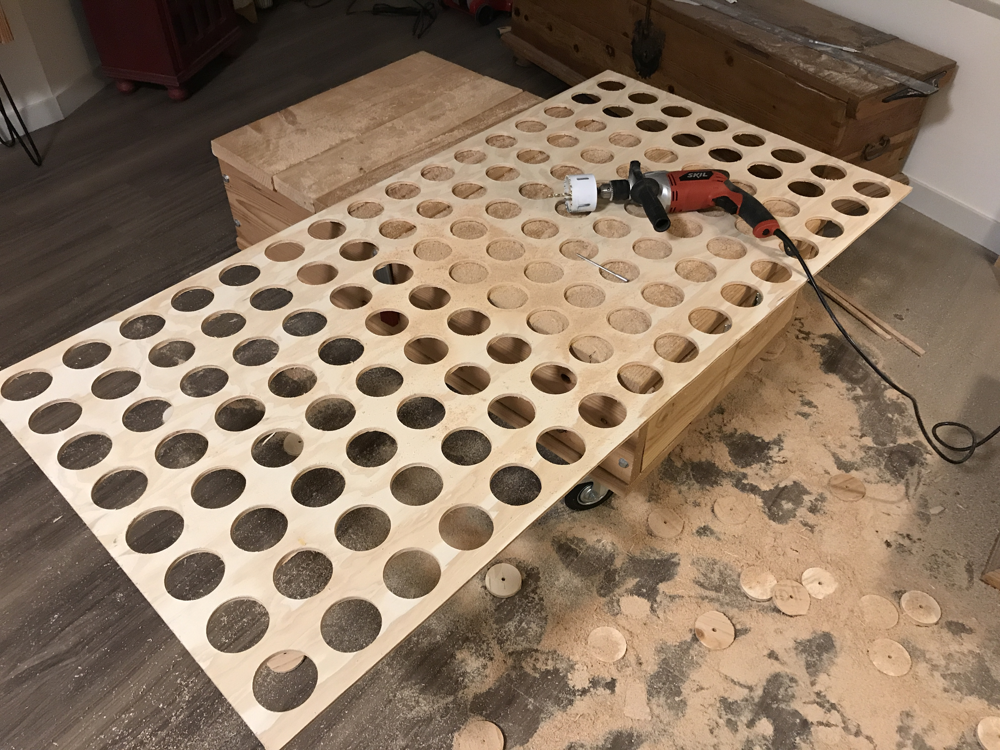
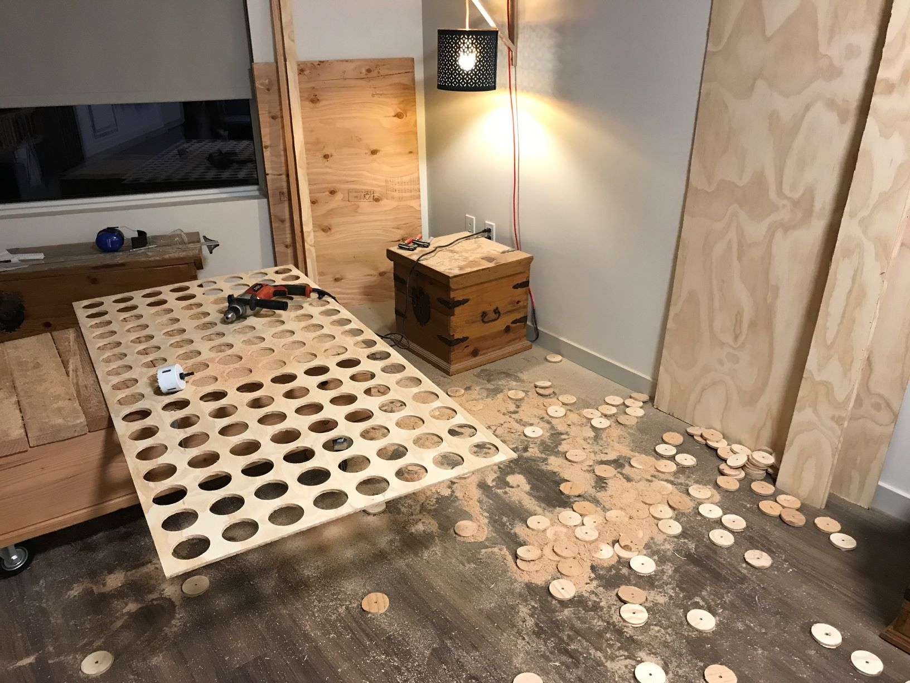

#### 09.02.2020
### RGB Wall Display Board, Part 2: Cutting and Wiring

_[NOTE: This post is incomplete and will be finished when time allows.  For now I just wanted to make sure to share these photos.]_

