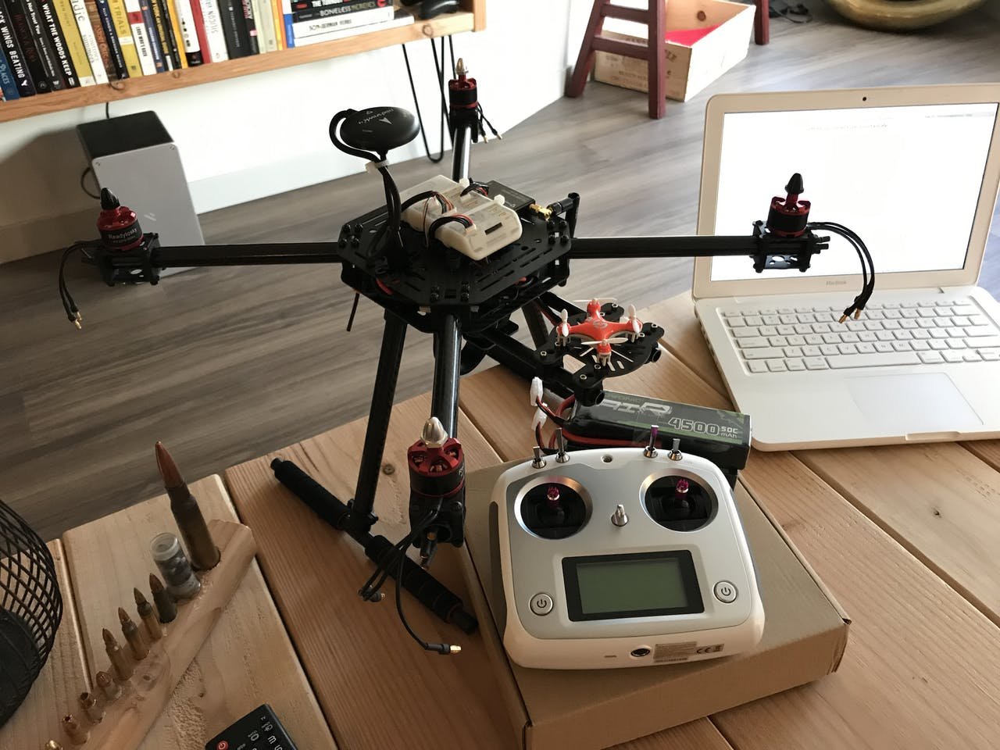
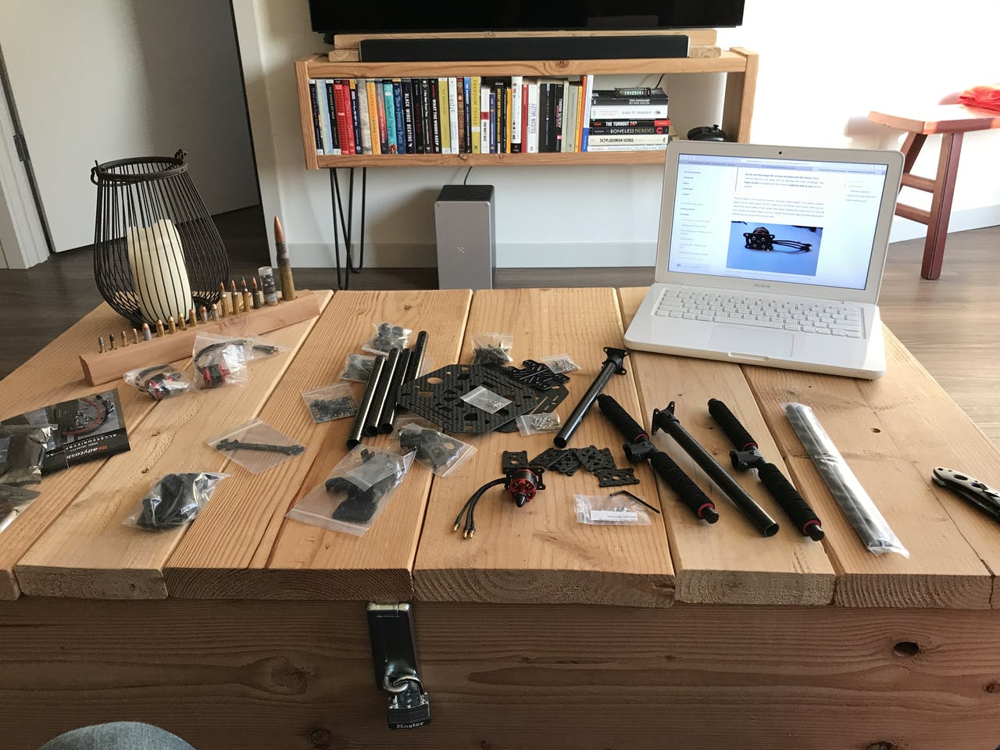
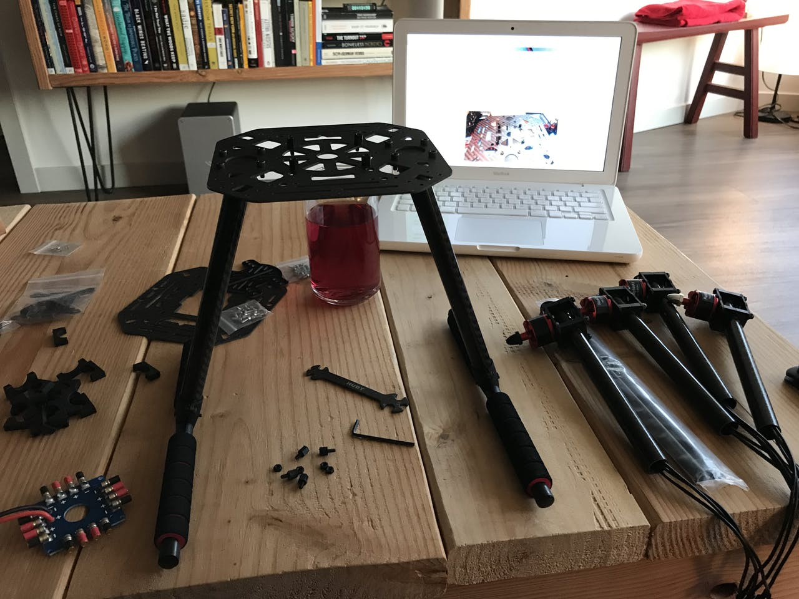
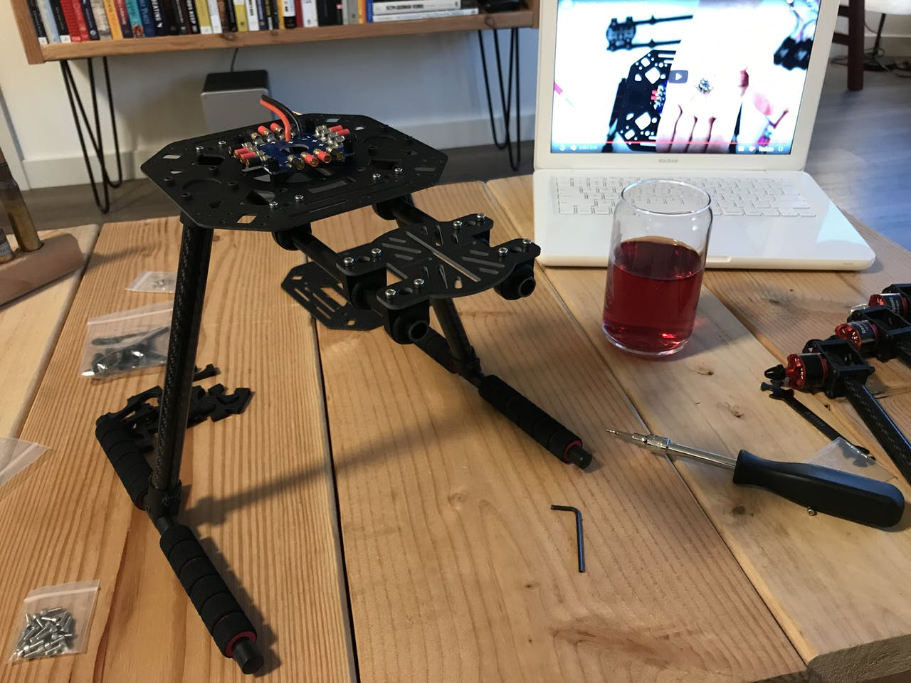
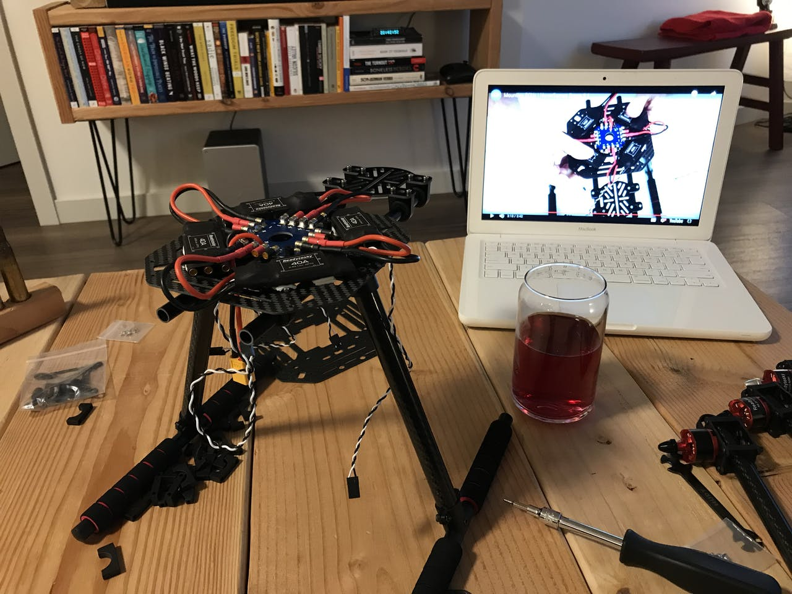
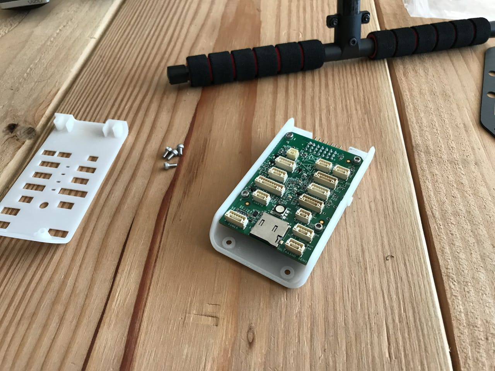
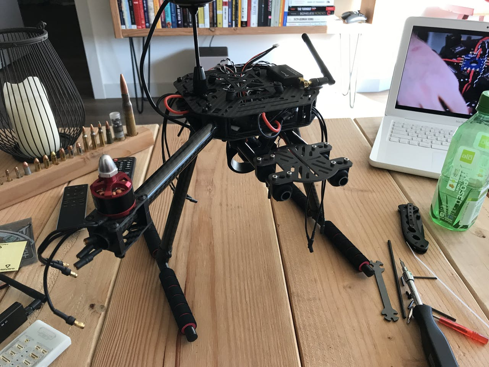
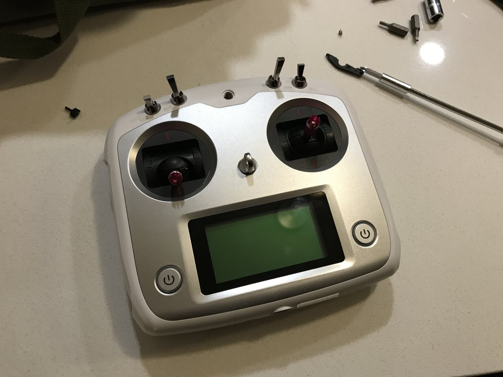
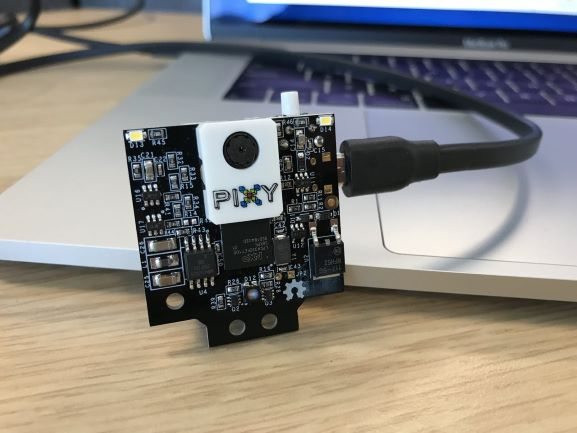

#### 16.03.2020
### NXP HoverGames Drone Build

> Original Project / Contest Submission on Hackster: https://www.hackster.io/kuzma/abandoned-bonfire-detector-91ef7d

The elevator pitch for this contest submission? _"Keep beachgoers safe by identifying still-hot bonfires, even when they've been put put out and covered."_  While the drone still has yet to achieve flight thus cannot even begin to come close to fulfilling that promise, I thought the build process for the drone was interesting enough to warrant sharing nonetheless.

The original purpose of the project was to build a drone that could identify hidden hotspots on the ground (read: improperly extinguished campfires) and report them to a human operator.  Were I to have had some success in achieving this, I would have submitted my drone schematics and code to Hackster.io as part of the [HoverGames Challenge 1: Fight Fire with Flyers](https://www.hackster.io/contests/hovergames#category-547) contest sponsored by NXP.

---

**Project Timeline:**
- 6/4/2019: Project idea submitted
- 7/11/2019: Telemetry kit and HoverGames drone kit ordered
- 7/19/2019: Telemetry kit received
- 7/22/2019: HoverGames drone kit received, PX4 Firmware repository forked
- 8/2/2019: Began assembling drone kit
- 8/4/2019: Finished assembling drone pending final motor wiring and FMU setup
- 8/6/2019: Camera gimbal ordered from AliExpress
- 8/13/2019: Registered drone as sUAS with the FAA, wrote PX4 firmware to FMU and started calibration
- 8/19/2019: Camera gimbal delivered
- 9/3/2019: Stabilized camera gimbal installed, telemetry firmware updated, ESCs calibrated
- 9/9/2019: Removed throttle return spring from TX, affixed FAA registration to the drone in preparation for first flight
- 9/10/2019: First experimentation session with Pixy2 camera
- 11/?/2019: Realized the (il)legality of flying in the area and maiden flight postponed indefinitely
- 12/26/2019: Sent email stating inability to follow-through with the competition and put all of my work for the contest on hold indefinitely
- 1/8/2020: Told by Hackster team to submit project as-is
- 1/26/2020: Submitted contest entry incomplete with the hope that the assembly photos might be useful to someone in the future

**Drone Assembly**

Click to view additional photos

- 
- 
- 
- 
- 
- 
- 
- 
- 
- 
- 
- 
- 
- 

**Transmitter Mod (Throttle Spring Removal)**

Click to view additional photos

- 
- 
- 

Most transmitters designed for aerial R/C vehicles lack a throttle-stick return spring in order to facilitate the holding of a given throttle input value.  Transmitters with this spring actively attempt to return the throttle input to 50% without a counteracting force provided by the operator's fingers.  This makes certain aspects of flying (hovering, landing, maintaining speed) difficult for helicopters, quadcopters, and airplanes alike.

The FlySky FS-i6S provided with the drone kit is something of a multipurpose transmitter and thus has this return spring installed at the factory.  I decided to remove it as I have with other transmitters (which seems to be the same decision taken by the NXP team given the photo of their transmitter in the Gitbook documentation), which was a relatively straightforward process.  Simply remove the four screws hidden underneath the rubber transmitter grips, carefully open up the transmitter case, identify the return spring assembly for the throttle stick (one spring plus two small plastic lever components), and set them aside for future re-installation if so desired.

**Pixy2 Camera Experiments**

_[Note: I never actually completed any actual experiments with the Pixy2 camera, hence why this section is blank.]_