#### 30.03.2020
### RGB Wall Display Board, Part 3: Finished!

> The finished board, mounted above my sofa.  (Ignore the messiness of the spare lumber in the background!)

It's been a long time coming but the light board project is finally complete.  Taking advantage of my newfound time spent sheltering indoors as the world battles the infectious spread of COVID-19, I managed to dedicate three days' worth of full-time attention to the final assembly of my _"RGB Light Board Mk.2"_.  At long last it is mounted proudly in my living room above my couch, ready to run whatever visualization algorithms I can imagine.

But first, a quick recap of how we got to this point:
- Part 1: [The Project Begins](https://github.com/ckuzma/blog/blob/master/posts/2020/2020-02-05-rgb-wall-display-board-part-1.md)
- Part 2: [Cutting and Wiring](https://github.com/ckuzma/blog/blob/master/posts/2020/2020-02-09-rgb-wall-display-board-part-2.md)
- Part 2.5: [Ported Code](https://github.com/ckuzma/blog/blob/master/posts/2020/2020-03-22-ported-code.md)
- Part 3: [Finished!](https://github.com/ckuzma/blog/blob/master/posts/2020/2020-03-30-rgb-wall-display-board-part-3.md) (This post.)

Finishing the board wound up being a lot more labor and time intensive than expected.

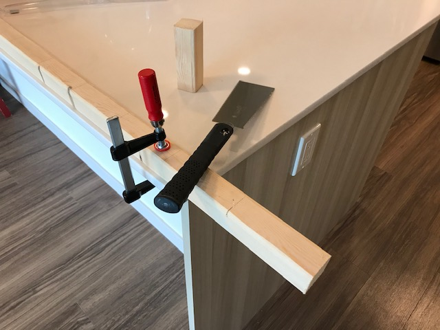
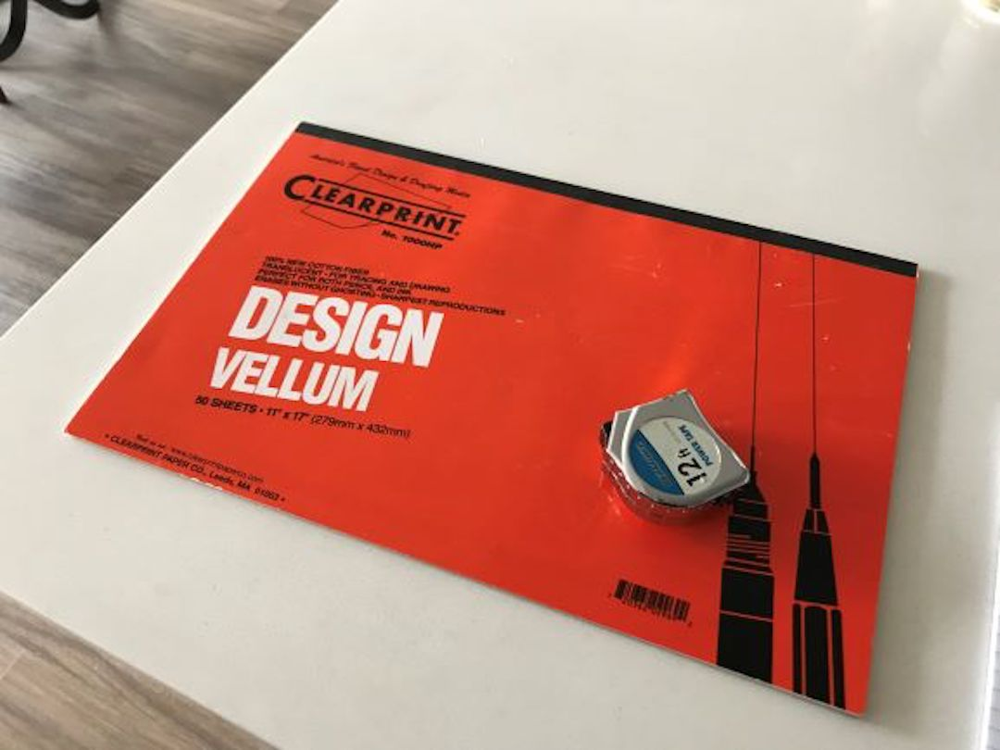
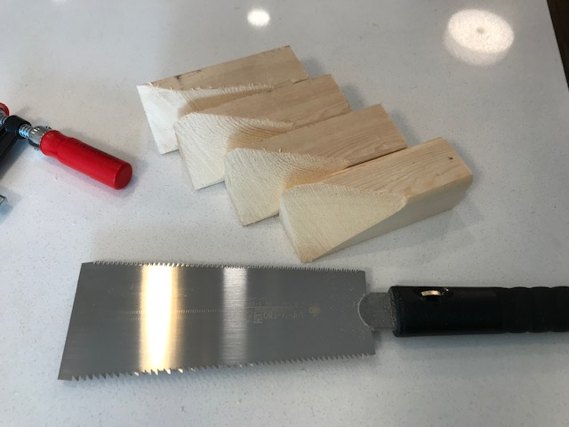
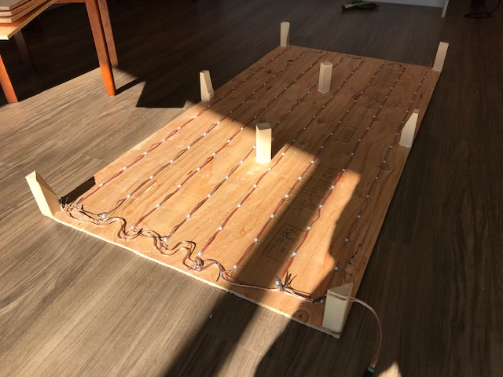
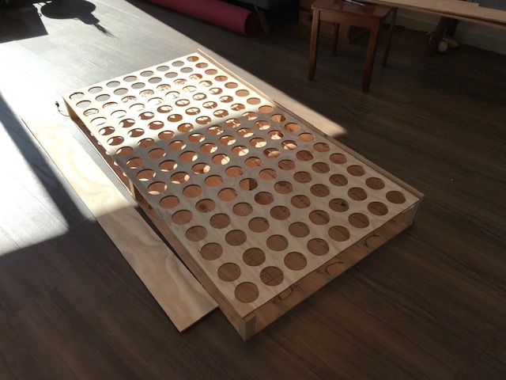

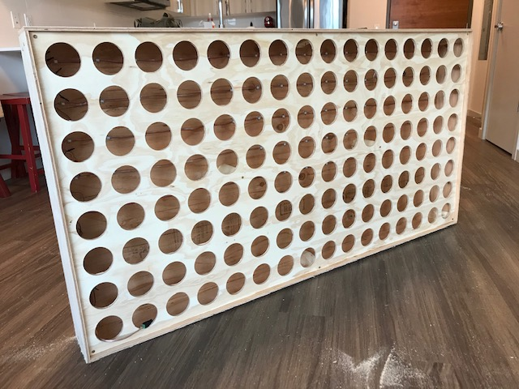
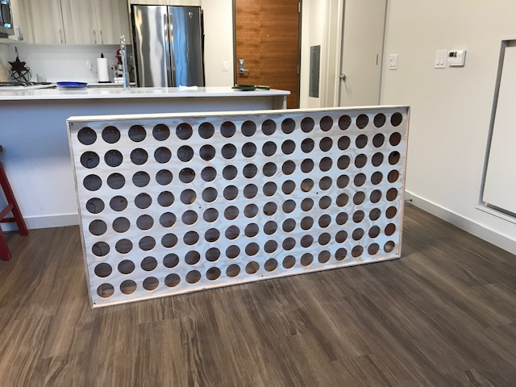
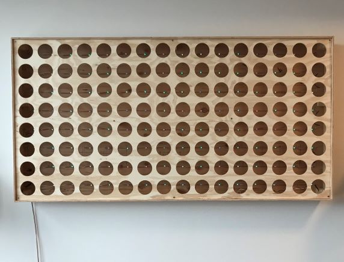

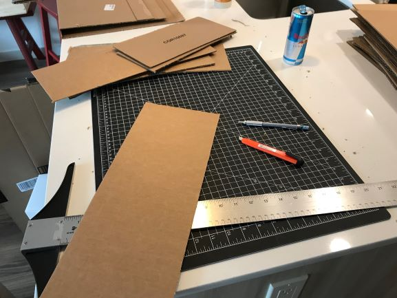
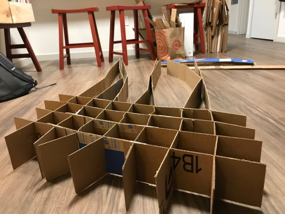
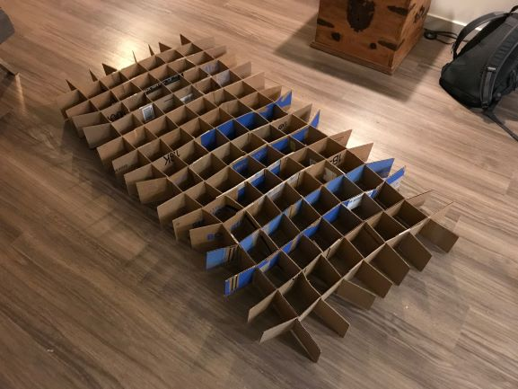
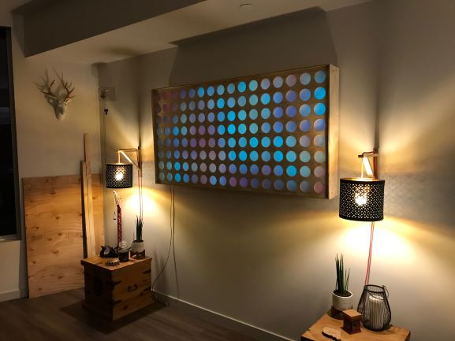
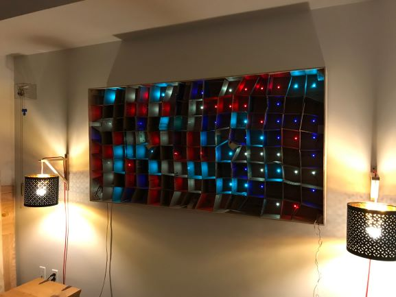
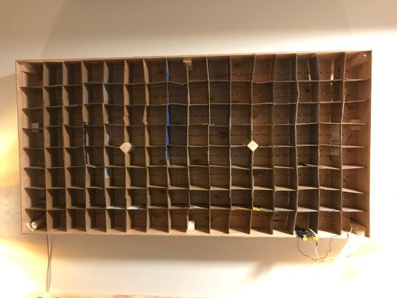
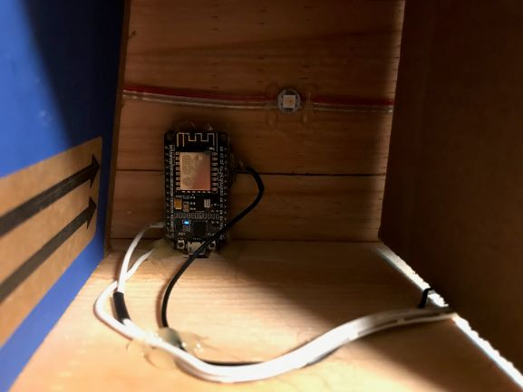