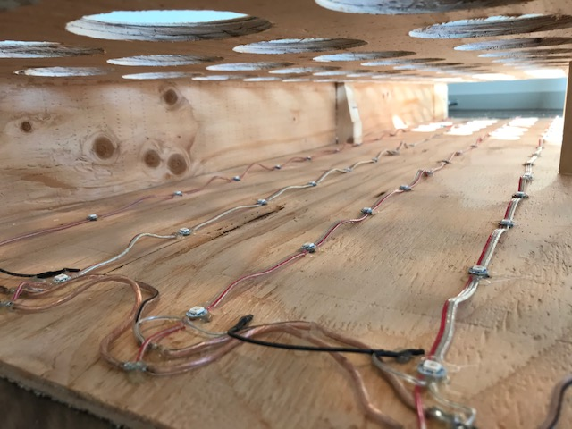
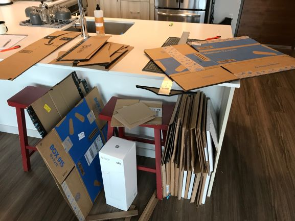

#### 30.03.2020
### RGB Wall Display Board, Part 3: Finished!

> The finished board, mounted above my sofa.  (Ignore the messiness of the spare lumber in the background!)

It's been a long time coming but the light board project is finally complete.  Taking advantage of my newfound time spent sheltering indoors as the world battles the infectious spread of COVID-19, I managed to dedicate three days' worth of full-time attention to the final assembly of my _"RGB Light Board Mk.2"_.  At long last it is mounted proudly in my living room above my couch, ready to run whatever visualization algorithms I can imagine.

But first, a quick recap of how we got to this point:
- Part 1: [The Project Begins](https://github.com/ckuzma/blog/blob/master/posts/2020/2020-02-05-rgb-wall-display-board-part-1.md)
- Part 2: [Cutting and Wiring](https://github.com/ckuzma/blog/blob/master/posts/2020/2020-02-09-rgb-wall-display-board-part-2.md)
- Part 2.5: [Ported Code](https://github.com/ckuzma/blog/blob/master/posts/2020/2020-03-22-ported-code.md)
- Part 3: [Finished!](https://github.com/ckuzma/blog/blob/master/posts/2020/2020-03-30-rgb-wall-display-board-part-3.md) (This post.)

Finishing the board wound up being a lot more labor- and time-intensive than expected.  To start with, I had to create some board/box reinforcement pieces out of a large piece of 2x2.  In an attempt to cut down on the amount of sawdust created (and to hopefully make a cleaner cut), I opted to use my Japanese razor saw for this.

The goal was to create pieces long enough to hold the front face of the box far enough away from the LEDS that their undiffused light output would be properly dispersed so as to fill the circular "pixel" completely.

Some of these pieces had have portions of them removed in order to avoid impeding on the light output of the LEDs nearest to them.

Once cut, I used wood glue and some steel screws to secure them to the back board.

In order to avoid any undesirable sizing mistakes as a result of sloppy cuts on my side pieces, I then attached the front board to these supports / standoffs.  Attaching the side pieces and then cutting them to size would ensure that the end product was a proper sealed box, even if all of the pieces weren't perfectly sized.

The above photo gives a good idea of how this works.  In much the same way as the original inspiration was designed ([Instagram link](https://www.instagram.com/p/BEDY9DbKdc0/) or [direct link to photo copied from link for historical purposes](media/rgb_board_mk2/inspiration_2.jpg)), each LED shines into its own isolated light box to prevent light bleeding.  The light will then enter a diffusing layer, after which it will be shaped via a circular aperture.

With the sides completely installed it was time to get busy with the sandpaper.

Sanded down, the board was now complete and ready to hang on the wall.

I have to admit that I was pretty impressed with how quickly I had this mounted and level above my living room couch.  Despite my better judgement I decided to hang it alone, and it turned out alright despite the box being an awkward 30ish pounds in weight.  You can also see that I added a power input cable in the form of transparent speaker cable.  I used that in order to contribute further to the board's raw appearance.

Finally it was time to work on the diffusing layer.  While my original intention was to use a single sheet of plastic, I found this vellum paper in one of my drawers and realized that it was perfectly suited for the job.

Diffusing layer installed, there was a dramatic change in visual appearance.  The lack of light siloing at this stage resulted in a neat lava lamp-style effect.  I must admit that I was conflicted about whether or not I should proceed further, but I decided that this effect could likely be mimicked in code later and persevered.

For the light boxes I opted to make a waffle-style grid out of interlocking pieces of cardboard.  I repurposed many months' worth of delivery boxes that I had been saving for exactly this purpose.  Seeing it all piled together was quite eye-opening. (Don't worry, anything that remained and wasn't used made it into the recycling bin.)

One of the most tedious parts of this whole project was cutting 4.5-inch wide bands of cardboard and then taping them together to make bands long enough for both the height and width of the board.  Had I knnown how long it was going to take I would have purchased a more hand-friendly box cutter.

When it came time to cut notches into the cardboard bands to enable them to interlock with one another, I found a neat shortcut: clamps held all of the bands together, and then a saw (in this case my Japanese razor saw again) performed the notch cuts.  Despite creating a fair bit of cardboard dust, this method was significantly more speedy than attempting to struggle with the box cutter.

