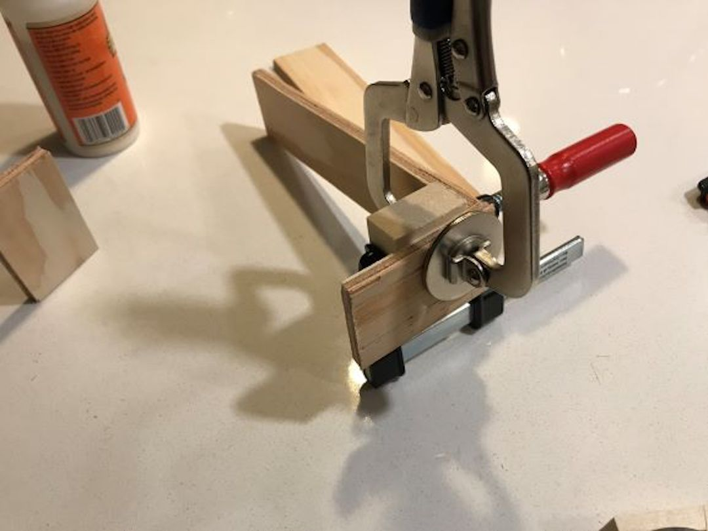
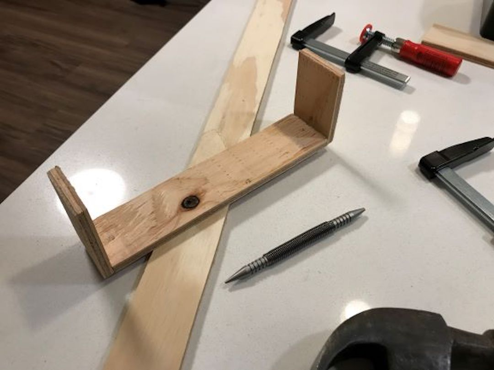
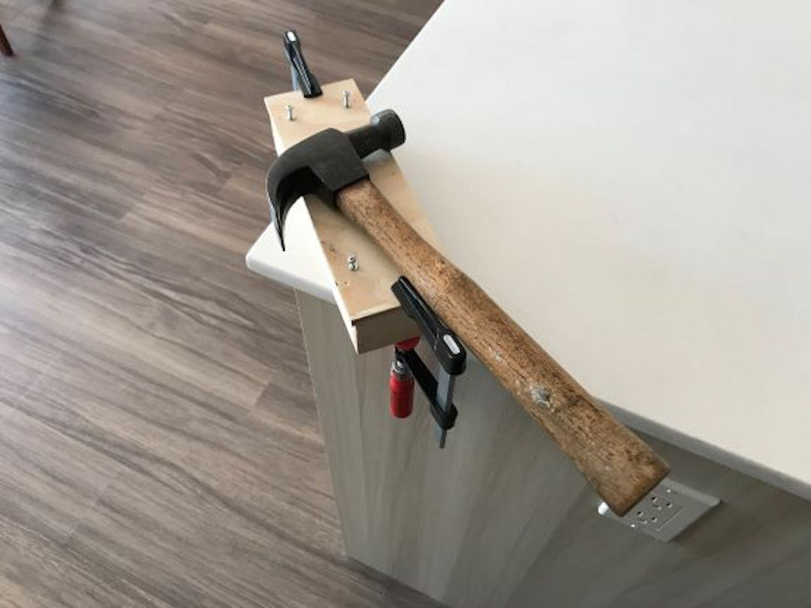

#### 08.04.2020
### Nixie Tube Clock Box Case - Part 1

> Two clocks using "outdated" technology: one fully mechanical, the other using Soviet-era vacuum tubes as a display medium.

A few days short of exactly a year ago, I purchased a Nixie tube clock to give to my mother on Mother's Day 2019.  The clock I selected for her was housed in a beautifully finished wood base complete with multiple number-transition effects and selectable brightness levels.  Despite my best attempts to resist the appeal of the warm-glowing aesthetic, I soon found myself desiring my own clock.

However I refused to purchase a pre-built clock.  No, if I was going to invest in this over-priced, undoubtedly outdated, and wholly unnecessary piece of technology... I would build my own clock.  Or a good chunk of it, anyway.  With that in mind I found the wonderful [NCS312 Arduino shield](https://gra-afch.com/catalog/diy-kit-for-nixie-tubes-clocks/diy-kit-for-shield-nixie-tubes-clocks-in-12-ncs312/) designed around the IN-12 Nixie tube.  Made by [GRA & AFCH](https://gra-afch.com).

Mine came fully assembled-- I purchased it on eBay instead of directly from the seller-- and required only an Arduino and 12-volt power supply in order to function.  I paired mine with an Arduino Mega 2560 so as to potentially take advantage of the shield's GPS time-sync capability, which wasn't supported by the Uno's smaller onboard storage and memory.

The board itself is very nice to look at and I found myself staring into it idly even thought the IN-12 tubes on it weren't quite as visually dynamic as the IN-14 tubes found on my mother's clock.  Eventually, though, I began to worry for the clock's safety.  It needed a housing to protect the exposed circuitry and tubes from damage should any curious visitors decide to examine it too closely.

Just this past week I (finally) took matters into my own hands and put some of the spare plywood from my [RGB Wall Display Board](2020-03-30-rgb-wall-display-board-part-3.md) project to work.  My first impulse was to create a sandwich of plywood layers glued together, each one cut to fit around the electronics at its respective depth.  This would essentially be a copy of [the official plywood case](https://gra-afch.com/catalog/cases-for-nixie-tubes-clocks/plywood-case-for-in-12-nct412-nixie-tubes-clocks) offered by GRA & AFCH, but without the wallet-shock of shipping costs from Eastern Europe.

That idea was vetoed when I realized the likelihood of making a properly-fitted case would be very low if I were to utilize only the (hand) tools available to me at the time.  It was then that I noticed that there was a new official _stand_ available for my clock in the shape of [a bent piece of polycarbonate](https://gra-afch.com/catalog/cases-for-nixie-tubes-clocks/acrylic-stand-for-in-12-nixie-tubes-clocks-nct412/).  Shipping costs, again, made this an unjustifiable purchase.  (Though I'm keeping this design in mind should I ever ask my friend [James](http://jameschristophercooper.com/)' workshop ([Precursor Design](https://precursor.design/)) to help me manufacture a more professional clock case.)

As someone who likes to consider themselves particularly handy, I grabbed some clamps, wood glue, nails, and some other tools and got to work.  My goal: build a simple box with an open side into which I could install my clock.  (Embellishments optional.)

---
**The Build, Part 1**

My first course of action was to attach together the sidewalls of my box.  I used a spare piece of (carving) wood that I knew was true in order to create (what I thought were) 90-degree angles.  I applied wood glue to both contact surfaces, clamped them together in the right position, and then drove small wood into the pieces to secure them.

The reason for the nails was so that I could repurpose the clamps instead of waiting for the glue in each corner to dry.  If that didn't make it obvious enough: I don't have enough clamps to assemble my sidewall structure in one go.  As a result the nails were necessary so that I could move the clamps to where they were needed next.

The nails I was using had very narrow heads on them and could thus be driven below the surface of the wood using a spring-loaded nail set tool.  This was my first time using the tool, hence many of the nails were (accidentally) driven to a deeper depth than others.

It wasn't until all of the sidewalls were attached to one another that I realized blindly assuming all of my jigsaw cuts to make the walls-- done about a month ago, at the finale of another project-- weren't quite accurate.  As a result, one of the shorter end pieces is just a bit longer than the other.  Something that (hopefully) only I will notice once everything is put together.

I left my completed walls out overnight for the glue to cure completely before moving on to the next step.  This was done out of an abundance of caution more than anything else, as I didn't want to risk tearing apart my box in the off chance that the nails were the only components providing structural rigidity at that point in time.

The next morning-- today, actually-- I test fit my clock inside of its new box.  While the box itself could undoubtedly have been made less long, I think that the extra space will allow for the fitment and attachment of a faceplace should I ever choose to install one.

As was expected, I noticed that the back side of the (incomplete) box wasn't actually flat.  This would make securing the back panel rather difficult, especially without an adequate number of clamps to hold it while the glue dried.  Even then, it would cause the back panel to warp, which would result in difficulties monunting the clock inside.

Thankfully I'd picked up just the tool for the job: a small hand planer.  This was its official christening and I'm happy to say that it performed exactly as I'd hoped.  With that out of the way I applied glue to the back edges of the walls, the contact points on the back panel, tightened the two together with clamps, and drove in some nails.

With my great-grandfather's trusty hammer laid on top for extra compression weight, the box is now sitting while the glue cures.  Up next: removing the excess wood from the back panel, sanding it down to a nice finish, and then drilling a hole for the power cable.  Things will probably stay in this state for a while as I first need to acquire an L-shaped plug for the power cable in order to facilitate the clock's fit within the box.