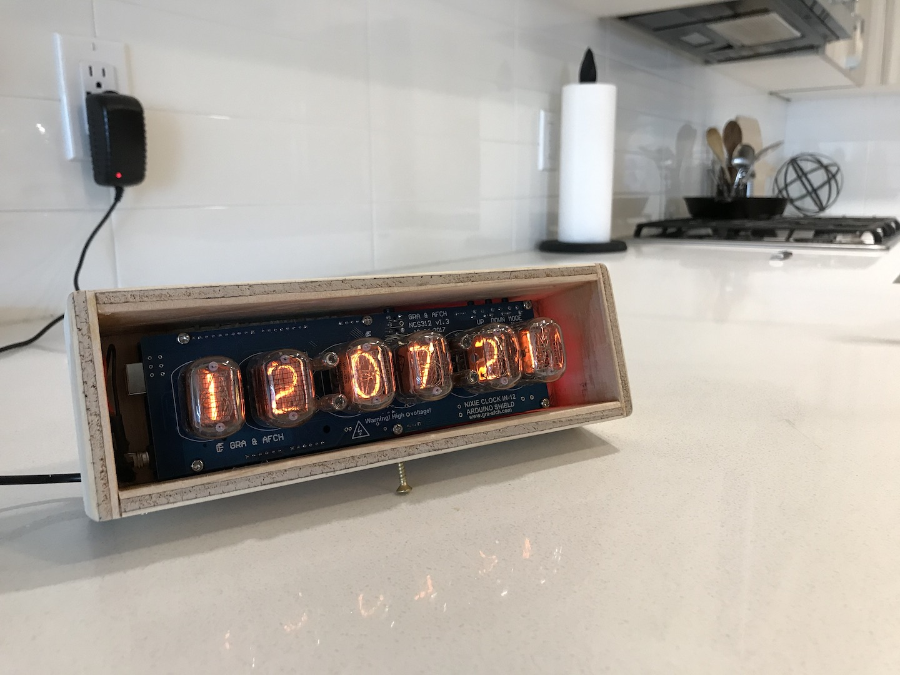

#### 18.04.2020
### Nixie Tube Clock Box Case - Part 2

It's finished!  While I wouldn't consider it especially pretty, it is much more of a complete "clock" than it was before as a raw, exposed circuit board.  Eventually i'd like to see the electronics moved into a case made out of laser-cut wooden slices but for now this will do.

As detailed in [my previous post](2020-04-08-nixie-tube-box-case-part-1.md) about the build, I began the second phase of work with a complete (but very rough-around-the-edges) box.  The majority of the work, then was to cut-to-size, plane, sand, and install a power cord into the box.  Below you can see my counter as I began this work.

Unfortunately I wasn't quite as careful with my razor saw as I should have been.  As a result there are a few small cuts where the saw's teeth took a chunk out of my box.  I attempted to smooth these out as best as I could with a bit of sandpaper.

Lastly, my box needed a small stand to elevate the display upwards toward the viewer.  I used a spare brass-colored wood screw more or less centered in the bottom of the case to do just that.

And that was it!  Downsides of the box as-is include an inability to set the time without removing the circuit board from the box, and a considerable amount of undesired light emission still happening as a result of the too-wide dimensions of the box.  Both will hopefully be solved in a more form-fitting case sometime in the future.

I also made some changes to [the official firmware](https://github.com/afch/NixeTubesShieldNCS314), which you can find in my fork of the repo linked below.  (Note that I fixed the typo in the original project's name.)  Most notable are the removal of the clock's annoying start-up routine (LEDs flashing colors, a loud song, etc.), the disabling of flashing the date intermittently, and the disabling of the hour/minute/seconds colon divider flashing.  All of which can be re-enabled thanks to the addition of handy boolean values located at the top of the source code to control the behaviors.

- https://github.com/ckuzma/NixieTubesShieldNCS314