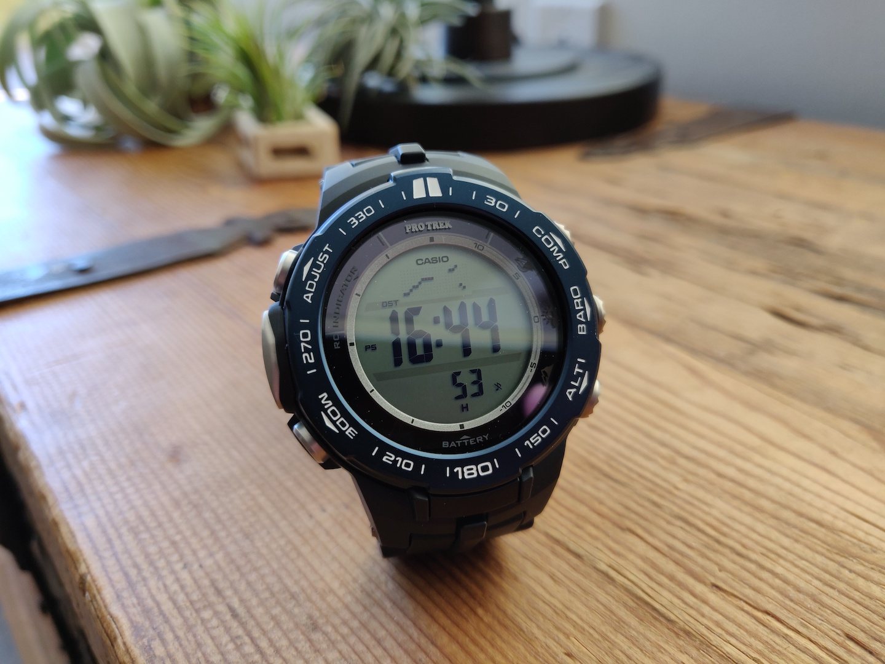

> This is an in-progress article.

#### 08.07.2020
### Casio Pro Trek PRW-3100 Review

**Introduction**

I really like wristwatches.  This might come as a bit of a surprise, given that historically I dedicated a 

[Invicta Review](../2011/2011-12-30-invicta-3449-review.md)

[Fossil Abacus](../2013/2013-02-19-more-closet-treasures-fossil-abacus.md)

**Multifunction Watches Owned (Chronological Order):**
- Radio Shack 63-5021 (Calculator Watch) (From 1999 according to a manual I found)
- Casio W-736H-2AV (Vibrating Alarm)
- Casio PRT-40 (Pro Trek w/ABC Sensor)
- Timex TMX2 (MP3 Player)
- Casio WQV-3 (Color Camera) (_Also worn by Sir Paul McCartney!_)
- Misfit Shine (Activity and Sleep Tracking)
- Pebble (Phone Notifications)
- Citizen JY8035-04E (Solar, Atomic, UTC, Slide Rule)
- Casio PRW-3100YB-1CR (New)
<!---
PRT-1GP = GPS watch w/big lithium battery
--->