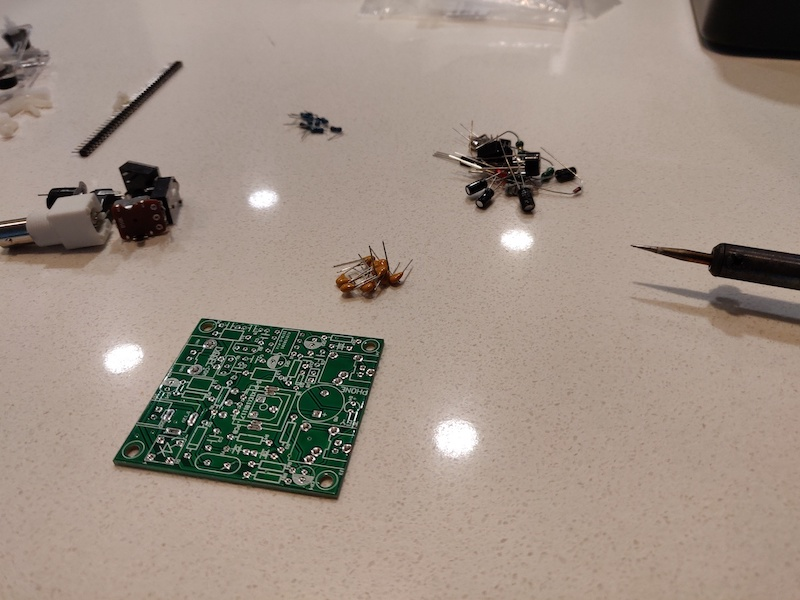
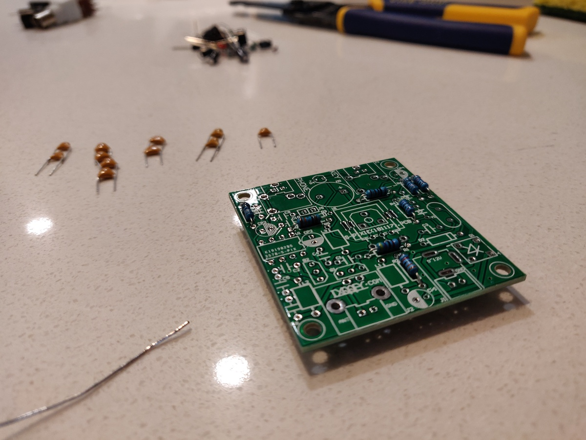
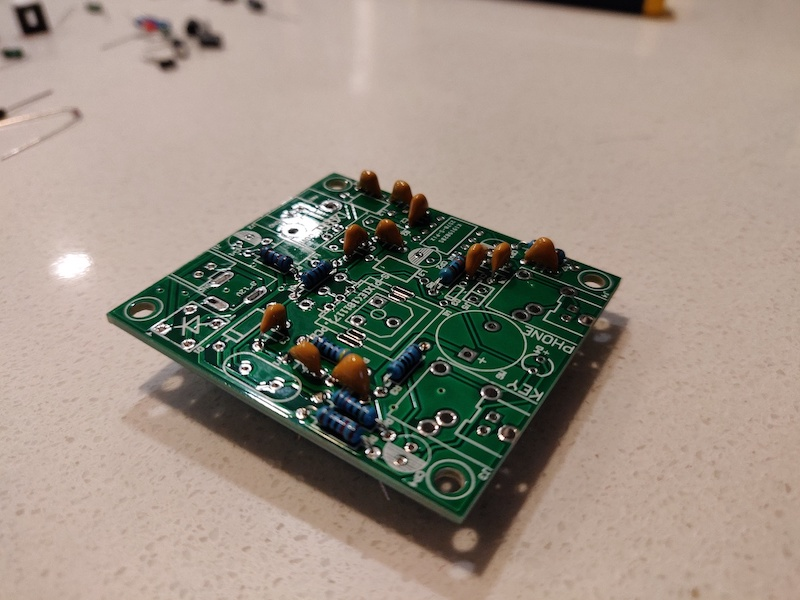
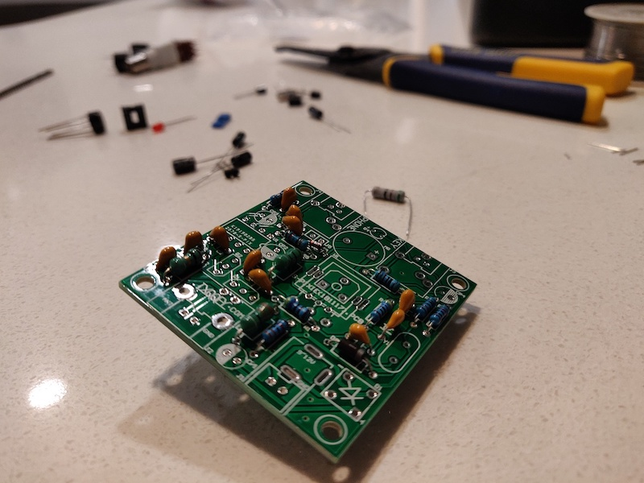

#### 12.07.2020

### Pixie QRP Transceiver Assembly (Part 1)

**Background**

One of my accomplishments during the COVID-19 lockdown was to study for, take, and pass the Technician-class amateur radio license exam.  Once my call sign was officially assigned by the FCC a few hours later, I immediately began making voice contacts on the local VHF radio repeater.  After all, being able to do so was the predominant reason for why I'd bothered to get licensed in the first place; I'd been listening to the local nets for a couple of months by that point using an RTL-SDR device connected to my computer.

However I was not satisfied to rest on my laurels, and the door to the vast world of radio communications hadbeen thrown wide open.  Well, or so I thought at first.  I quickly noticed via the [ARRL Frequency Charts](http://www.arrl.org/graphical-frequency-allocations) that I was limited in scope to what bands I could use with my Technician license, especially in the HF (high frequency) bands.  (This was the moment that I realized I should have at least attempted the General-class exam immdiately following my success with the Technician exam.)  Not to be dissuaded, I identified the section of the 40-meter bands where I was allowed to operate a CW (Morse code) station.

Why 40-meters?  The answer to that is quite simple: because that's the frequency range supported by the Pixie radio transceiver.  That's important for one very simple reason: it's extremely budget friendly.  More specifically, the Pixie kits I purchased cost a whopping $7.40 including tax and shipping.  That's undoubtedly one of– if not _the_– cheapest ways to get into amateur radio communications from HF all the way to UHF.  Of course, it is a CW-only radio, but hey... I needed something else to study anyway.

With that in mind I placed an order for three Pixie kits on eBay.  I figured it couldn't hurt to have a spare, plus hoped one of my local friends would decide to try their hand (literally) at CW radio with me.  The kits arrived a couple of weeks later and I immediately got to work assembling one of them.

**Assembly**

The Pixie radio is sold, predominantly, as a kit.  For a few more dollars it can be purchased fully-assembled but... where's the fun in that?  I plugged in my soldering iron and began to inventory all of the included pieces.  A few components came with wildly bent leads but all of could be straightened by hand and, perhaps more importantly, all of the necessary parts were accounted for.  I was pleased to see that the kit I'd ordered included both a piezo buzzer and an LED to be used as aids for morse code transmission.  (Some kits don't feature those parts.)

The instructions– not included but easily found on the internet– suggest beginning with the lowest components (resistors) and working up to the biggest components last (e.g. the Q9 antenna connector).  The hardest part was making sense of the resistor values, as the colored identifying bands weren't completely color-accurate.  Hopefully everything works down the line.

After installing the smallest resistors, I moved on to the ceramic capacitors.  These were marked with numbers and much easier to identify than the resistors.

It was at this point that I realized: I don't actually have any wire cutters.  Sure, my wire strippers (seen in the background) can cut loose wires, but they're not any good for cleaning up the backside of through-hole circuit board component leads.  I was effectively blocked from continuing further as the component leads were becoming a forest on the backside of the circuit board.  Seeing how I'll undoubtedly use them again in the future, I invested in a remedy for the situation with a quick Amazon purchase of some diagonal cutters (also known as wire cutters).

So construction shall have to resume another day, after I manage to clean up the component leads.  Total elapsed build time as of this point: 65 minutes.  However that time includes an agonizing 7 minutes spent removing the protective paper layer off of the polycarbonate housing pieces, so I'm hoping to still complete my build in under two hours, which appears to be the average for this build.