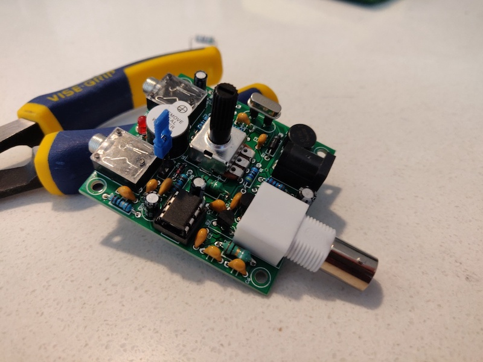
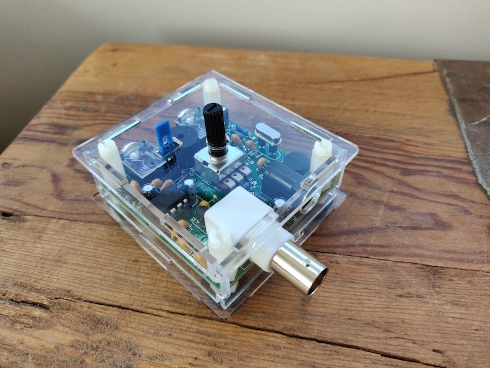

#### 13.07.2020

### Pixie QRP Transceiver Assembly (Part 2)

[_(See Part 1 here.)_](2020-07-12-pixie-transciever-pt1.md)

**Assembly**

The wire cutters arrived!  And while the pair I ordered isn't the most precise tool in the world, they'll work for my purposes.  With forest of component leads dealt with, I continued to mount parts onto the circuit board.

A modification I made was to install SIP sockets where the crystal would otherwise be affixed.  This allows me to swap out the crystal oscillator included with the kit for one of my own choosing.  Seeing how the included crystal oscillates at 7.023 MHz, sticking with that would only allow me to tune within the range of about 7.016 to 7.030 MHz.  Given that a Technician is [only allowed to operate](http://www.arrl.org/graphical-frequency-allocations) CW stations within the 7.025 to 7.125 MHz range, the included crystal would limit me to a very narrow couple of transmit frequencies.

With the polycarbonate case assembled and the board secured inside, my transceiver was complete!  A quick power test resulted in no "magical smoke"– a good sign– and I was able to hear faint background static on the phone jack using a pair of headphones.  Shorting the key jack with a pin resulted in an audible tone from the onboard buzzer in addition to lighting up the LED, indicating that it, too, was functional.

**Thoughts**

Of course it wasn't until my Pixie was "complete" that I noticed a design flaw: the SIP sockets I installed to facilitate the swapping of oscillator crystals aren't doing a lot of good when the crystal is inaccessible behind a polycarbonate panel.  Perhaps I'll drill holes in the top of the case to provide access, but for now I'll leave it as I am nowhere near ready to start coding morse on my own.  Total build time to reach this point: 1 hour and 37 minutes.

Up next is the construction of a basic antenna and– hopefully– the successful capture of another station's [QSO](https://en.wikipedia.org/wiki/Contact_(amateur_radio)).  Until the necessary parts arrive, however, I'll continue to focus on learning Morse code using the [Koch method](https://en.wikipedia.org/wiki/Koch_method) on [LCWO.net](https://lcwo.net).  With a bit of luck I'll be able to copy "full speed" code in a couple of months from now and, sometime after that, transmit my own messages.