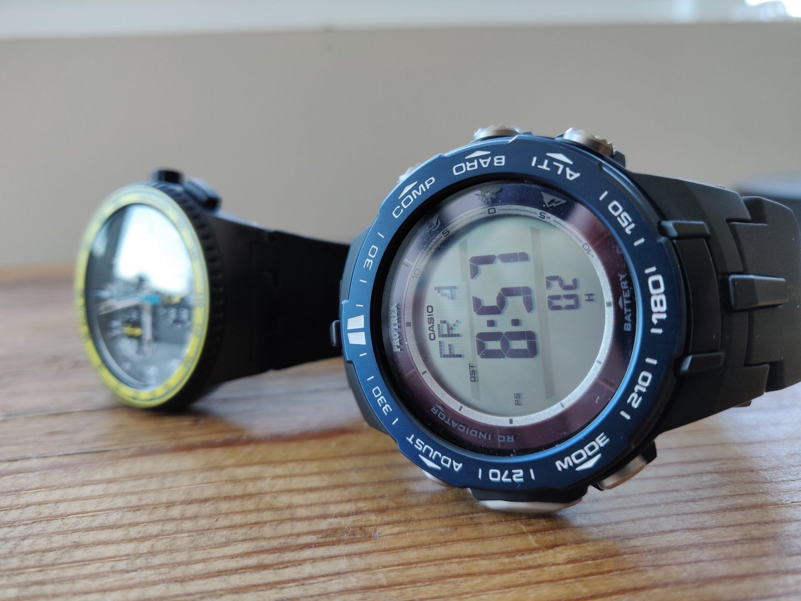

#### 31.08.2020
### Casio Pro Trek PRW-3100 Review

**Introduction**

Let's cut straight to the chase: the Casio Pro Trek PRW-3100 is is _not_ a member of high-brow [haute horology](https://www.watch-wiki.net/index.php?title=Haute_Horlogerie).  Nothing about it resembles those meticulously-polished, might-as-well-be-bespoke timepieces with their eye-watering price tags and tuxedoed brand representatives.  Where those _other_ watches might hope to find themselves adorning the wrists of VIPs while they're being photographed by paparazzi, the Casio being reviewed today merely hopes to return home from an outdoors adventure in one piece.

So who, then, is the PRW-3100 targeted at?  If it's not trying to weasel itself into what one might think of as the typical watch enthusiast's collection, then who is buying it, and why?  In this review we'll hopefully figure that out.

**Unboxing**

Haute horology, this is not.  The PRW-3100 comes in one of the most unpretentious and unassuming forms of packaging out there: a cardboard box.  Credit where it's due, it is _nice_ looking cardboard, especially with the minimal splash of forest green with logos for Casio and Pro Trek in negative on it.

Upon opening the top panel of the box I was greeted with what might qualify as the thickest user's guide to ever accompany a wristwatch, plus a small pop-up plackard detailing the features of Casio's Triple Sensor.  At this point a cardboard flap was exposed which gave access further into the box.

Lo and behold, it turns out that the PRW-3100 comes in more than just a cardboard box!  (Looking at you, Timex.)  Though with an average price of around $200, perhaps this should be less of a surprise and more of an expectation.  Nevertheless it is a nice addition to the overall package, and the minimal decoration matching that of the exterior cardboard box is tasteful.

The box itself is made out of a wood composite, and only contains the watch in a clear plastic sleeve surrounded by a thick paper holder.  (Pretty boring stuff, hence the lack of a picture.)  A hunch tells me all of the packaging has recycling / composting in mind which seems rather fitting given the types of activities an owner of this type of watch is likely to engage in.  But more on that later.

**Design**

The PRW-3100 is small.  Or, at least compared to the PRT-40 that I owned two decades ago, it is.  Sitting next to my Swatch SUSB404 (pictured above) and the new Pro Trek is obviously a bit bigger, with its rugged protruding bezel, accidental-button-press-protectors, and fixed-angle strap attachment points being responsible for most of that extra bulk.

Taken entirely on its own and the Pro Trek looks... functional.  The colors are admittedly a bit of a mishmash, with the black band, silver buttons, blue bezel, dark purple sub-bezel, green-ish face, and white markings and labels all present here.  That being said, _most_ of Casio's Pro Trek line are a bit garrish in terms of color choices, and when compared against those this particular model appears nicely restrained.  (And let's not forget that G-Shock exists which often combines both garrish colors _and_ outlandish designs.)

The multi-segmented LCD display looks undeniably old-fashioned amongst modern smartwatches, yet looks right at home next to nearly any G-Shock, Suunto, Garmin or other watch aimed at the outdoors enthusiast.  The top of the display features a small array capable of displaying text such as the current mode or a graph of line (barometric pressure trends) or bar (altitude history) type.

The back of the watch has a steel case back held in place with four screws.  These are hidden underneath two plastic band-aligning pieces that are somewhat integral to the design of the watch.  These pieces help provide a more natural wrist-shaped contour to the back of the watch but aren't strictly necessary.  In fact, they would actually need to be removed should the band ever be swapped out for something unofficial.  That's slightly annoying in the same way that Swatch watches use their own proprietary band.  Thankfully the resin strap found here is both comfortable without feeling "grippy."

The left side of the watch features the "AB" part of the ABC sensor, along with two buttons.  These metallic (presumably steel) buttons feature an embossed sunbeam design and have chamfered edges lending to a more sophisticated look.  The steel sensor cap, on the other hand, sports a simpler brushed look with two visible screws and two inlet vents inside of which a steel mesh can be seen.  Where older watches (such as the PRT-40) located their magnetic compass sensor in this position, the PRW-3100 instead has (presumably) both the temperature and barometric sensors.  There is no external indication as to where the sensor for the compass has been relocated.

It's all buttons on the right side of the device.  The buttons feature a rugged diamond-shaped knurling for non-slip actuation with wet hands or gloves.  Clearly visible in this photo are the body protrusions that surround each button by about 1/3 on the back side to prevent their accidental activation.

The band features a simple, slightly-oversized buckle that tastefully includes "Casio Thailand" embossed on the underside.  No gaudy logos-just-because ala [Invicta](../2011/2011-12-30-invicta-3449-review.md) here!  ...mostly.  The band still sports massive "PRO TREK" raised lettering on the band, but thankfully this is mostly covered by the excess strap when it is being worn.

**Features**

- Solar charging
- Radio-controlled atomic time synchronization (USA, UK, Germany, Japan, China)
- Pro Trek Version 3 Triple Sensor ("ABC")
    - Altimeter
    - Barometer
    - Compass
    - Thermometer (which is somehow always forgotten)
- LED backlight
- Modes
    - Sun up/down schedule based on latitude and longitude
    - Max/min records for altitudes and ascent/descent rates
    - Stopwatch
    - Timer
    - Alarms (x 4)
    - UTC time + home time
    - Last receipt of time via radio

**Using It**

The PRW-3100 straps easily to one's wrist, though the spacing between sizing holes on the resin band is a little larger than I would prefer.  Once on, though, the Pro Trek feels more or less like a "normal watch" in terms of size and weight.  And this theme of "normal" can be applied to many of the PRW-3100's other attributes and features.

Something I'd learned from my short time owning a Citizen Navihawk (model JY8035-04E) is that my apartment acts similarly to a faraday cage.  While this seems to have lent itself to reliable WiFi coverage within the confines of my unit, radio signals attempting to leave or enter don't fare so well.  Be it 4G LTE, Amateur Radio, or the atomic time radio signals broadcast by [WWVB near Fort Collins, CO](https://en.wikipedia.org/wiki/WWVB), these services are difficult to take advantage of unless the affected device is propped up in a window.  This has caused the radio-synchronized clock in my bathroom to fall out of sync, rendered my transmissions to local HAMs nearly inaudible, and effectively neutered the aforementioned Citizen wristwatch no matter where it is located within the confines of my apartment.

However things are a bit different, in a good way, for the PRW-3100.  Through a bit of trial and error, I found out that the watch actually manages to achieve a great reception signal of the time broadcast when placed near any of the windows.  Considering that the Pro Trek is significantly smaller than the Navihawk, I consider this a significant strength in Casio's favor.  It probably then goes without saying that anywhere the (bigger and pricier) Citizen had been able to obtain a WWVB signal, so too did the Casio, but that's not as exciting as the at-home-in-Seattle performance I just described.

**Final Thoughts**

Annoyingly, the exact same scenario aversely affects one of my favorite features of the watch: the continuous barometric history graph that can be made permanently visible on the main time mode screen.  This graph is unfortunately affected by the altitude difference between my apartment and the elevator ride to the top or bottom of the building, and makes it nearly impossible to analyze barometric trends should I find myself running in and out of my building during the day.

**Conclusion**

While my initial reaction was amazement at the fact that the same technology in the PRT-40– and then some– has been crammed into the much more svelte PRW-3100, a quick look at [the history of Pro Trek watch models](https://protrek.com/asia-mea/en/concept/history.html) reminds me that it has been a whopping seventeen years between the release of the two models.  That seems like an awfully long time, but lest we forget, it was 4 years after the PRW-3100 was released before the [Apple Watch](https://en.wikipedia.org/wiki/Apple_Watch) received a barometric sensor, and another two years after that until it came with a magnetic compass.  Nevermind a long battery life and solar charging; the PRW-3100 seems to hold its own in the self-sufficient hardware department.

I paid $99.99 for it!

<!-- 
I really like wristwatches.  This might come as a bit of a surprise to some, given that historically I have dedicated comparatively little time– pun intended– towards writing watch reviews for this blog with but a [couple](../2011/2011-12-30-invicta-3449-review.md) of [exceptions](../2013/2013-02-19-more-closet-treasures-fossil-abacus.md).  However, unlike the vast majority of wristwatch afficionados, I would not consider myself a so-called "collector" by any stretch of the imagination.

Sure, I currently own and regularly wear a handful of wristwatches, but I wouldn't consider myself to be a fan of classical [_haute holology_](https://www.watch-wiki.net/index.php?title=Haute_Horlogerie).  Luxury watches simply don't appeal to me in the way they do to many of the mainstream watch collectors one finds on YouTube.  Rolex?  Not for me.  Audemars Piguet?  Too much bling.

That isn't to say there are some luxury watches that tickle my fancy.  Richard Mille, with their wire-suspended custom movements, or Piaget, for pushing the boundary of just how thin a mechanical watch can be made.  However the watches from those companies are, quite simply, astronomically priced.  The value they provide simply doesn't seem worth it compared to more similar and yet more economical models made by Casio or Swatch.  I recognize that the R&D effort to design and build [Rafael Nadal's Richard Mille](https://www.richardmille.com/friends-and-partners/rafael-nadal) compared to a Casio G-Shock is akin to designing ceramic tiles for the Space Shuttle versus clay bricks for a fire pit, but given that the likelihood of tending a backyard fire is mucher for most of us as opposed to hurtling through the atmosphere at 17,000 miles-per-hour, I think the cheaper option will do just fine for my use cases.

Perhaps my mentality stems from my personal history of owning watches that were both budget-friendly as well as extremely useful.  Take, for example, one of the first watches I ever remember owning: the Radio Shack 63-5021 calculator watch from 1999.  (Or so I think, anyway.  I can't find any good information about it online.)  This was a more-or-less impulse purchase by my dad, who purchased two identical units on the spot for my brother and I when we accompanied him to Radio Shack when I was a kid.  Despite the fact that I didn't have much reason to _use_ a calculator watch– I was only 9 or so years old at the time– I fondly remember that watch returning to my wrist intermittently through 5th grade until the keypad finally bit the dust.

Then there was the Casio W-736H-2AV, my first ever Casio watch.  Featuring a built-in vibrating alarm, it was responsible for waking me up every morning without pestering my brother with whom I shared a room.  Of course it didn't do me much good once I stopped wearing a wristwatch to bed, but that didn't change the fact that it was a watch with a unique feature and I thought it was cool at the time.

Nowhere near as cool, however, as my next Casio watch: the Pro Trek PRT-40.  A beast of a watch, my brother and I again acquired matching (albeit in different color schemes) timepieces while on a family vacation in Hong Kong.  Equipped with Casio's first-gen ABC (Altimeter, Barometer, Compass (and Thermometer, which somehow never made the cut for the acronym)) sensor, a big LCD featuring a small array section for graphs, and indiglo backlighting, this was a go-anywhere, do-everything watch for the active outdoorsman.  Being only 12 years old at the time, that description obviously didn't fit me.  But I was far more interested in what my watch was capable of as opposed to what I myself was actually doing. 

**Multifunction Watches Owned (Chronological Order):**
- Radio Shack 63-5021 (Calculator Watch) (From 1999 according to a manual I found)
- Casio W-736H-2AV (Vibrating Alarm)
- Casio PRT-40 (Pro Trek w/ABC Sensor)
- Timex TMX2 (MP3 Player)
- Casio WQV-3 (Color Camera) (_Also worn by Sir Paul McCartney!_)
- Misfit Shine (Activity and Sleep Tracking)
- Pebble (Phone Notifications)
- Citizen Navihawk JY8035-04E (Solar, Atomic, UTC, Slide Rule)
- Casio PRW-3100YB-1CR (New)

**Lusted after**
PRT-1GP = GPS watch w/big lithium battery

 -->
