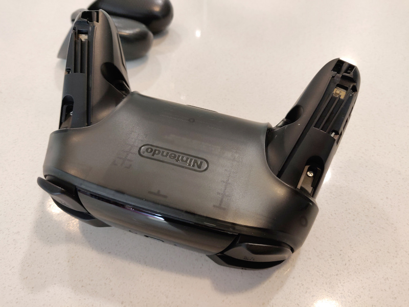
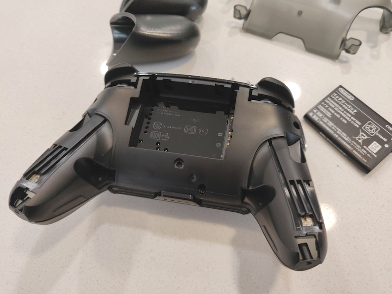
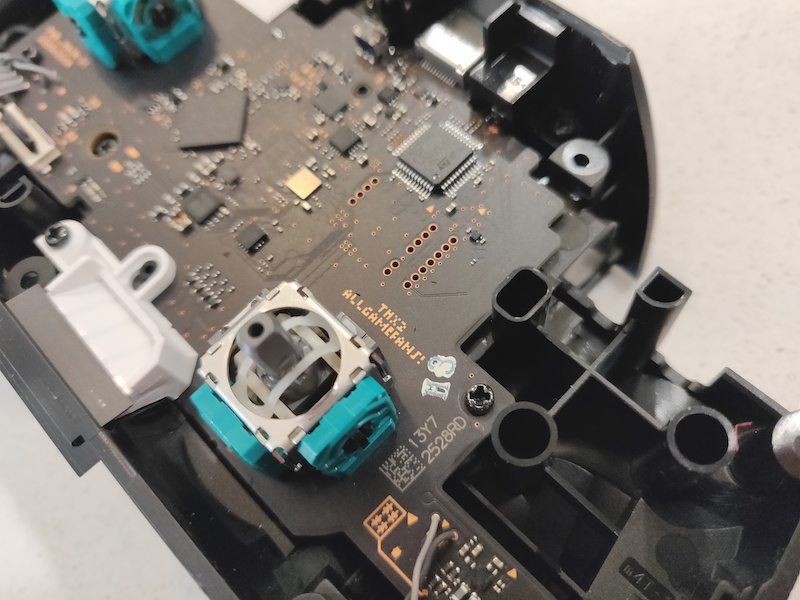

#### 31.08.2020
### Nintendo Switch Pro Controller Joystick Drift Repair

Alas, my Nintendo Switch Pro Controller finally fell victim to the surprisingly-common [joystick drift issue](https://en-americas-support.nintendo.com/app/social/questions/detail/qid/78176/~/pro-controller-drifting), for which the internet has thankfully already come up with [some easy fixes](https://www.nintendolife.com/news/2020/08/guide_how_to_fix_a_drifting_nintendo_switch_pro_controller).  Armed with a small screwdriver, plastic pry tool, and [a repair guide from iFixit](https://www.ifixit.com/Device/Switch_Pro_Controller), I sat down to solve my newfound pet peeve.  What follows are a few photos that I took along the way along with a small bit of an explanation of what I was doing.

The first step involved removing the "wings" on the controller, each of which were held on with a single screw.  Much to Nintendo's design credit, these wings effectively hid the access points into the rest of the controller while allowing it to retain a sleek and nearly seemless appearance.  With the wings removed, four now-visible screws needed to be removed in order to remove the back plate of the controller.

In a nice nod to easy repairability, the battery for the Pro controller is a self-contained unit that relies on contact points and spring-loaded pins in order to make a connection.  Removing it is as simple as prying it out with a fingernail or guitar pick.  No fragile battery leads and connectors here!

Having removed another set of four screws, the front plate of the controller came free with a bit of prying.  Unfortunately, a rather awkward ribbon cable conects the main controller board to buttons on the front face, so I was unable to snap a good picture of the process as both of my hands were busy.  But my frustration was short-lived as I was then met by a friendly greeting in the form of "THX2 ALLGAMEFANS!" printed on the aesthetically-pleasing motherboard.  I'm going to ignore the possibility that Nintendo _knew_ their joysticks could be problematic and require repair, and instead assume they just wanted to say hello to to the good people over at [iFixit](https://www.ifixit.com) when the inevitable teardown occurred. 

At this point my teardown was complete, as I merely needed to blast the left joystick with a bit of compressed air.  And by that, I mean I simply utilized lung power and my own pursed lips.  Definitely not the "correct" or recommended method of cleaning out the contacts inside, but it worked for me.  The only thing left to do was to reverse the teardown practice and get back to trolling my friends in Human Fall Flat.