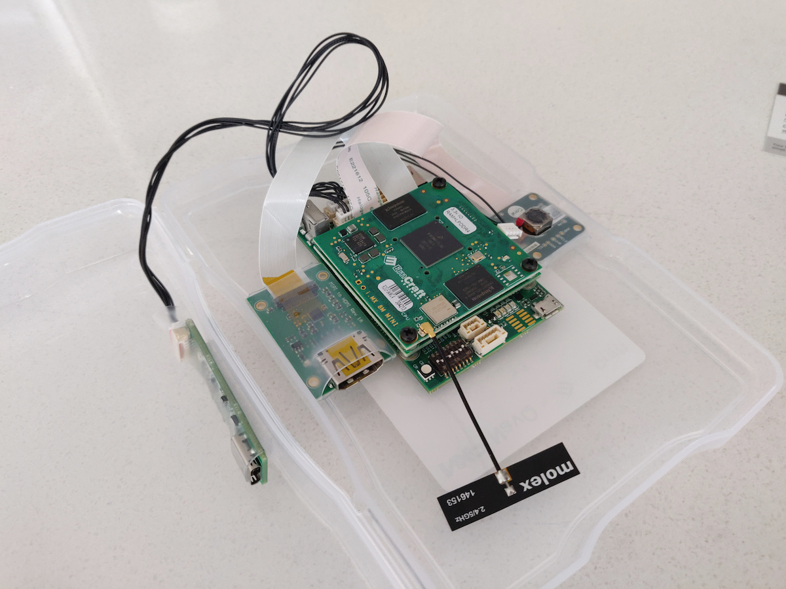
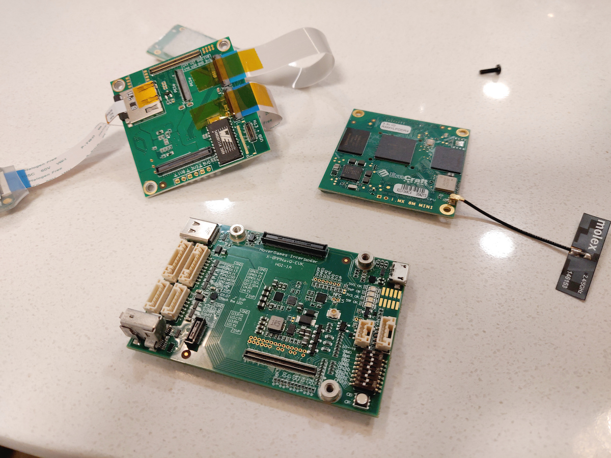

#### 02.09.2020
### Start of HoverGames 2 Project

Cameras?  Ribbon cables?  Wires?  Serial adapters?  Embedded linux?  That spells only one thing: another hackathon project!  This time around it's not an altogether new contest as it builds upon the back of the [first NXP HoverGames](https://www.hackster.io/contests/hovergames) hackathon.  Different this time around is a little more freedom; whereas the first HoverGames was bound around the task of fighting fires, [HoverGames Challenge 2](https://www.hackster.io/contests/hovergames2) is a lot more open ended.  If it fits the challenge's top-level description of "_Help Drones, Help Others During Pandemics_" then it qualifies as an entry.

...So long as it also adheres to the hardware requirements, ayway.  And new this time around is an [NXP i.MX 8M Mini](https://emcraft.com/products/1097#starter-kit) System-On-Module computer with a few additional goodies.  And yes, before you ask, I do think that this is a horribly complicated name to give to a ~~single-board~~ sandwich computer system.  But let's not digress too far, because the point of this post is to show off the hardware and what I've done to it so far.

Upon opening the translucent plastic case the kit ships in, I was presented with the i.MX 8M Mini computer– hereafter referred to by its shorter nickname "NavQ"– and a few of its accessories affixed to the case with velcro.  One of those accessories can be seen front and center here: a [Google Coral Camera](https://www.coral.ai/products/camera) module.  The module's description leads me to believe that it doesn't pack any fancy AI tech whatsoever, but that's okay.  I'm sure I'll find a use for it someday.

Also affixed to the case is an HDMI breakout and a UART-to-USB (type C!) adapter.  While I might one day repurpose the board and require video output, I decided that the HDMI module,  much like the camera, weren't going to be useful for my project and might as well be detached for a cleaner setup.  Since I want to create a somewhat ruggedized, self-enclosed system, it doesn't make sense to leave more than what is required dangling off of the NavQ via fragile ribbon cables.

Noticing that both the camera and the HDMI modules were attached via connectors between the bottom and middle layers of the NavQ board, I realized I needed to take the whole thing apart in order to remove them safely.  With that in mind I scrounged out a screwdriver and removed the three screws holding the sandwiched circuit boards of the NavQ together and then pried the boards apart from one another using a guitar pick.  Care was taken to not impart undue stress on any of the surface mounted components.

Annoyingly– or perhaps fortunately, to prevent accidental separation?– both the camera and HDMI ribbon cables were secured with [Kapton tape](https://hackaday.com/2018/04/04/kapton-miracle-material-with-a-tragic-history/) into their connectors.  Undeterred, I carefully pried this off, unlocked the connector latches, and successfully detached the ribbon cables before reassembling the NavQ stack and tightening the retaining screws.

That looks so much better!  I wish I could do something about the dangling 2.4GHz/5GHz WiFi antenna, but it seems I'm stuck with it unless I want to use an ethernet connection instead.  But given how that would require the use of _yet another_ adapter / dongle, I don't think I'll bother.  The UART  adapter, thankfully, utilizes a JST-GH connector– at least I think that's what it is– so I can attach or remove it easily without having to separate the sandwich again.

All-in-all the NavQ has already proven itself to be an awkward and cumbersome ~~single-board computer~~ sandwich.  Where something like the [Raspberry Pi 4 Model B](https://www.raspberrypi.org/products/raspberry-pi-4-model-b/) features standardized onboard connections for USB, ethernet, HDMI (albeit the micro variant), audio, _and_ features a built-in antenna for WiFi... the NavQ is a hard sell with its asking price of nearly $400 for the starter kit.  Sure, the NavQ features JST-GH connectors which are more compact and secure than the unprotected GPIO pins on the RPi, but that's about all I can identify that's in its favor at this point in time.

Anyway, more to come soon.  For now I've only done a few things with the NavQ board, such as [accidentally hose the OS it shipped with](https://www.hackster.io/contests/hovergames2/discussion/posts/7287#challengeNav) and [successfully connected to a USB sound card](https://www.hackster.io/contests/hovergames2/discussion/posts/7404#challengeNav) and utilized it with the [fldigi](http://www.w1hkj.com) software.  (Spoiler alert: everything a HAM radio enthusiast might want a RPi to be able to do, this seems also capable of doing.)  Next up involves building a basic enclosure to help with the wires-going-everywhere problem and some long-distance radio tests.