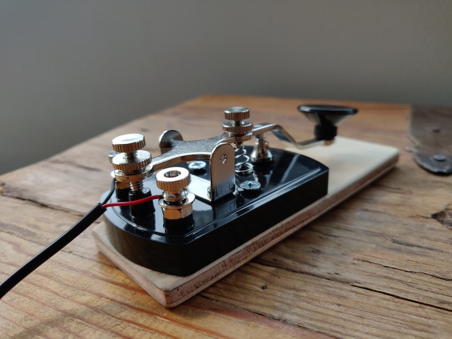
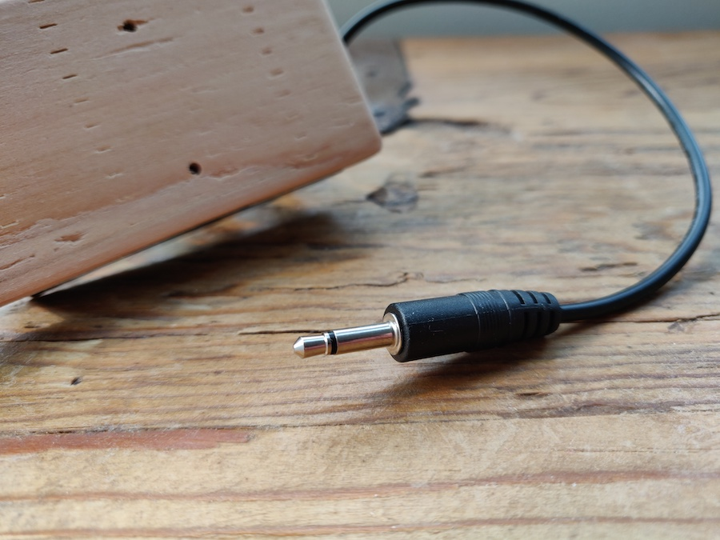

#### 21.09.2020
### S-Pixie Morse Key

> Mounted Morse key connected to the S-Pixie radio transceiver.  Connected in lieu of an antenna is a 50Ω dummy-load for testing purposes.

As part of my ongoing participation in [Hackster and NXP's HoverGames Challenge 2](https://www.hackster.io/contests/hovergames2) contest, I previously built an S-Pixie [QRP](http://www.arrl.org/why-qrp) 40-meter band (7.030 MHz) CW (Morse) radio transceiver (see [Part 1](./2020-07-12-pixie-transciever-pt1.md) and [Part 2](./2020-07-13-pixie-transciever-pt2.md)).  This small pocket-sized device radio can be used by any licensed amateur radio operator, so long as it is hooked up to a source of power, antenna, headphones, and some sort of tool for creating the dits and dahs that make up Morse code.  While just any tool capable of succinctly opening and closing an electrical circuit will be sufficient for use with the S-Pixie, I decided to pick up a MFJ-550 straight key [from Gigaparts](https://www.gigaparts.com/mfj-550.html).

The key itself is simply constructed: a plastic mounting plate and key button combined with some simple metal parts (likely steel or brass).  Had I known that some of the tolerances would be wildly off– just take a look at that off-center return spring and contact electrodes– I would have purchased something a little nicer, but this gets the job done.  Using it is as simple as attaching the two ends of the key wire using thumb screws, adjusting the spring tension and travel distance, and that's it.

However it's a little fiddly as-is and should be attached to a larger surface for stability.  I cut a piece of scrap plywood down to size for exactly this purpose, and invested a little bit of elbow grease in sanding it down to a nice smooth hand feel.  It's not the prettiest thing in the world but it works.

The other end of the wiring leads to a 2-pole audio plug.  The S-Pixie has a receptacle designed for this, hence why I use it here.  Should I ever find myself using the key and transceiver in a more permanent manner I'll likely extend the leads from the plug to the radio.  But for now this system works and allows me to practice my manual Morse code keying.

Of course... all keying will eventually be automated by a relay switch for the purposes of my hackathon project.  So everything described here in this post has just been for fun.  More project documentation to come!