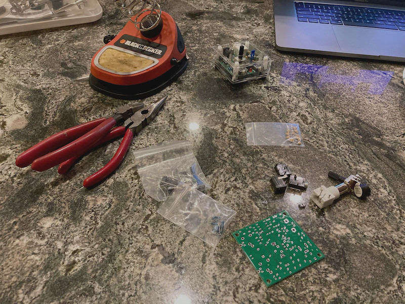
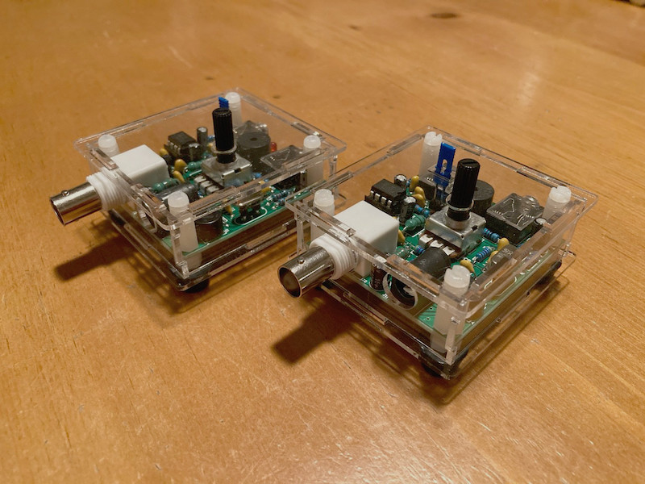

#### 21.11.2020
### Second S-Pixie Radio Built

> The bare components laid out for inspection while the soldering iron got up to temperature.

_This is part of an ongoing series of documentation for my entry into [Hackster and NXP's HoverGames Challenge 2](https://www.hackster.io/contests/hovergames2) contest.  Links to the related blog posts can be found below:_
- _[Part 1: Pixie QRP Transceiver Assembly (Part 1)](./2020-07-12-pixie-transciever-pt1.md)_
- _[Part 2: Pixie QRP Transceiver Assembly (Part 2)](./2020-07-13-pixie-transciever-pt2.md)_
- _[Part 3: Building a Morse key](./2020-09-21-morse-key.md)_

A few days ago I finally managed to carve out some time to build the second of the two S-Pixie radio transceiver kits that I had ordered.  Perhaps it shouldn't have been surprising, but it only took me a fraction of the amount of time to complete compared to my first build.  Being able to make use of my father's not-budget-bin soldering iron was a big help as well.  I hope [the Pinecil](https://pine64.com/product-category/soldering-irons/?v=0446c16e2e66) is released for sale soon...

With the two transceivers complete– this time I did receive some help from my girlfriend who removed the protective sticker layer off of the acrylic pieces– I powered up both radios and was able to confirm that they could successfully transmit a CW (Morse) tone in either direction.  Success!  I was even able to further test out [the simple automatic CW keyer](https://github.com/ckuzma/arduino-cw-key) I wrote as an Arduino sketch.

Next up is figuring out a way to replace the relay-based circuit with a purely transistor-based solution.  This will hopefully reduce both the footprint and the weight of the CW keying aparatus for flight purposes.