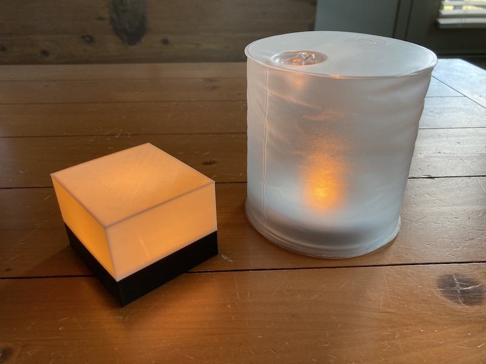
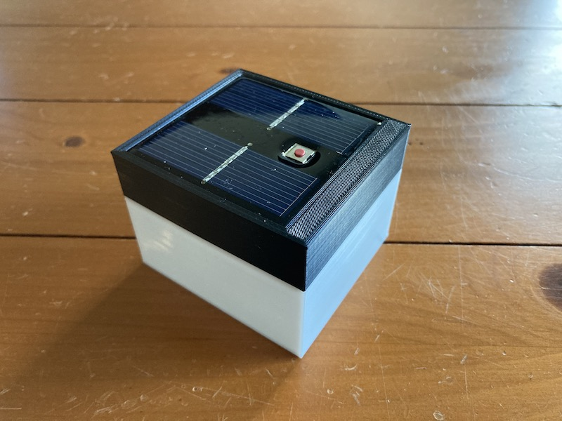

#### 16.02.2021
### Adventures in 3D Printing: MPowerd Luci Candle Housing

> Above we see a possible desired outcome on the left, and the starting point for the project on the right.

My first encounter with an MPowerd product involved the Luci, now known as the [Luci Original](https://mpowerd.com/products/luci-original-f2017) (and also sporting a few small design tweaks).  A potential lifesaver for the outdoors afficionado, I still have at least one of those packed away with my camping gear and emergency supplies.  The basic design involves an LED lantern combined with a solar charging circuit enclosed in a soft inflatable plastic structure similar to a beach ball, rendering the whole thing both waterproof as well as bouyant.

Unfortunately, as a diffuser, the soft plastic shell leaves something to be desired.  After I picked up a couple of [Luci Candle](https://mpowerd.com/products/luci-candle) lanterns for use around the home-- what can I say, I'm a sucker for eco-friendly tech-- I decided to create my own modern and minimalist housing for the internal circuitry of the lamp with the goal of designing something a bit more appropriate for a domestic environment.  I think I succeeded, but first let's dive into how I arrived at my solution.

The first thing to discuss is what exactly makes up the electronic half of an MPowerd solar lantern.  Underneath the external layer of inflatable plastic lies, obviously, a solar panel and a power button.  This much at least obviously needs to exist for a Luci to work in the first place, so let's jump to the backside of the board and see if anything more interesting lives there.

In the case of the Luci Candle, a solitary LED provides all of the illumination and we can see that in the center of the board.  Between it and the battery is a small momentary tacticle button of the surface-mount variety.  Though, in the case of this device, the button is actually suspended and connected to the rest of the board via solder joints.  This is not the most secure mounting method but time will tell how long it continues to hold.

The big gray silver cylinder is a 3.2-volt Ronda Lithium-Ion battery with approximately 350 milliamp-hours of capacity.  Seeing as this battery requires a higher voltage than its nominal rating in order to successfully charge, we can assume that some of the other circuitry on this side of the board serves the purpose of voltage conversion, while some of the rest is related to regulating power output and controlling which mode the light is in.

From a design perspective, I was immediately aware of the fact that the side of the battery protrudes just a bit beyond the edge of the square circuit board.  Short of busting out the soldering iron and relocating the battery, this finding meant that I would have to choose between designing my new lamp's housing in the shape of a rectangle in order to accomodate from the battery's protrusion, or scale up the size of the small cube that I'd originally envisioned.

Seeing how I was rather hoping to create a perfect cube-shaped housing sized around the circuit board's square dimensions, I decided to forge ahead and create a basic model in [TinkerCAD](http://tinkercad.com).  Having used [SketchUp](https://www.sketchup.com) extensively in the past, I was almost immediately familiar with the similar navigation system and soon had a model ready to be exported for printing.

Pleased that the test print adhered perfectly to the size of the main board-- despite measuring in imperial units and converting to metric for use with TinkerCAD, even!-- I then admitted that the easiest path forward which still adhered to the smaller-is-better mentality would be to extend one of the bezels on is "upper lid" part to account for the protruding battery, and move on.

> Note the cylindrical shape on the inside of the lid that was added to account for the protrusion of the cylindrical battery.

> The bottom section was designed as a rectangular box with a smaller inner lip on top of which the lid could sit snugly.

> 3D printed parts made of PLA next to the raw Luci Candle circuit board.  

With the parts printed, it was time to complete the assembly of my new lantern.  This is not a difficult process.

First, place the original Luci PCB into the appropriate spot in the lid, making sure that the solar panel is properly exposed and centered in the cutout provided for it.

Assuming the board was installed correctly, this is what the top should look like.

Affix the board into the lid with some hot glue.  Less is more and there's no reason to go overboard since more can be added as the lamp is not permanently sealed.

And then place the lid on the bottom diffuser.  This is done very much so like one would replace the lid on a tin of cookies.  That is to say it can also be just as frustrating, but fret not as the diffuser has a little bit of give and can be squeezed to fit if needed.

Above you can see the new version (and a prototype) next to the original Luci Candle, soaking up some sun.  The new version takes up considerably less space and presumably charges a little more efficiently than the original due to the lack of a translucent cover over the solar panel.  That being said, charging in a sunlight-obstructed window such as the one pictured definitely isn't where solar-powered lanterns are most efficient at charging.

And with that, my project was complete and ready to shine.  It just needed one last thing...

... to be flipped over.  Ignoring the poor lighting conditions that caused my camera to record the lantern's light output as if it were a sickly yellow hue, the Luci Candle in its new housing looks right at home in a contemporary home.  Much more so than the obviously outdoors-oriented inflatable lantern that it used to resemble, anyway.

For those wishing to print one of these housings for themselves, the project repository including printable _.stl_ CAD files and print settings can be found here:

- https://github.com/ckuzma/luci-candle-remix