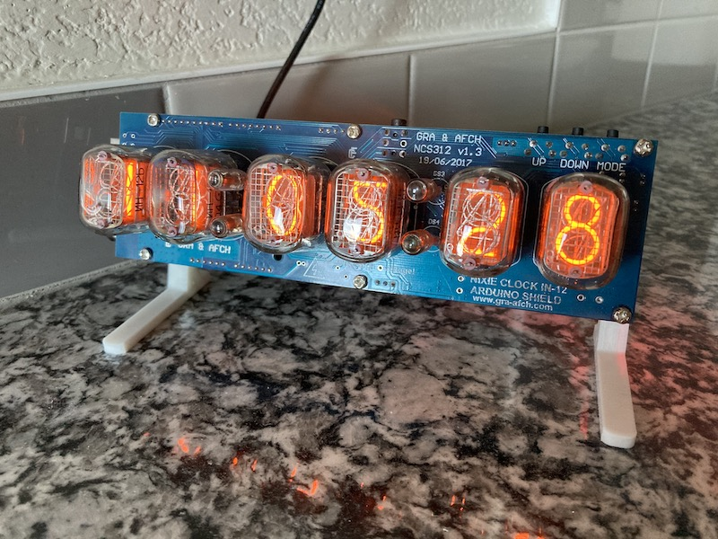
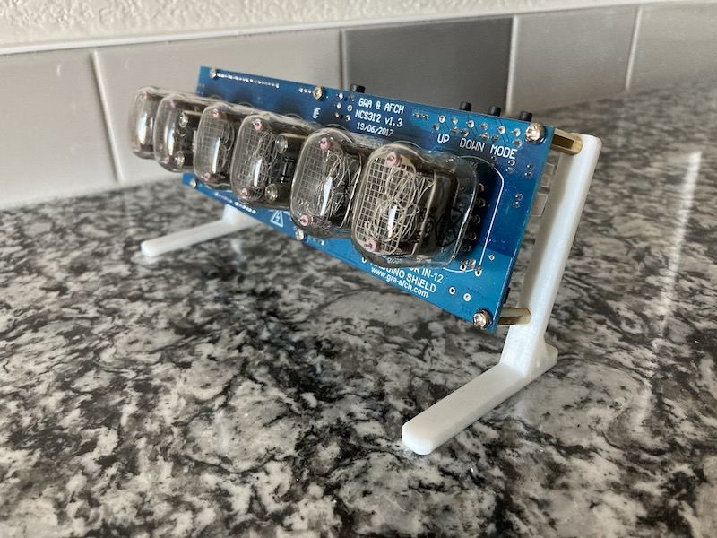
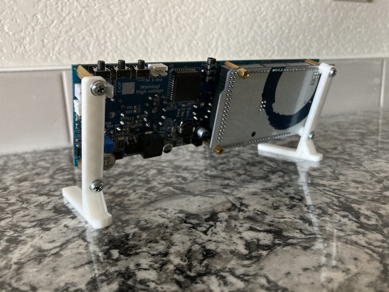
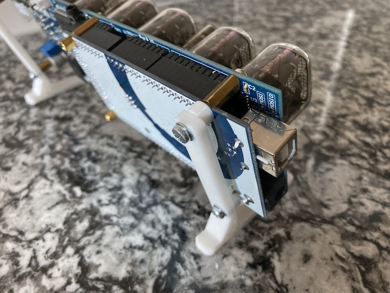

#### 16.02.2021
### Adventures in 3D Printing: Nixie Clock Stands

Despite investing a not-insignificant amount of time and energy into [the woden case I built for my nixie tube clock last year](../2020/2020-04-18-nixie-tube-box-case-part-2.md), I could never shake the feeling that it was just temporary.  Be it the lack of access to the control buttons, the horrendously abrasive sound that would be emitted by the lone tilt screw when dragged across a surface, or the somewhat poor appearance of the wood finish itself, I just never loved it.

- https://github.com/ckuzma/nixie-clock-stands