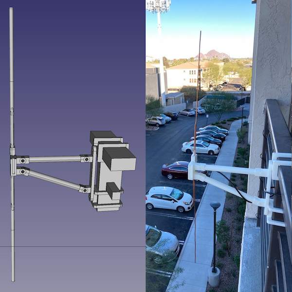
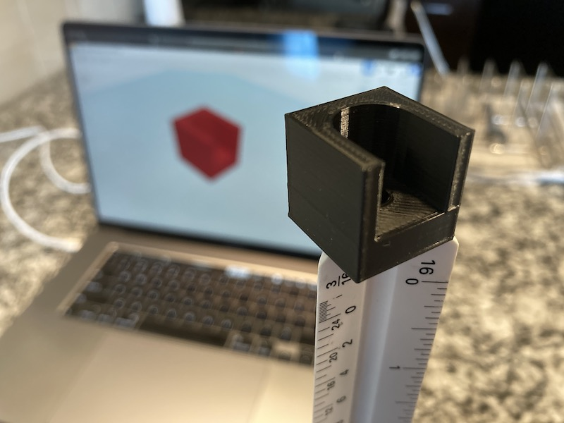
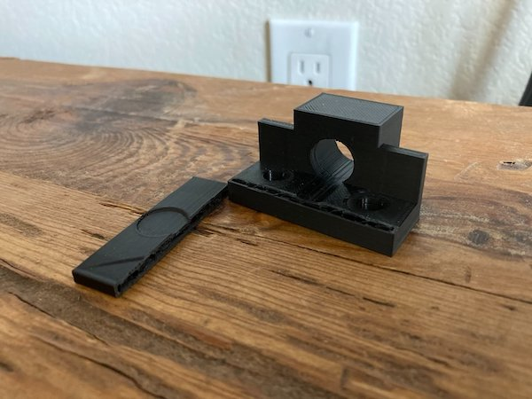
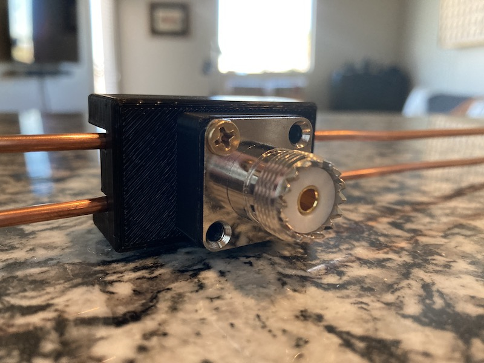
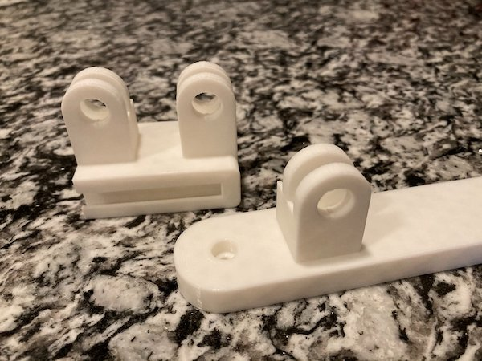
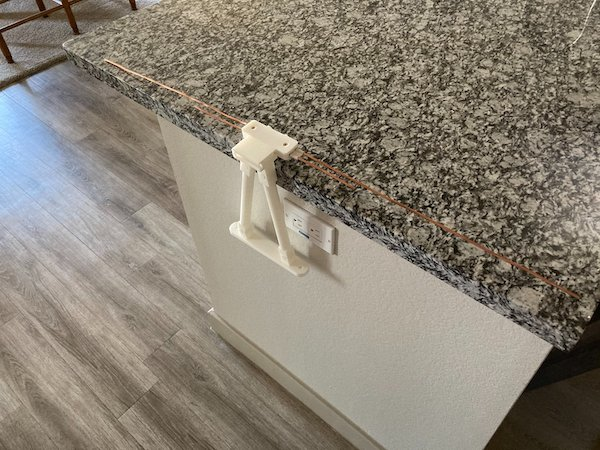
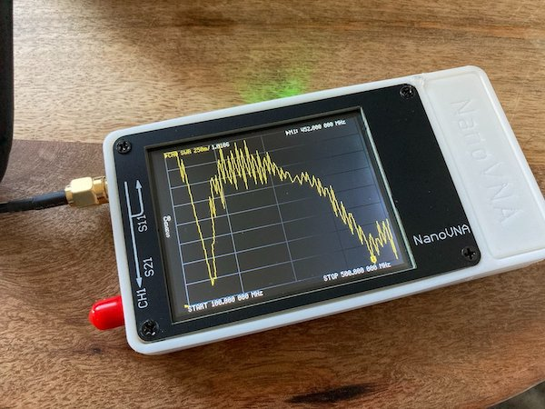
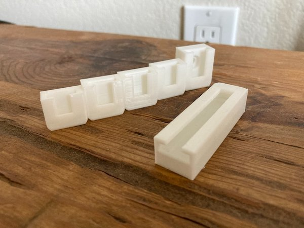

#### 17.07.2021
### Adventures in 3D Printing: Dipole Antenna

> The completed dipole antenna and railing bracket / arms mounted to the railing of my apartment's balcony.

During the winter of 2020 I decided to jump into a new hobby: amateur radio.  My first contacts were made with a Baofeng UV-5R, the same handheld transceiver that many HAMs get started with these days.  However it wasn't long until I began to lament the inconveniences of using an HT ("Handy Talkie" in HAM parlance).  Standing in just the right spot to transmit and receive successfully meant I rarely attempted a simplex conversation with my licensed coworker just down the road, and partaking in the evenings nets on the local repeater was usually limited to an in-and-out check-in.

The obvious solution to me at the time was to fit a better antenna on my radio.  While this did seem to help marginally, the almost-a-faraday-cage that was my apartment rendered the upgrade mostly moot.  What I thus decided I needed was a more powerful radio transceiver and a fixed external antenna.  While the former would require significant work to build myself, I decided that I was handy enough to design and create the latter with ease.

-----

#### The TinkerCAD Days

My first step was decide what kind of antenna I wanted to build, and this seemed rather obvious for the bands (2-meter / 70-centimeter) I wanted to transmit and receive on: a dipole.  Having stumbled across numerous guides describing how to construct and tune the dual-band dipole antenna I desired, I was well-aware of the basic design I needed to follow.

But what was I going to construct it with?  Having just acquired a 3D printer and being very eager to put it to use and re-learn how to use CAD software

-----

### Enter FreeCAD

-----

### Test Parts

