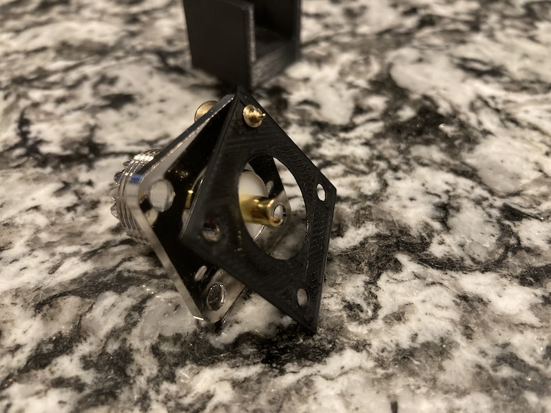
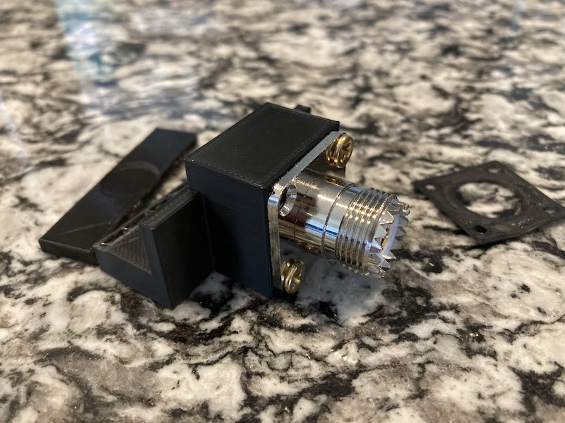
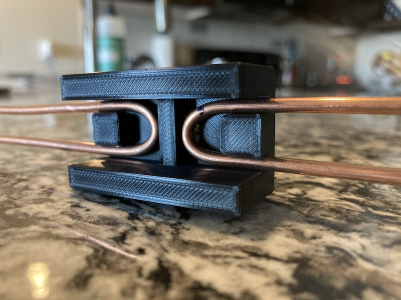
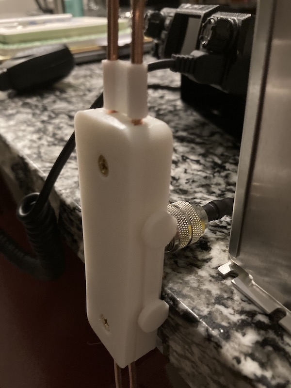
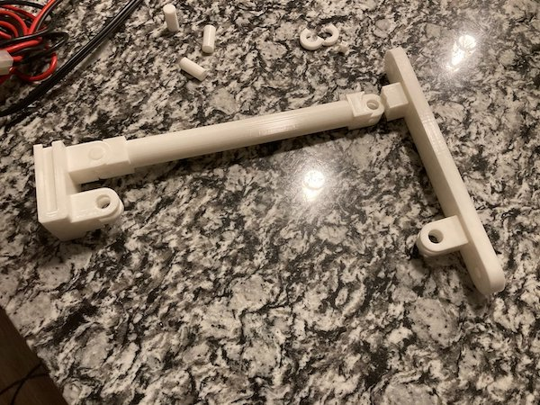
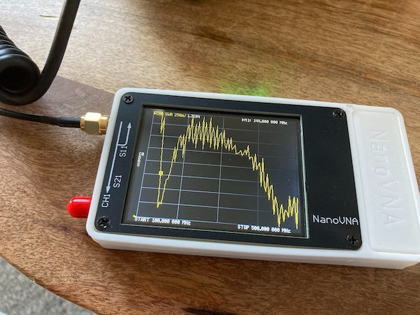
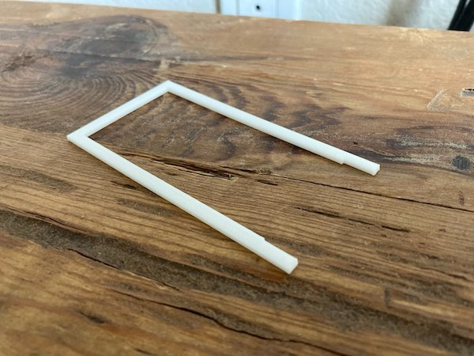

#### 17.07.2021
### Adventures in 3D Printing: Dipole Antenna

> The completed dipole antenna and railing bracket / arms mounted to the railing of my apartment's balcony.

During the winter of 2020 I decided to jump into a new hobby: amateur radio.  My first contacts were made with a Baofeng UV-5R, the same handheld transceiver that many HAMs get started with these days.  However it wasn't long until I began to lament the inconveniences of using an HT ("Handy Talkie" in HAM parlance).  Standing in just the right spot to transmit and receive successfully meant I rarely attempted a simplex conversation with my licensed coworker just down the road, and partaking in the evenings nets on the local repeater was usually limited to an in-and-out check-in.

The obvious solution to me at the time was to fit a better antenna on my radio.  While this did seem to help marginally, the almost-a-faraday-cage that was my apartment rendered the upgrade mostly moot.  What I thus decided I needed was a more powerful radio transceiver and a fixed external antenna.  While the former would require significant work to build myself, I decided that I was handy enough to design and create the latter with ease.

-----

#### The TinkerCAD Days

My first step was decide what kind of antenna I wanted to build, and this seemed rather obvious for the bands (2-meter / 70-centimeter) I wanted to transmit and receive on: a dipole.  Having stumbled across numerous guides describing how to construct and tune the dual-band dipole antenna I desired, I was well-aware of the basic design I needed to follow.

But what was I going to construct it with?  Having just acquired a 3D printer and being very eager to put it to use yet still needing to reacquaint myself with the basics of modern CAD software, I turned to the web browser-based TinkerCAD.  Similar to AutoDesk in terms of its short learning curve, I was soon modeling separate pieces of my full envisioned antenna and printing them out to test-fit them with the components I intended to work with.

It at this point that I thought I ran out to Home Depot and purchased a few feet of the thickest solid copper wire they had.  Unfortunately, my design did not stand up to the stress of the wire as it strained to un-bend itself, and I began to lament how cumbersome it is to iterate on a design using TinkerCAD.  That combined with my reluctance to rely on a cloud-based non-open source product was all the push I needed to look around.

-----

### Enter FreeCAD

While FreeCAD is nowhere near as user-friendly or stable as TinkerCAD, it is immensely more powerful and far easier to make small edits and iterate upon a design.  After a few tutorials I had quickly re-implemented my previous work albeit with some tweaks for added strength as well as practical considerations for wiring.

It was at about this point that I realized: I have no way to mount my antenna to anything, short of taping it up on a wall.  So back to the drawing board I went.

The new design sports many of the same attributes as the earlier design, but with added screw holes and side-mounted slot attachment points.  Pleased with my work at this point I opted to complete the print, solder up my connections, and liberally apply hot-glue where appropriate before sealing up the mount by screwing it shut.

In the above photo I am testing out the antenna with it balanced on the end of my kitchen counter.  There is also a small plastic piece on the upper two elements, separating them.  My original intention was to print out a bunch of these but this never came to pass before the antenna was retired.

The only thing left to design and print was a bracket to extend the antenna away from whatever I mounted it to.  This was a simple design that utilized friction-fit printed plastic pins.  It worked out surprisingly well and none of the pins ever came loose during the year or so that the antenna was installed outside.

Unpictured are a set of railing mount clamps that I designed and printed for my particular setup.  These worked surprisingly well and required no destructive (read: apartment deposit decimating) installation.

Above you can see the SWR performance of the installed antenna for both the 2-meter and 70-centimeter bands.  It's not perfect, but it worked plenty well enough to keep my transceiver from frying while also enabling me to easily reach out to some pretty distant repeaters on both bands.  The PLA plastic did, eventually, succumb to Phoenix's always-sunny weather just shy of a year, but I was otherwise quite happy with it.

If you'd like to print one for yourself, you can find all of the files necessary to do so in my project repository here:

- [ckuzma: dipole-antenna](https://github.com/ckuzma/dipole-antenna)

My plan is to eventually iterate on this design or at least print it anew out of a more durable polymer, but for now I have other projects to handle.

-----

### Bonus Photos: Test-Fit Parts

