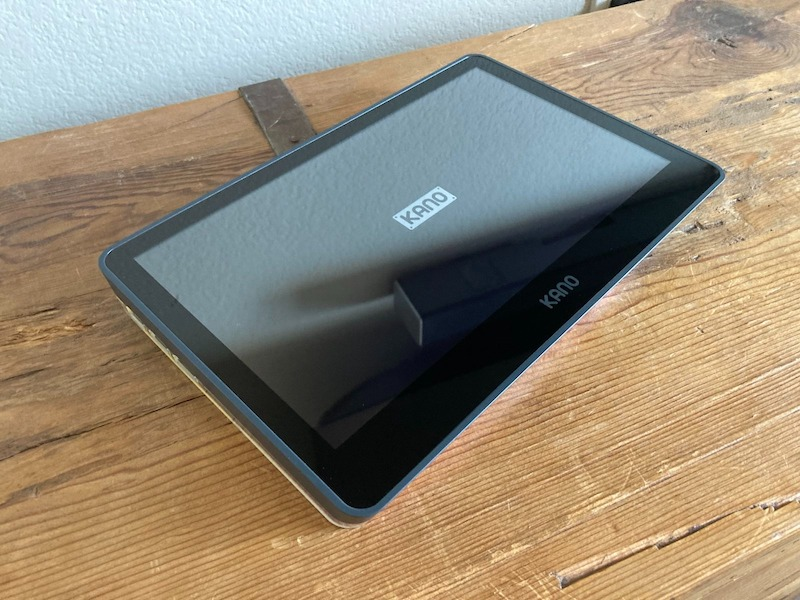
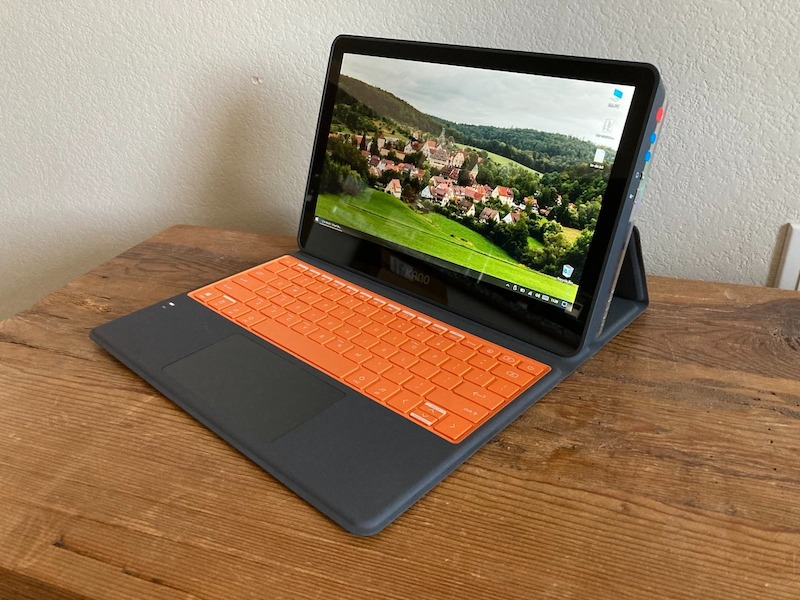
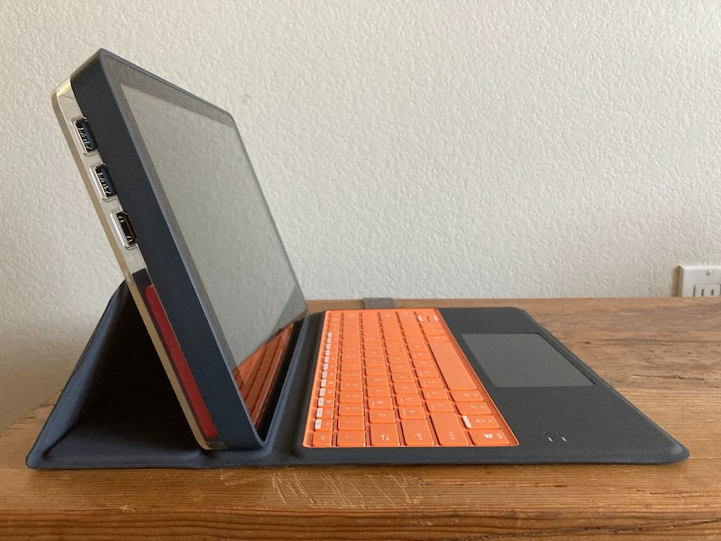
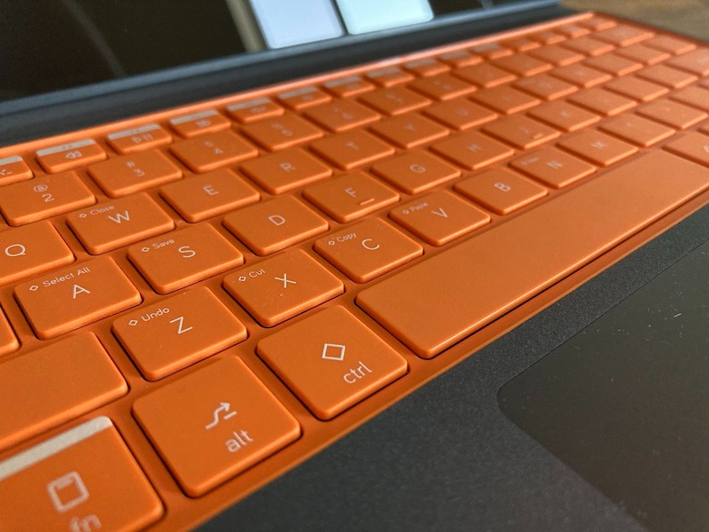
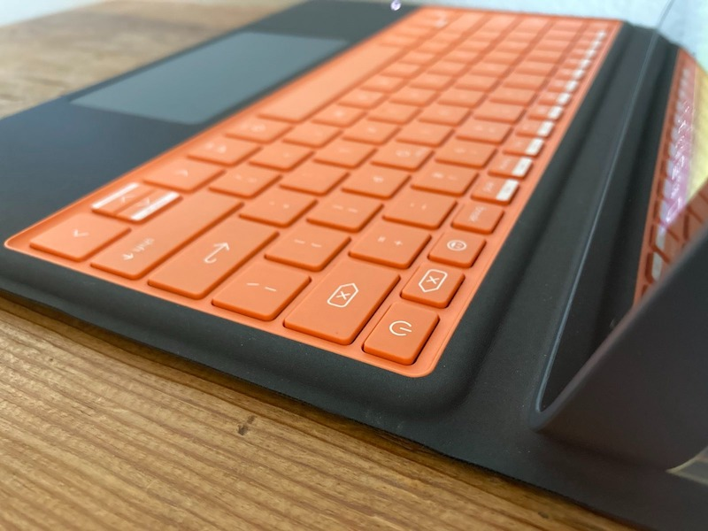
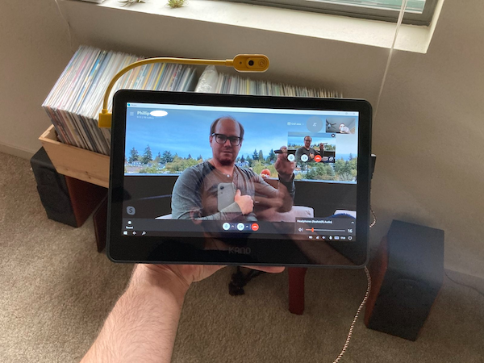
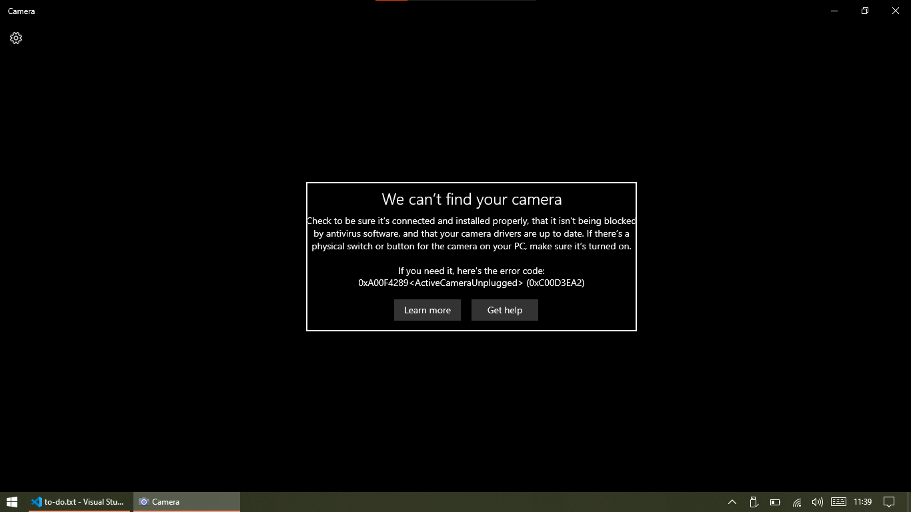
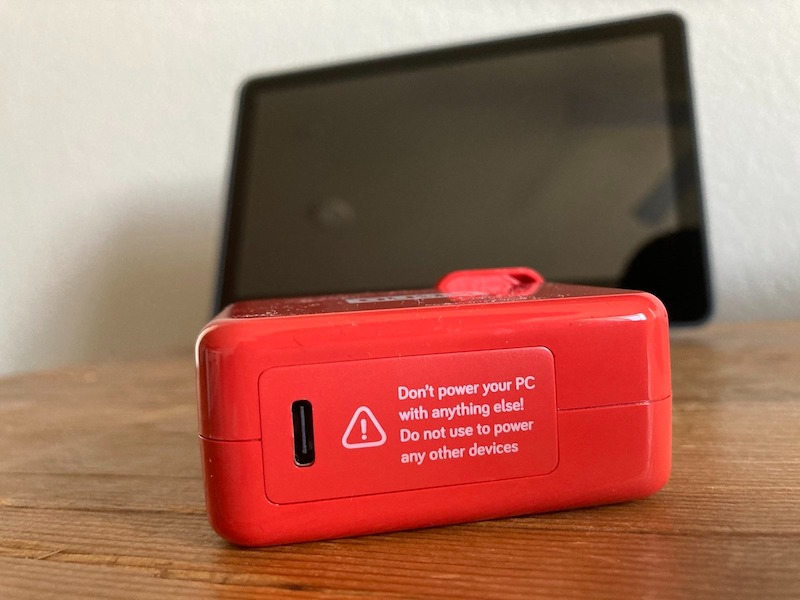
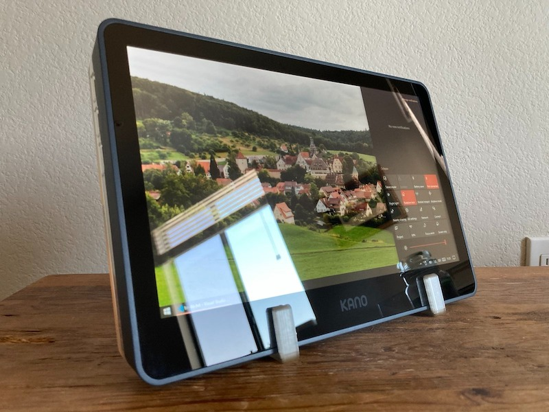

#### 21.12.2021
### Kano PC Review

# Unboxing

Perhaps the most important attribute of the Kano PC is how it arrives to customer: unassembled.  Though if I'm to be perfectly honest, the assembly that is required is more akin to locking the removable battery into place on a new ThinkPad laptop than it is applying thermal grease and a heatsink to the CPU of a homebuilt PC.  Nevertheless, the Kano PC does arrive in a state of disassembly and that's intentional.  Much like the Raspberry Pi-based Kano Computer kits that preceded it, the final assembly process of the Kano PC is a user experience that was consciously implemented by Kano so as to foster curiosity, learning, and a sense of accomplishment and ownership.

The gist of what this experience entails is this: remove all of the securely packaged contents of the Kano PC product box, connect via the motherboard's internal 2.5mm audio jack and USB-C port the blue speaker and Lithium-Ion battery, press these components into place, snap the clear plastic back panel into place, and then affix the keyboard/stand via its built-in magnets and pogo data pins to the bottom of the computer.  That's it.  There are no other cables, peripherals, or components to install by hand.  The CPU, RAM, and eMMC flash storage are already soldered to the motherboard underneath the pre-installed passive heatsink.  Should one desire an additional build step, I suppose one could install an optional MicroSD card into its respective slot before installing the back panel.  (And if this computer is to remain running Windows-- a hint of what is to come later in this review-- then I strongly suggest that this additional storage option be utilized.)

# Design

As I poked, prodded, and tested the Kano PC with the intention of forming some sort of opinion about it, "Surface-esque" is the description that kept coming to mind.  While it is highly doubtful that anyone on the street would ever confuse the Kano's chunky tablet computer for one of Microsoft's svelte Surface-branded devices, their form factors are similar enough that their overall design shares the same pros and cons.  Both connect to their respective keyboards/covers via pogo pins and magnets.  Both tend to fall over when used on an actual human's lap.  Even the attribute of a proprietary charger is present for both devices, with Kano eschewing Microsoft's funky Surface Connector for a non-standard implementation of USB-C for charging.  But more on that later.

Unfortunately the Kano PC does not share any of the the sexier attributes commonly associated with Microsoft's Surface line of devices.  With a thickness of about 27mm just on its own, the main hardware of the device is out of its league compared to the petite 13.4mm of the Surface Pro.  Similarly, the Kano's 31mm of bezel (space between the edge of the display and the edge of the device) below the LCD display isn't going to win it any best-of-show awards.  Combine that with a build that can best be described as plasticky-- because just about everything is literally made of plastic-- and it's no wonder that most tech reviewers and YouTubers panned the Kano PC for being clunky, feeling cheap, and lacking any sort of curb appeal when stacked against similarly priced alternatives like the Apple iPad or Microsoft Surface Go.

And yet.  It's impossible to deny that a consider amount of design work went into the Kano PC, from its custom silkscreened motherboard to its rather tasteful cardboard packaging.  There were conscious design decisions made with the target audience in mind.  Where a company like Amazon's approach to making a kid-friendly tablet is to put a chunky carrying case onto a normal tablet and then call it a day, the Kano PC was designed from the ground-up to be used by kids.  With this in mind I attempted to resist the urge to draw comparisons and instead took a look at the computer from a different, more free-standing perspective.

# Design, Take Two

The Kano PC is, in my opinion, striking to look at.  No, it doesn't inspire awe to the same degree as the latest cutting-edge laptop or tablet from any of the "grown-up" companies.  But then again, neither did the original Apple iBook computer when it was released, and it enjoyed a not-insignificant amount of success in the classroom thanks largely to its larger-than-needs-be form-over-function design.  And the Kano PC seems to be shooting for a similar classroom likability; it doesn't really matter that it isn't the most svelte machine on the market, even if the internals would easily allow for a smaller housing.  But before we dwell too long on those internals, let's take a look at what the tangible components of the Kano PC consist of.

Compared to Kano's earlier attempts, portability seems to have been prioritized much more so than the Raspberry Pi-based computers.  Gone are the separate computer, display, and power source, and in their place a single chunky tablet with detachable keyboard case remains.  It's a smart strategy that does away with the (most of) the confusion a parent might experience related to shopping for all of the components of a traditional DIY computer.  Plus, the Kano PC can be used on-the-go thanks to its all-in-one design, adding new possibilities for use beyond the tether of a power cord.  Classrooms, libraries, the kitchen at home, and more are now open to hosting a computing session on the funky computer.

Ports and buttons are, thankfully, not in short supply on the Kano PC.  Two USB-A 3.0 and a full-sized HDMI port are found on the left-hand side of the computer, while clicky-yet-cheap-feeling power and volume buttons in addition to a 3.5mm audio and USB-C port are found on the right.  The lattermost port happens to be how the Kano PC receives external power but alas, the charging protocol appears to be non-standard as the the included charger is not for use with any device except the Kano PC, and likewise the Kano PC is not to be used with any other charger.  This questionable trait is notably annoying, as it precludes the use of a spare USB-C charger with the device.  Perhaps this is why Kano opted for a fun red color for the bundled charger: to help prevent it from becoming lost.

Before my thoughts on it become lost in commentary on trivial details, such as the Kano PC's thicker "chin" bezel on the bottom of the display in comparison to the other sides, it's best we move on to the elephant in the room: the keyboard case/stand.  Somewhat reminiscent of the screen-protecting keyboard accessory for Microsoft's Surface tablet devices, the one included with the Kano PC attaches and connects via magnets and pogo pins for data transfer.  Unlike Microsoft's implementation, however, the case is also responsible for propping up the tablet for use on a table surface.  Also, there is only a single angle at which the tablet can be propped up using the keyboard case.

## 

# Conclusion

----

## Photos

----

---

----

----

