#### 27.12.2021
### Kano PC Review

# Introduction

The Kano PC is perhaps best described as a full-fledged modular Windows tablet-computer designed for kids.  It features an Intel Celeron CPU, 4GB of RAM, 64GB of eMMC solid-state storage, an 11.6" touchscreen and a case that doubles as a keyboard reminiscent of a Microsoft Surface device.  But far more important than the device's hardware specifications is its purpose: to inspire curious minds.

# Unboxing and Assembly

That just-mentioned important purpose makes itself known immediately in that the Kano PC ships unassembled.  That is to say, partly unassembled.  Compared to the previous Raspberry Pi-based computers released under the Kano name, the Kano PC is not quite as demanding when it comes to its assembly procedure.  Perhaps that's a good thing, as Kano's previous offerings were potentially too complicated and fragile even for the parents of the target age audience.

The gist of the assembly experience this time around is: unpack all of the components from the product packaging, connect the blue loudspeaker to the computer's exposed motherboard via an internal 2.5mm audio jack, plug in the red lithium-ion battery via a neighboring USB-C port, and then snap on the clear plastic housing to keep everything protected.  That's it.  No miniscule Micro SD cards to lose under the couch, no RAM cards to install, no fiddly ribbon cables or power lines to mess with this go around.

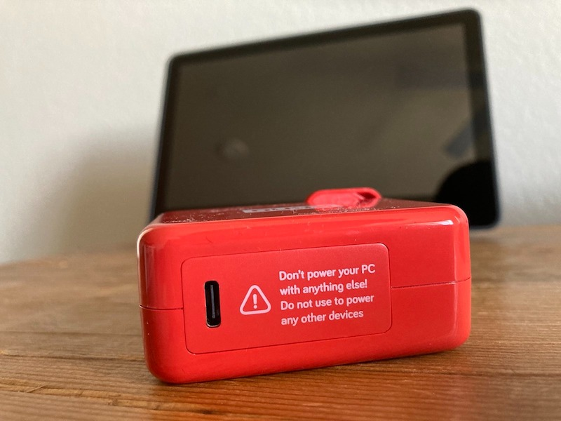

Speaking of cables, the only cable that comes with the Kano PC is a red-colored AC-to-USB-C power brick and matching USB-C charging cable, aesthetically reminiscent of the power supplies that ship with Apple computers.  Annoyingly, though, Kano's version is proprietary.  That's right, even though it features USB-C jacks and plugs, the charger included with the Kano PC is not to be used with any other device.  Likewise, the Kano PC itself is not to be used with any other charger.

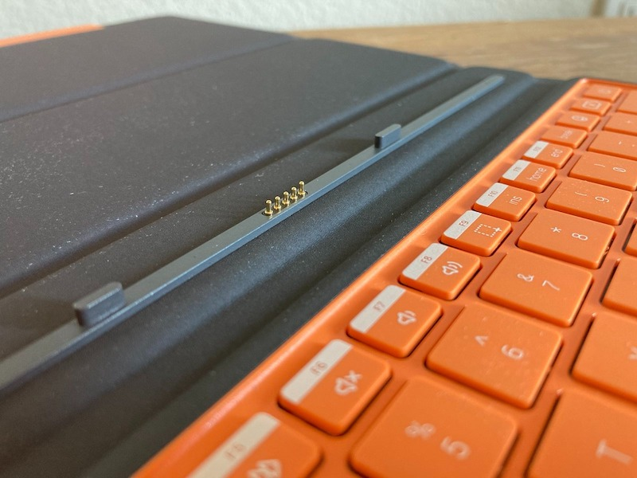

I'd be remiss if I didn't at this point mention that the Kano PC ships with a trick magnetically-attached protective case that also features a functional QWERTY keyboard and touchpad.  This isn't some limited-edition bundle item; it comes standard with every Kano PC.  Attaching it to the rest of the device is again very Microsoft Surface-esque: magnets are responsible for aligning and mantaining the physical connection while gold-plated pogo pins enable data communication.

# Design Commentary

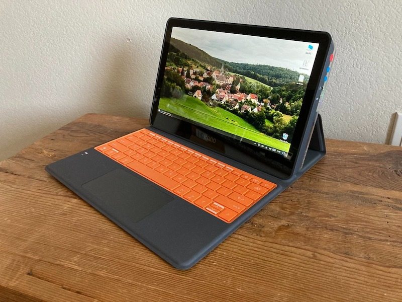

While the Kano PC might from the outset _look_ a lot like a Microsoft Surface device, details show just how much the two differ.  For starters, the Kano PC is thicker than most "modern" laptops, and by a lot.  With a thickness of 38.5mm when swathed in its protective (read: requisite) case, the Kano is more than twice the thickness of my Apple MacBook Pro 16" from 2019.

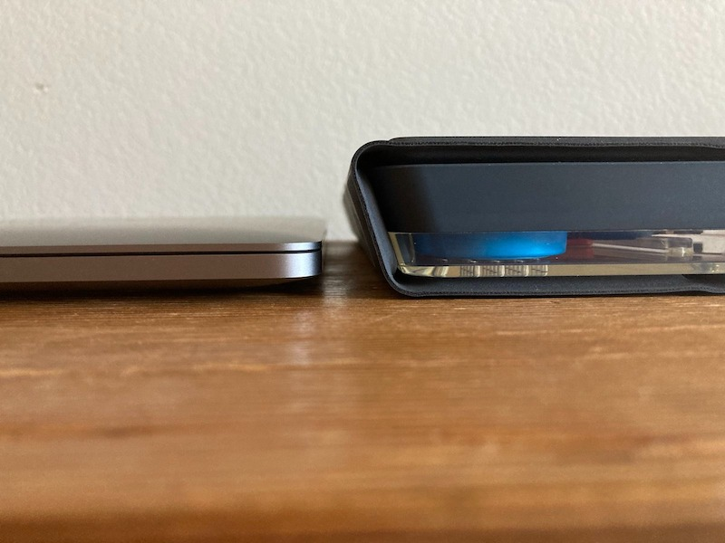

Another avenue where it lacks finesse compared to the multitude of other 2-in-1 tablets on the market is in its fixed display angle when using the cover's built-in prop stand.  While this design is much simpler and perhaps more rugged than that of, say, the Surface's adjustable stand implementation, it does mean that unless one happens to be exactly the right height, using the Kano PC will be done with the display aimed either above or below one's eyes.

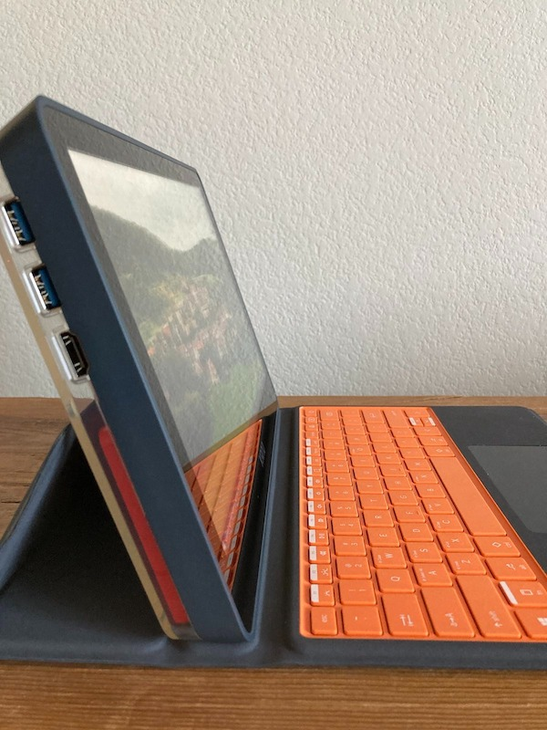

Where the Kano PC _does_ excel compared to many other market offerings, is in its inclusion of full-size ports.  These are last-gen ports for the most part, meaning full-size HDMI, USB 3 (Type A) jacks, and a proper 2.5mm audio connection.  These can all be found on the left- and right-hand side of the device, with power and volume control buttons also found nearby.

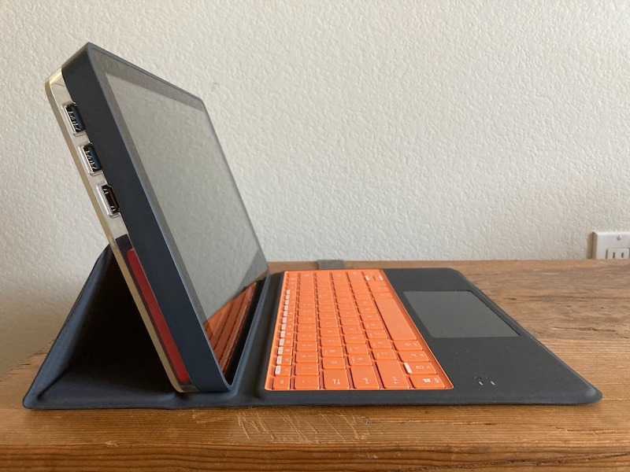
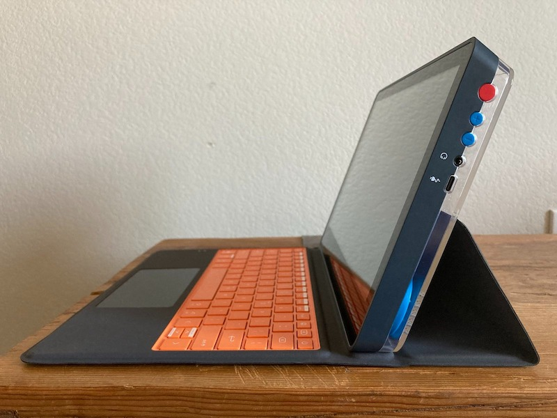

# Usage Notes

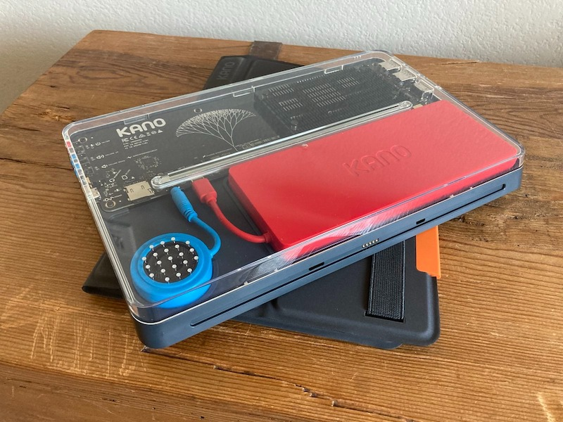

In an attempt not to be wordy, I've decided to describe my findings using the Kano PC in bulleted format:

- The keyboard and trackpad surprised me with their quality.  Where the Surface Pro's keyboard cover sounds hollow and features a lot of flex, the one bundled with the Kano PC is much more rigid with solid actuation.  And the same can be said for the trackpad, though just like every non-Apple trackpad it still pales in comparison to its fruity cousins.
- Rather curiously the physical keyboard features a non-standard layout for its special-function keys.  For example, the CTRL button has been moved to where one would expect the FN or ALT key on a typical Windows-layout keyboard.  This makes sense for users coming from Apple's keyboard layout, but as a developer used to interacting with machines of both types, it kept tripping me up.
    - 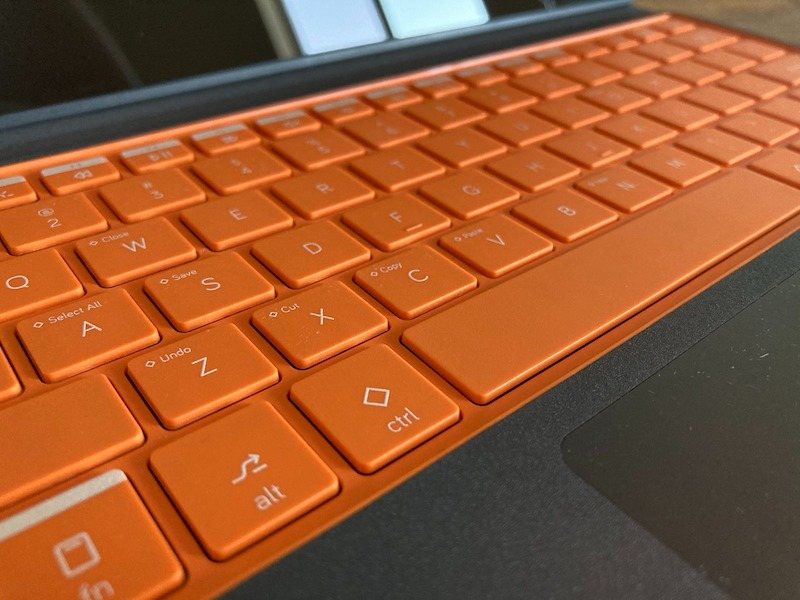
- I found I was accidentally hitting the power button (located in the top-right hand of the keyboard) when my pinky reached to hit the backspace key.  This would result in an annoying minute or so of lost time as the machine cycled into and then out of the sleep state.
    - 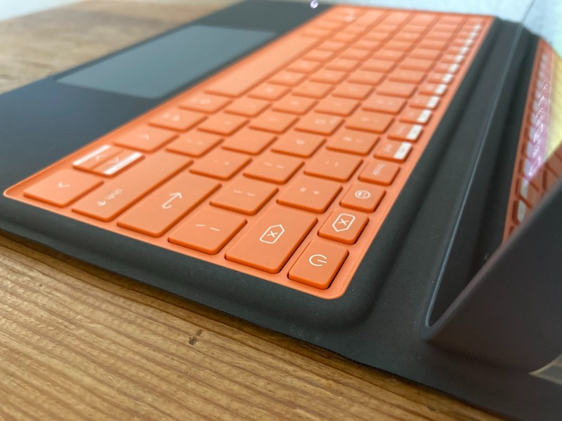
- After removing all of the bloat, Windows 10 runs much the same as it does on any other hardware.  That is to say: slow, but manageable for light browsing, document editing, and even some programming.  So long as one keeps resource usage low, everything should chug along just fine at speeds that were considered fast in the early 2000s.
- The display, while sporting bezels that would make a Casio wristwatch from the 80s blush, has fantastic viewing angles.  It does exhibit a bit of tint when it isn't viewed straight-on but it's enough to make up for the otherwised fixed angle of the computer when using the cover's built-in stand.
    - 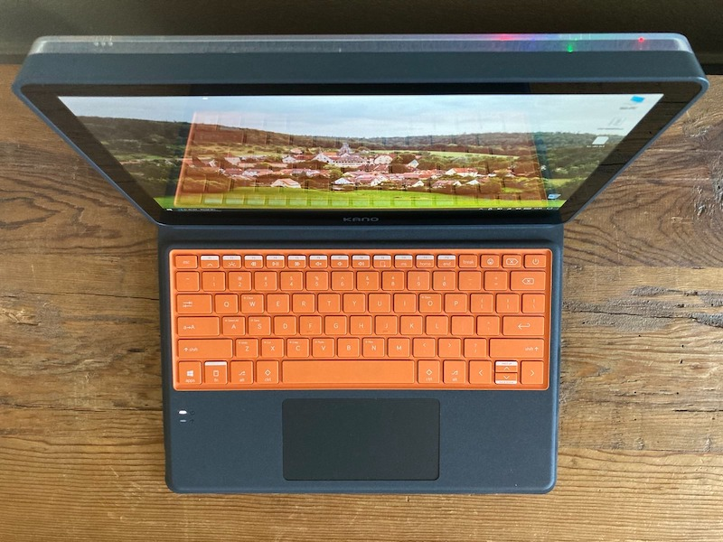
- While I am a fan of all of the detailed silkscreening found on the motherboard, the use of superbright LED indicator lights is glaring.  Quite literally.  I like multicolored LEDs but when the portion of a dark room _behind_ the display ceases to be dark after powering up a device... that's annoying.
    - 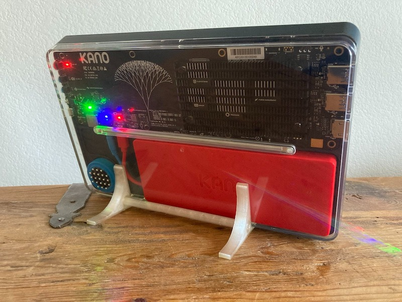
- Despite its thickness, I found the Kano PC easy to use as a tablet while lounging on the couch.  As an added bonus, its unique design caused it to also double as a conversation starter about tech _education_ (as opposed to mere gossip about the latest and greatest gadget) when guests noticed it on my coffee table.

# Kano Webcam

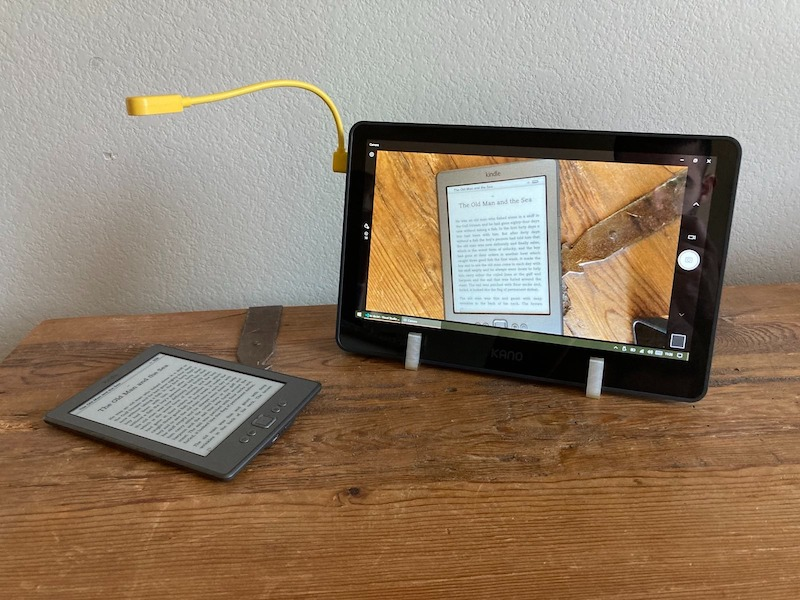

Wanting to use the Kano PC to its full potential, I ordered one of the company's flexible USB webcams.  Yellow in color with an adequately stiff gooseneck, the camera features two lenses for normal and macro use cases plus an intermediary "mode" that blocks the camera aperture entirely for privacy.  (Though why one would do that versus simply unplugging the camera is beyond me.)

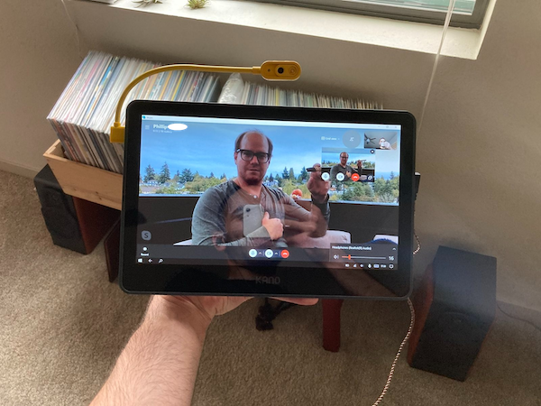

I found the camera to be surprisingly usable and almost _good_.  Given the choice of any option I'd still prefer a higher-resolution affair with autofocus and better low-light performance, but Kano's rendition seems well-suited to a classroom environment.  Be it snapping photos of homework or video chatting with a tutor, this camera seems set to be successful in its attempt to be a jack-of-all-trades.  As an added bonus, the built-in LED light can double as a dim light of sorts for illuminating the (non-backlit) keyboard.

However the camera did seem to glitch on occasion, and my particular camera would suddenly become unrecognizable to Windows.  This seemed to happen whenever I would quickly bend the camera's gooseneck in a new direction.  Whenever this happened I was presented with the error message below when using the camera offline, or I'd immediately receive complaints from my colleagues when chatting with them on Skype that my camera feed had disappeared.

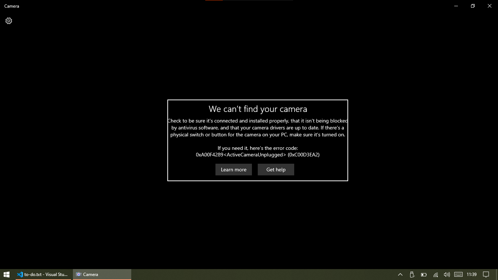

I should note that I didn't seem to experience this issue when using the camera with Linux on the Kano PC... but more on that after the conclusion.

# Conclusion Part 1: The Current-Gen Kano PC

Before purchasing a Kano PC, I ingested numerous product reviews and found that nearly every one of them ended with something to the tune of, "You should just buy a cheaper and faster Chromebook."  Despite this dismissal, I made my purchase anyway because I saw the Kano PC as more than just a spec sheet.  Rather, the Kano PC appealed to me in the same way that the colorful Apple iBook G3 laptops were a success in classrooms across the US: it's simply cool, and it got kids interested in technology.

Sure.  There are faster and sleeker devices out there.  But they don't ooze the same amount of techo-quirk that the Kano has.  And while it's true that a Chromebook may be easier for the parent of a child to maintain, the Kano PC is more of an open door to exploration of all that computers have to offer.  And beyond simply wanting one, I walso wanted to support Kano's mission to promote coding.

However, I will admit that the Kano PC isn't for everyone.  If you're not a tech-savvy parent– or tech-savvy yourself, if you're buying this for yourself– then I might caution you away as the Kano PC's low-end hardware is going to inevitably slow to a crawl without at least the occasional software cleanup.  Likewise, hardware design has progressed since the Kano PC was released and I tell you honestly that my nephew would much rather reach for an iPad than he would my Kano PC.

# Conclusion Part 2: Looking Forward

However it seems like Kano is aware of their product's longtoothed perception, and has been working to remediate it, as I recently spied something neat on [Kano's website](https://kano.tech/us):

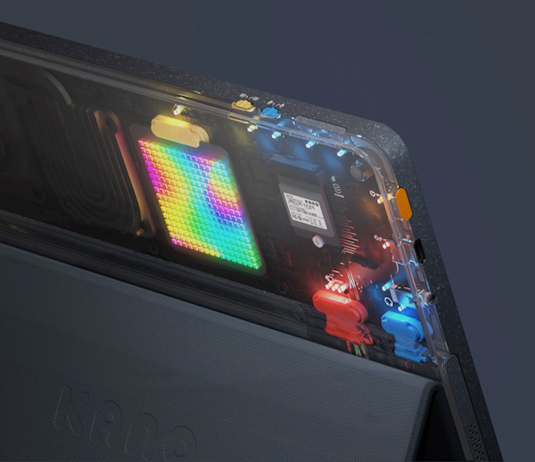

While the announcement header appears to have been removed, this image of the upcoming Kano PC 2 remains on the site.  It's hard to get an idea of how thick the device is given that we have no idea of where the device's edges are off-camera, but the relative proportions of the USB-C jack seem to indicate a thinner profile.  Likewise there appears to be an upgraded thermal management implementation, some sort of (interchangeable?) RGB LED array, and a swappable M.2 SSD for storage.  Gone are the internal 2.5mm audio and USB-C battery power jacks, replaced with the type more commonly found on "real" laptop computers.

New are microphone and camera privacy switches which seem to indicate that both are presumably built-in on the PC 2.  Next to them, I presume, is the volume control switch.  What is a bit of a head-scratcher is the new style of device stand.  Is it adjustable?  Does it attach magnetically?  Is the keyboard still an integrated component of it?

Overall I'm excited to see what the Kano PC 2 has to offer.  While I did complain about the overabundance of superbright LEDs on the current-gen Kano PC, I'm quite willing to put up with them if it means I gain an RGB LED matrix that I can play with.  ([You know how much I love LED matrices.](../2020/2020-03-30-rgb-wall-display-board-part-3.md))  I look forward to seeing what the Kano PC 2 eventually looks like and hope to be able to share a review of it one day.

# After-Thoughts: Linux

On a whim, I decided to try booting the Kano PC from a live USB installation of [Lubuntu, the lightweight version of Ubuntu](https://lubuntu.net).  To my surprise, the Kano PC's performance seemed to become much more satisfactory for full-time usage.  By that I mean I was streaming YouTube with multiple browser tabs open, connected to a bluetooth speaker, and doing light development work without even installing the Lubuntu OS to the Kano PC's eMMC.

Given my rather spotty experience using the Kano Webcam on Windows, I didn't cross my fingers as I fired up a Google Hangouts video chat with my family but the results turned out much better than I could have predicted.  I was able to bend the webcam this way and that and not once did it disconnect or interrupt my video feed.  While it's possible that I simply didn't trigger whatever physical fault may exist in the gooseneck, I chalk this up to Linux simply handling the webcam better.

Long story short: I think I'll soon be replacing Windows with Lubuntu as I'd always envisioned the Kano PC becoming something of a software playground anyway.  With faster performance, a less-annoying update schedule and a much smaller required storage footprint, Linux seems much better suited to the Kano PC's lower-spec hardware.

# Bonus Project: Custom 3D-Printed Stand

For those who are aware of my other projects, I recently started [a new GitHub project repository](https://github.com/ckuzma/device-stands) dedicated to custom-designed and 3D-printed device stands.  Comprised of two prints of [a fitted leg](https://github.com/ckuzma/device-stands/blob/master/STLs/kano-stand.stl) plus a single print of [a connector spar](https://github.com/ckuzma/device-stands/blob/master/STLs/connector-spar.stl), it is about as materials- and space-efficient as I could come up with in a short amount of time.

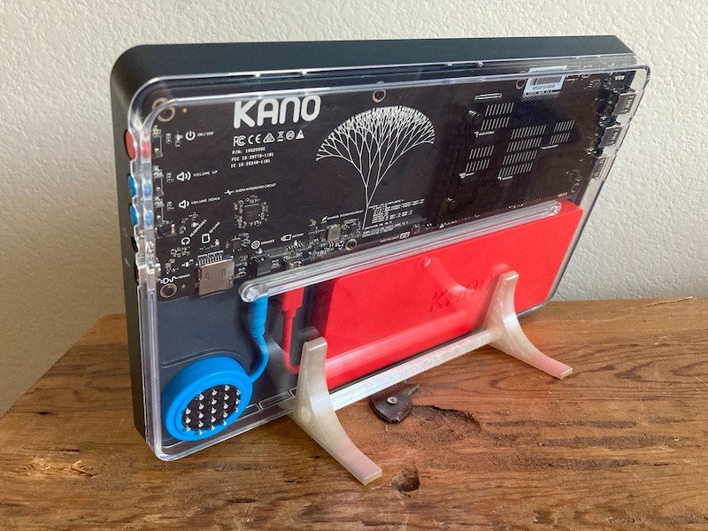

I decided to make this and share it with the world because the Kano PC's form factor and adjustable camera makes it a decent candidate for video conferencing.  Given that I often chat with friends and family while cooking or making drinks in the kitchen, leaving the keyboard attached just to prop up the device seemed like an accident waiting to happen should food or liquid ever become airborne in the vicinity.

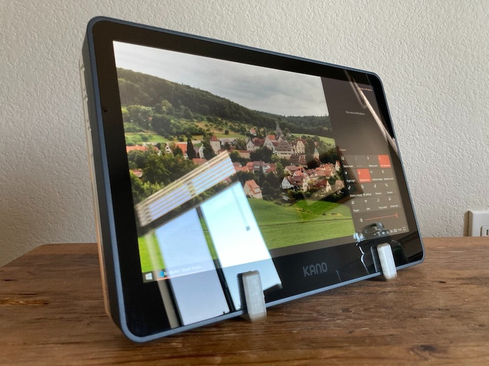