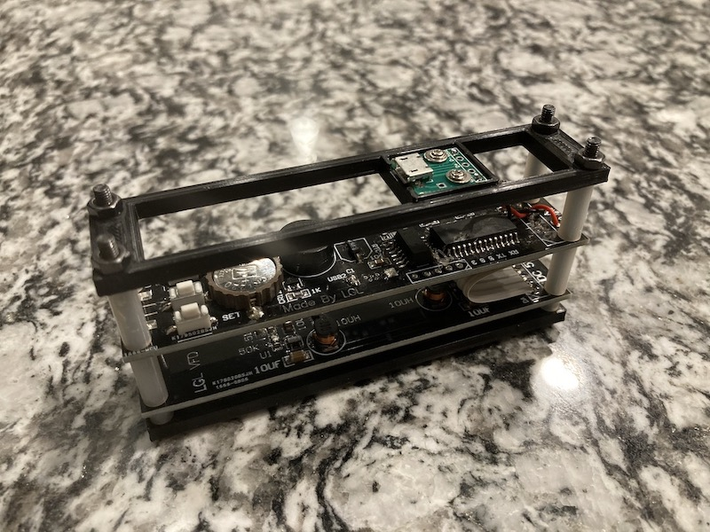
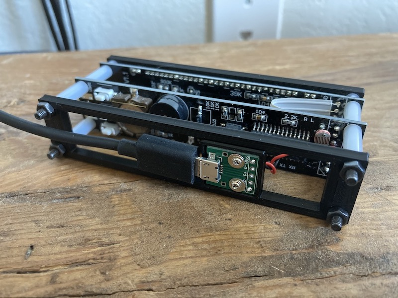
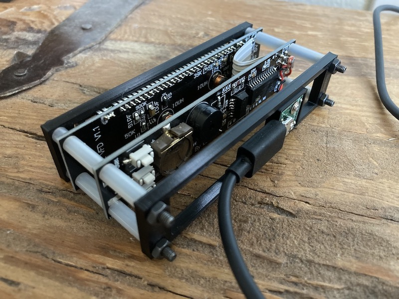
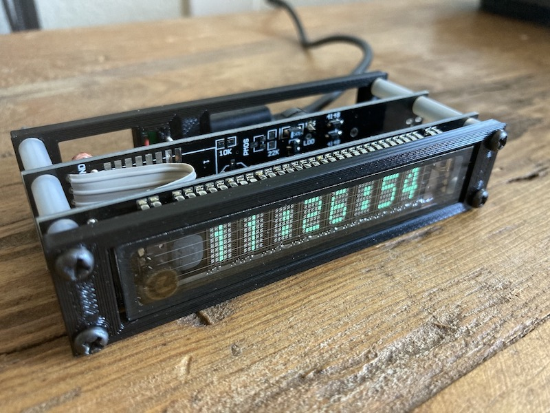

#### 15.01.2022
### Adventures in 3D Printing: VFD Clock Minimalist Housing

I'm not sure if anyone reading this is aware, but I [really](../2013/2013-02-19-more-closet-treasures-fossil-abacus.md) [like](../2020/2020-04-08-nixie-tube-box-case-part-1.md) [timekeeping](../2020/2020-09-08-casio-pro-trek-prw-3100-review.md) [devices](../2020/2020-03-30-rgb-wall-display-board-part-3.md).  While I have a soft spot for all things mechanical, I do enjoy the myriad of "digital" display technologies that can be employed by clock circuitry.  One of those happens to be the basically-obsolete VFD (vacuum flourescent display) tube.  Similar to the modern AMOLED panel, the pixels in the matrix of a VFD are self-emitting.  Unlike the more modern counterpart, VFDs require significantly higher voltage similar to that of a Nixie tube.

A couple of years ago, whilst trawling the open waters of the internet (read: AliExpress), I stumbled across a simple and cheap VFD clock.  While it's not the most intricate VFD clock out there, I was rather struck by its legible display reminding me quite a bit of the one adorning the face of my grandfather's HiFi audio amplifier.  In-person it was quite enjoyable to look at, but unfortunately it stopped working reliably after a few months.  Being unable to troubleshoot it myself, I took the circuitry and display out of its extruded aluminum housing to save space and put it into my parts bin.

Fast forward about a year and I finally found the time to poke at the clock again.  This time the problem presented itself almost immediately: some loose solder joints were causing shorts for both the clock's USB power socket as well as for the main IC on the logic board.  I fixed the latter, ordered a new socket, and then realized I needed to design a new housing or mount of some sort.

Somewhat inspired by the sandwiched-acrylic cases for Arduino/RPi/whatever, I decided to create a minimal frame onto which I could mount and display the clock's circuitry while also providing a bit of protection for the glass VFD.  Armed with FreeCAD and my 3D printer this was a pretty fast process with only a couple of thin-layer test-fit prints required to get everything sized correctly.

Perhaps my favorite part is how slick the new Micro-USB connection is.  Where the old clock required additional clearance behind it because of how a USB cable protruded directly backwards, my new design allows the clock to be mounted nearly flush with whatever is behind it.

Eventually I'll probably slot this entire assembly into a larger housing to provide some more protection plus angle the display subtly upwards for ease-of-reading purposes, but for now I'm quite happy that I got it all working and (somewhat) polished up again for general use.