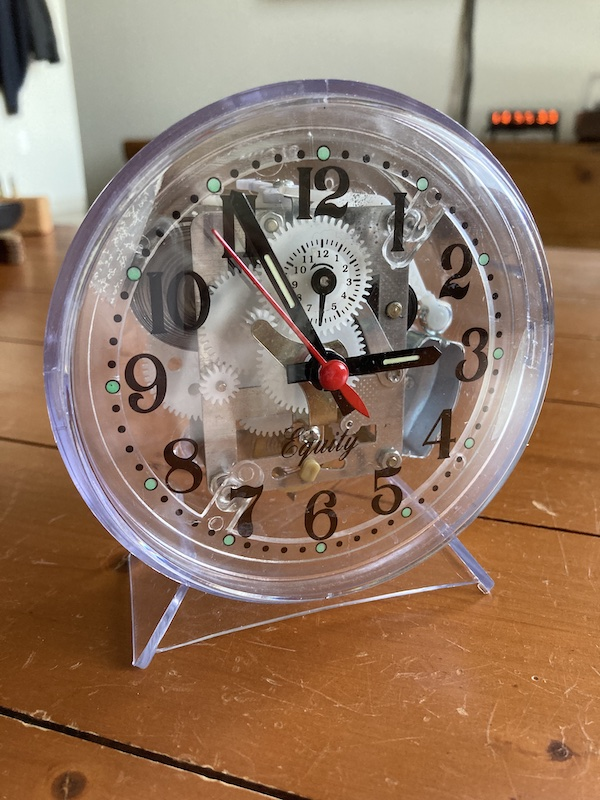
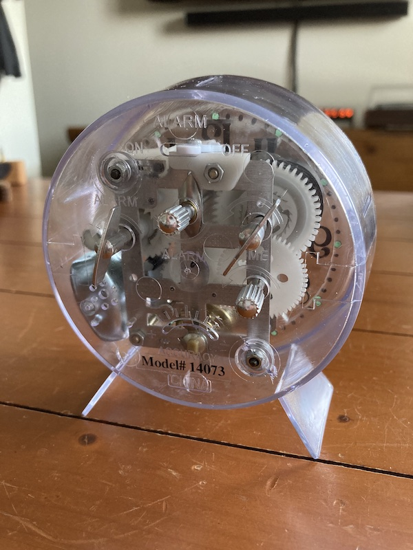
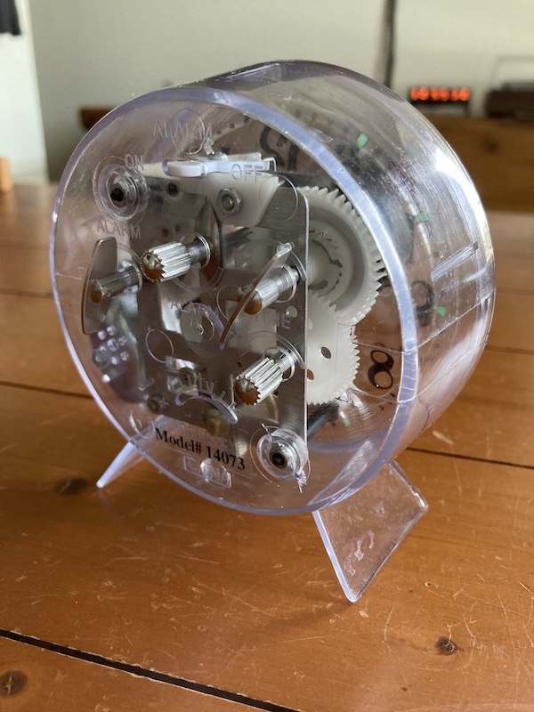
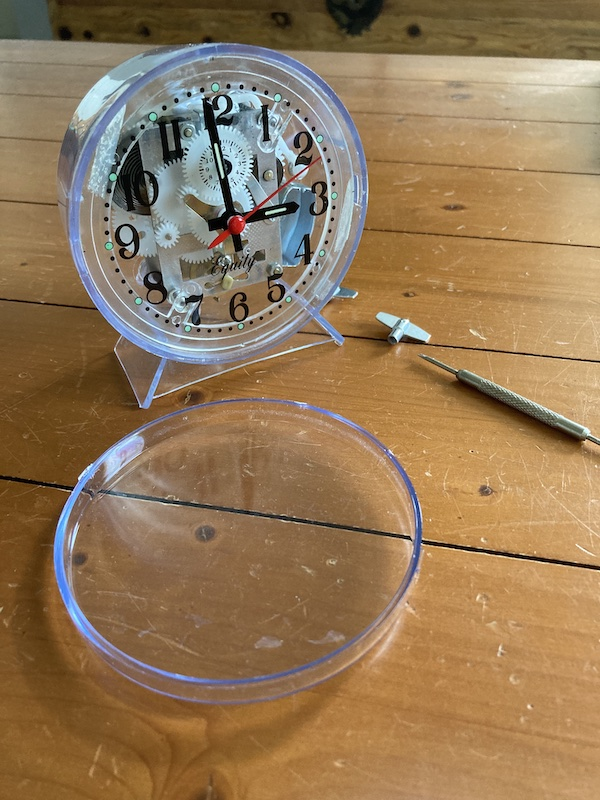
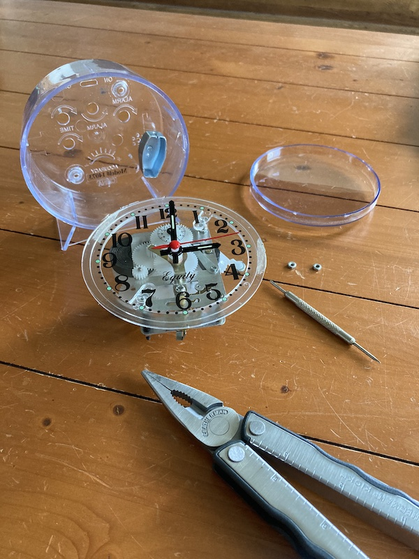
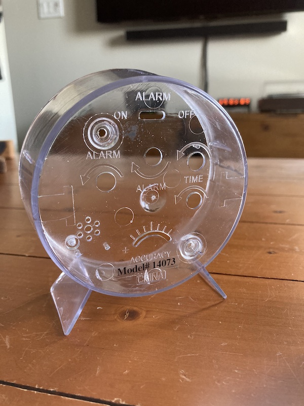
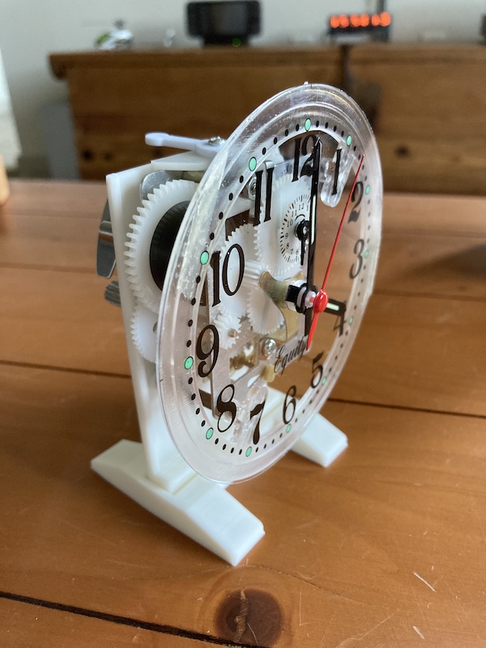
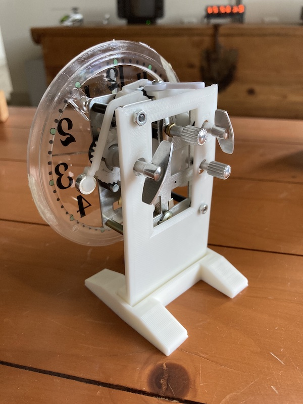
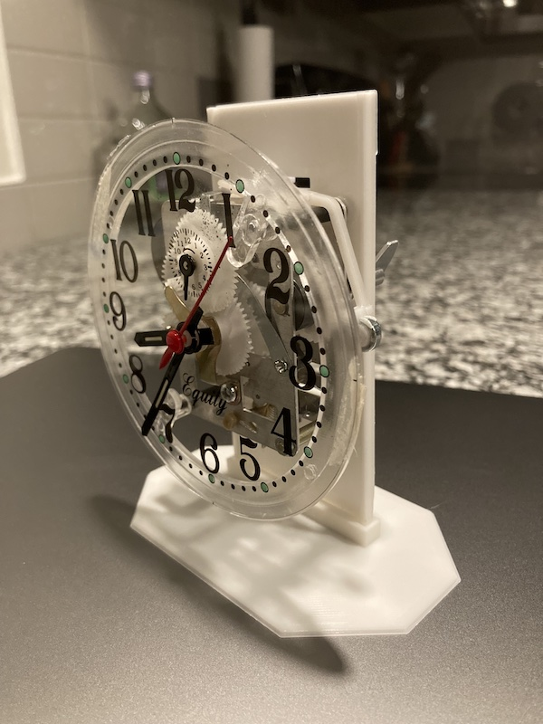
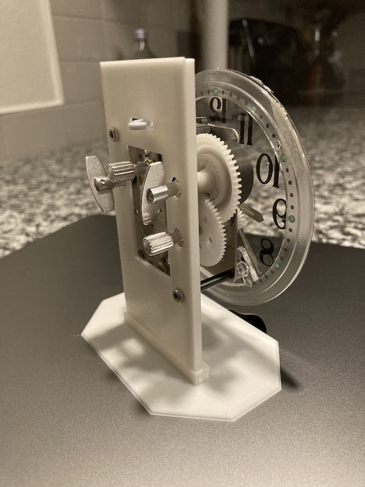

#### 16.01.2022
### 3D Printed Carriage Clock Part 1

Have I ever mentioned before that I really like [timekeeping devices](2022-01-15-vfd-clock-frame.md)?  Even though my first ever wristwatch was, if I remember correctly, a Timex with a digital display, I have always been absolutely enamored by the purely mechanical variety.  That's not to say I can't appreciate a decent [digital](../2020/2020-09-08-casio-pro-trek-prw-3100-review.md), [quartz](../2011/2011-12-30-invicta-3449-review.md), or mecha-quartz timepiece, mind you.  I just love the history, intricacy, and rythmic ticking of a mechanical watch or clock.  Even though they lag in accuracy and must be wound up daily (or worn, in the case of an automatic), I enjoy them immensely.

One can ~~blame~~ credit my parents for this love affair of mine.  From the ancient grandfather clock adjacent to the not-so-ancient grand piano in the living room of their house to the assortment of antique wall clocks forming an ensemble in the main hallway, I've always been surrounded by mechanical wonders.  While not all of them worked, I found myself drawn to my father's surprisingly-functional brass Waterbury carriage clock.  Small enough to be held in one hand yet dense enough to sit solidly atop a stack of papers, I remember spending a full week regulating its escapement to be more or less accurate, MacGyvering a non-permanent paperclip-based fix for the sheared-off pins of the rear door, and generally spending hours staring at the little movement ticking away when I should have been focused on my math homework instead.

Now, as an adult, armed with a 3D printer and mechanical clock movement, I think you can see where this is going.

#### The Donor Clock

This business of building a clock began, somewhat predictably (for me at least), with an already perfectly functional clock.  Namely, a see-through Equity-branded wind-up alarm clock.  Why?  Because I could already see the movement and its overall aesthetic matched the look I wanted for my also-going-to-be-see-through carriage clock.  Many cheaper clocks utilize all-in-one circular alarm clock movement "units" that I simply despise the look of.  The goal, after all, is to create an mechanical carriage clock with new parts and not one of those quartz monstrosities that abound on eBay.

Seen from the back of the Equity model 14073 clock, the movement's rectangular frame is exposed.  While undoubtedly stamped out of some cheap metal like nickel, it's not a horrible looking movement despite using plastic for just about every component of the drivetrain.

Disassembly of the clock was relatively straightforward involving the removal of the lens, loosening of two retaining nuts on the backside plus the removal of the winding knobs, and then gently lifting the complete movement out of the rest of the housing.  You might notice that the alarm mechanism bell is affixed to the housing and not the movement; I kept the bell but have yet to decide if my carriage clock will ever make use of it.

The emptied housing turned out to be very useful for measuring the required spacing between the protrusions (knobs, lever, etc.) on the back of the movement for mounting purposes.  It might also be evident in this photo as to exactly how thin the housing plastic is which would explain why the clock seemed so to run so much louder than the brass one I remember from my childhood.

#### Movement Mount

I'll spare you the fine details but suffice to say it took a number test fit 3D prints, re-measuring, and general patience to reach this point.  But after what amounted to a weekend's worth amount of work I finally had the completed movement bolted to a mount which was then held up by a rudimentary stand.

On the backside of the mount you can see that I left a large cutout in the center to allow one to peer into the movement just a bit.  (Plus it gives access to the escapement adjustment.)

After what probably amounted to a few weeks' pause on the project, I revised the movement mount and stand to be a better approximation of how I envisioned it being installed in the final carriage clock.

Here you can see that the mount itself was elongated upwards to interface with a "stand" (read: the inner top of the clock) for secure retention.  It was also a nice test to make sure that my mount was actually sturdy enought to support the weight of the movement without excessive flexing due to stress.

[_3D Printed Carriage Clock Part 2_](2022-01-17-carriage-clock-pt2.md)