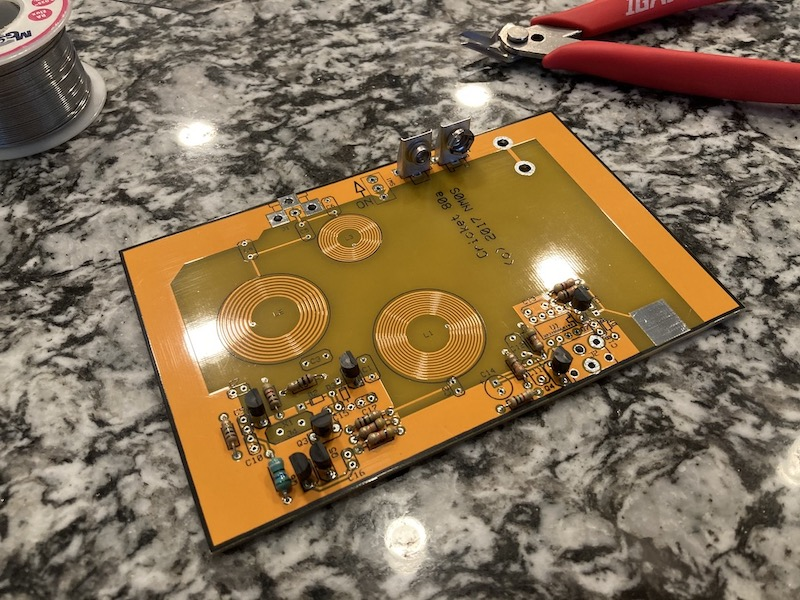
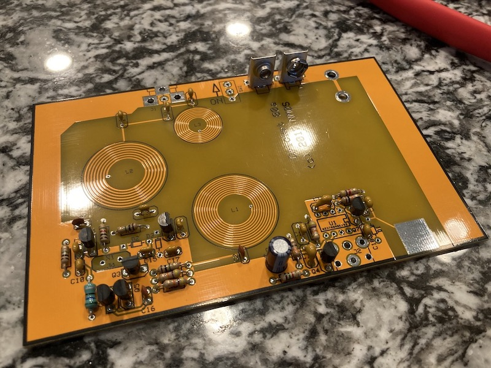
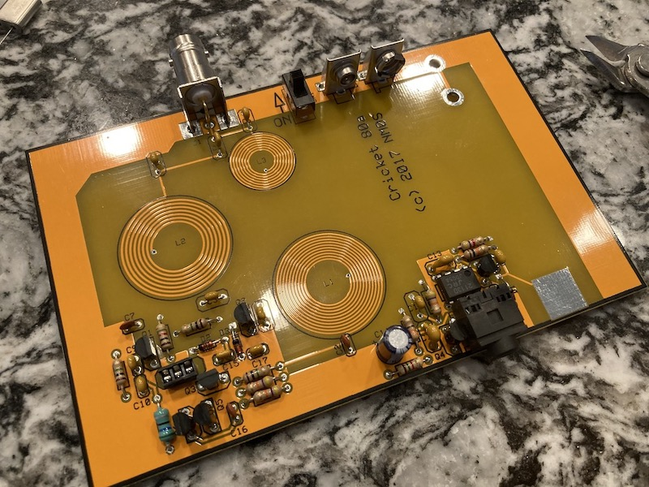
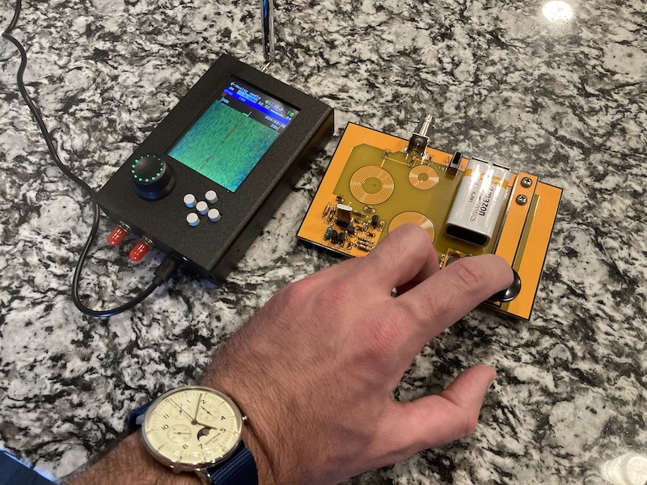

#### 16.01.2022
### Photos: Cricket 80A Soldering Project

There's not much of a story to go with this post, I just thought it would be fun to share some photos.  As a result of my participation in a Hackster contest, I found myself sitting upon some [Tindie](https://www.tindie.com) store credit and decided to put it towards a [Cricket 80A, a ham radio transceiver designed by "NMØS"](http://4sqrp.com/cricket.php) for CW (read: Morse) operation.  What follows are some photos taken while I was soldering components to the board as well as a final one showing the board in operation with its signal being picked up by my HackRF One.

Before you say anything, yes, I realize that in my rush to take a photo to prove that my assembled kit was working, I forgot to connect a dummy load to the system.  Even though it's unlikely my signal would have propagated farther than my own kitchen, subsequent tests did indeed make use of a connected dummy load.  My apologies, FCC.

