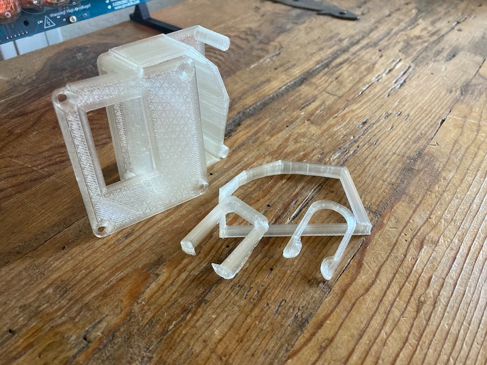
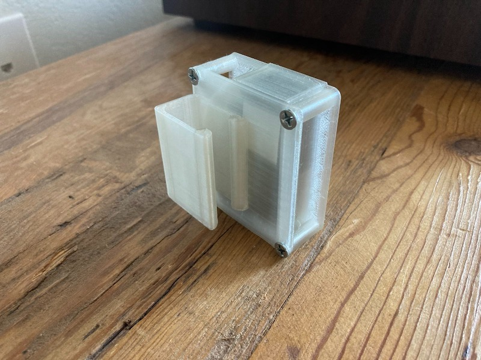
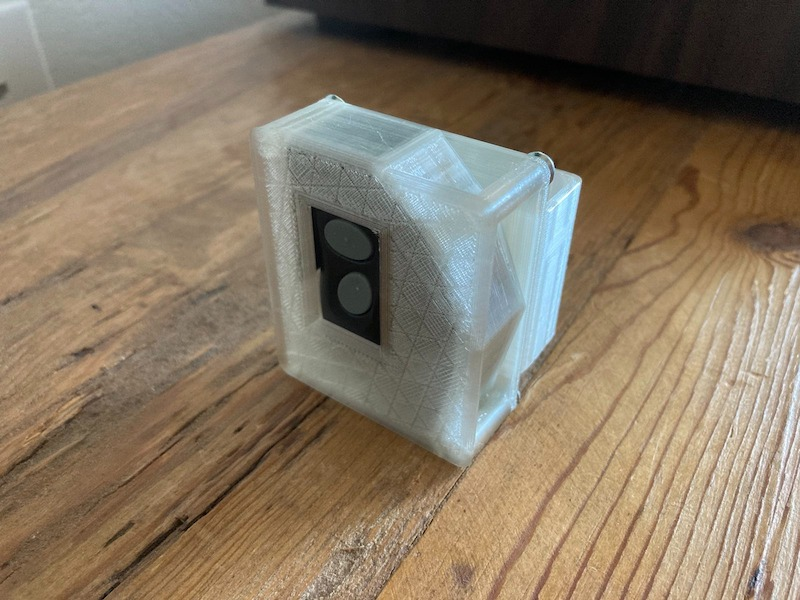
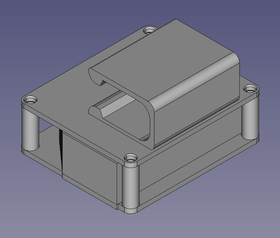

#### 16.01.2022
### Adventures in 3D Printing: Garage Remote Fob Holder

Partially as an experiment, and partially because I was fed up of my apartment building's garage door remote fob working itself into hard-to-reach places, I decided to make [a project out of designing and printing a clip for the darn thing](https://github.com/ckuzma/garage-door-keyfob-holder) that would enable me to attach it somewhere convenient in my car and trust it to remain there.

One of the requirements I placed on myself was to somehow mimic a "traditional" garage door remote-- those non-descript black boxes with flexible steel clips attached to them-- while also using as little print material as possible.  I also wanted to give some of these away to friends of mine in the building so it also needed to look refined enough that they would actually use it and not just chuck it in the trash.

The project began, like many of my others, with a few test prints to check fitment.  At this point in time I hadn't yet given in and purchased calipers to nail the measurements, so what you see in the front underneath those two clips is a fitment test of the profile I'd eyeballed for the fob itself.  Those clips depict the two different designs I played around with for affixing the whole thing to the sun visor of my car.  In the back is an initial "full" test print of just the housing for the fob, which turned out to be far too fragile and let me to strengthen the design a bit.

Above is the completed "clip" which wound up being more of a complete over-housing plus a clip for attachment to the sun visor of my particular car.  (That's relevant information, because not all sun visors share the same thickness.)

On this side you can see the cutout that exposes both of the remote's buttons for easy activation.  You might also be able to spy some of the felt tape I installed inside in order to prevent any rattling of the fob inside of its new (temporary) home.  In practice, the holder worked flawlessly for about a week until it became apparent that the clip was holding less and less snugly due to warping caused by Phoenix's hot ambient summer temperatures.  This might be solved by printing the whole thing out of plastic a bit more resilient than PLA, but I think a steel clip is probably a better way to go for better compatibility with more visors.

All of the files can be found in the [garage-door-keyfob-holder](https://github.com/ckuzma/garage-door-keyfob-holder) project on GitHub here:

- https://github.com/ckuzma/garage-door-keyfob-holder