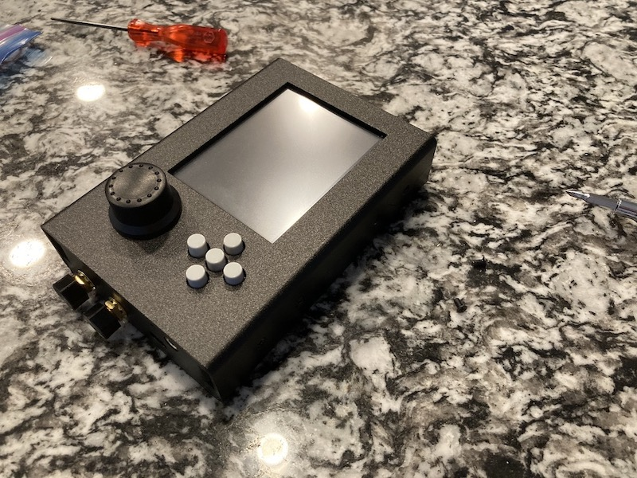
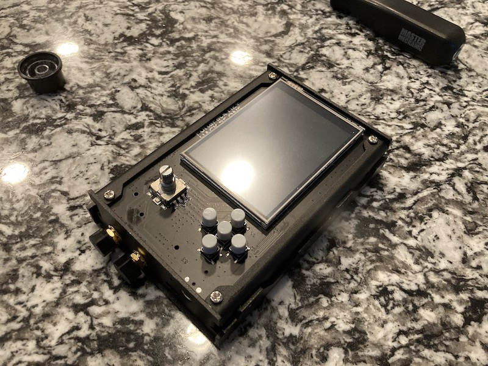
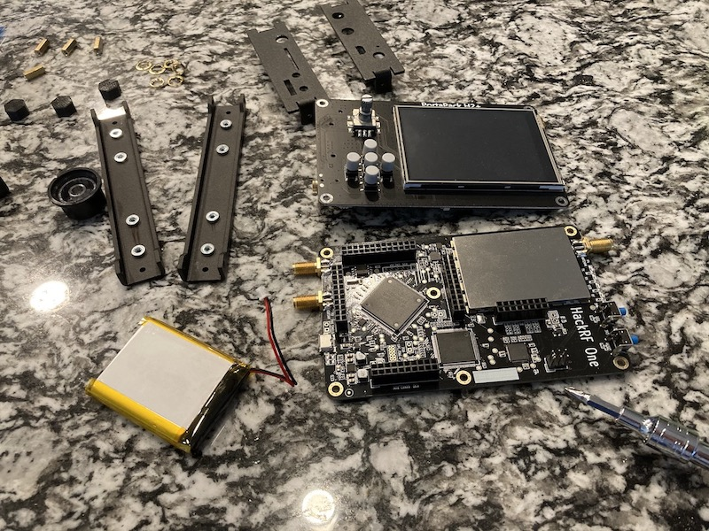
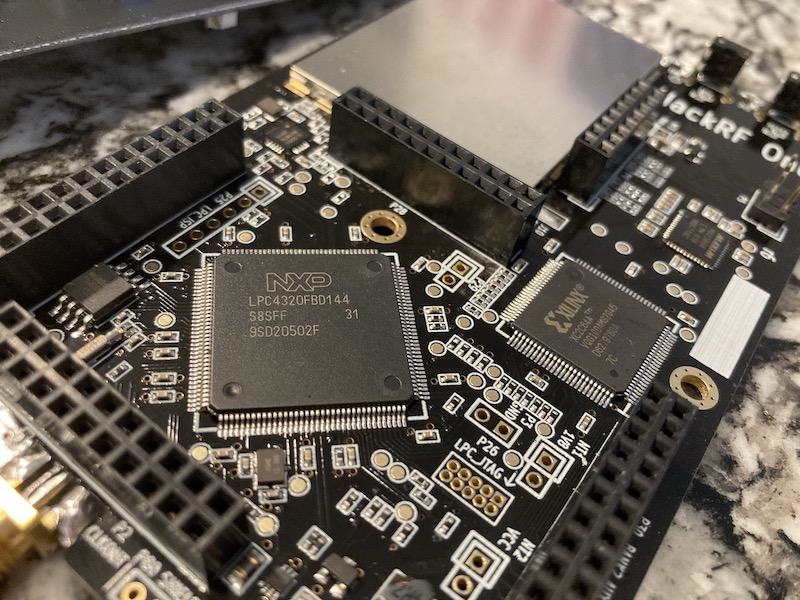
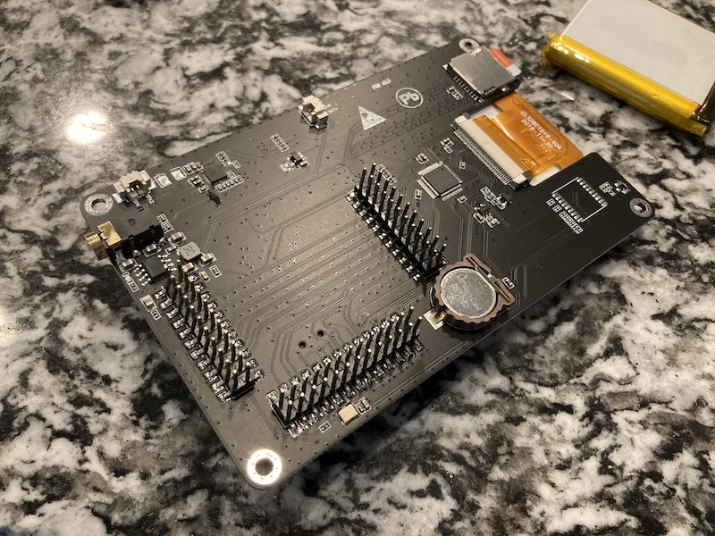
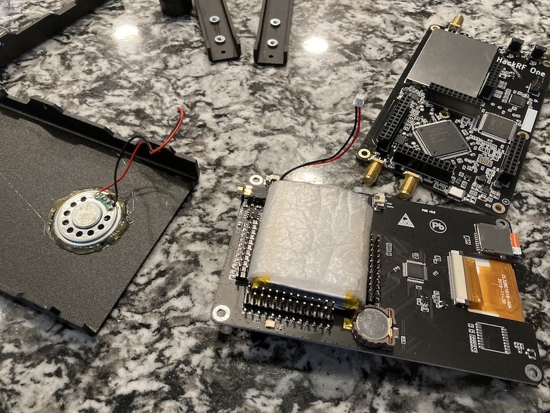

#### 16.01.2022
### Teardown: HackRF One Portapack H2

In [a recent previous post documenting the assembly of an amateur radio transceiver kit](2022-01-16-cricket-80a-soldering.md), I shared a picture depicting the functional operation of the completed radio.  Specifically, I utilized the display on a a HackRF One in a Portpack H2 housing to demonstrate the transceiver's transmission within the expected frequency band, as well as functioning on/off pulses as is required for CW mode communication.

What I neglected to do at the time was hint that the assembled Cricket was not the only radio transceiver in the photo that had required a bit of DIY handiwork.  For, you see, the HackRF device itself had required a bit of repair/improvement, too.  Namely: when I received it, I was rather stunned by what sounded like a loose battery rattling around inside.  Given the propensity of Lithium batteries to do alarming things when damaged or even looked at for too long, I decided to rip apart my (preassembled) Portapack H2 to figure out some way to protect its heart.

Despite the use of sturdy and chunky metal (aluminum?) to protect the circuitry inside of the Portapack, I was rather shocked at the rather exposed nature of the human interfaces.  Namely the oversided rotary encoder knob, the length of the stem on the rotary encoder itself, and the button protrusions.  Suffice to say I immediately began some mental design work to figure out how to replace these snag-friendly protrusions with low-profile 3D printed versions.  (Note that I'd already kitted out the device with 3D printed SMA connector proectors.)

With the Portapack entirely disassembled, my suspicions turned out to be true: the lithium-ion battery had simply been rattling around in its little space between the H2 interface board and the HackRF One mainboard itself.  With everything completely apart at this point I took a moment to have a look around at the circuitry.

I suppose it should have been obvious to me from the start but it was at this point that I was aware that the whole Hack RF One + Portapack H2 was actually sporting two batteries, with the second one being used by the RTC (real time clock).

Keen to get everything back together before I lost one of the many tiny screws that hold the housing together, I grabbed some thin foam that had been used by a seller to protect a microcontroller they had shipped to me-- that must mean it's safe to use and won't generate any static, right?  Right?-- and wrapped the battery in it a couple of times before reassembling everything.  Problem solved, no more rattling!