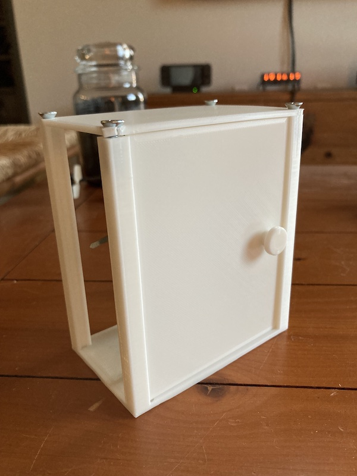

#### 17.01.2022
### 3D Printed Carriage Clock Part 2

[_3D Printed Carriage Clock Part 1_](2022-01-16-carriage-clock-pt1.md)

Having previously [designed and printed a functional movement mount and interlocking system](2022-01-16-carriage-clock-pt1.md) to attach it to the rest of the clock, I was ready to move forward with the rest of the clock body.  Namely the housing/case with its windows and access door.  I happened to have some "spare" white PLA filament and knowing the likelihood that components would have to be printed twice due to unaccounted-for stresses and tolerance variances, I decided to print out my work-in-progress CAD model to see how everything fit together.

One obvious initial "oopsy" was forgetting that I was aiming to use countersunk screws to hold everything together.  Naturally this resulted in above-and-beyond stresses imparted on the top panel, causing it to fracture.  However I was rather proud of the simple-yet-functional door.  Sure, while my design relies on friction to stay shut whereas every other (brass) carriage clock I've ever interacted with has utilized some sort of latch, it at least worked and looked the part.

The other big issue I noticed was spacing.  Z-axis spacing was just fine, I needed to expand the case in both the X- and Y-axis directions to give the movement and hands enough clearance.  That or I'd simply have to forego installing any windows, and that simply wasn't an option.

I also decided that attempting to print a unibody-design combination of the bottom plate and vertical pillars simply didn't make sense.  For one, it meant reprinting most of the entire clock housing should anything ever need replacing.  For another, the spacing of the columns would require my printer to zoom the hot end all over the place and render the total print time much longer than it needed to be.  After all, a "real" carriage clock uses screws in both the top and bottom plates to attach the vertical columns, so why shouldn't I?

Having thus decided to start my housing anew from the ground up-- with the exception of the manner with which I intended to mount the movement, that part was just fine-- I turned my attention towards another important aspect of any clock: the face.  At this point I wasn't entirely sure how or even if I was going to adorn the face but I knew I needed to get the spacing right otherwise the hands would drag across it.  In the above photo you can see a new test stand with an additional slot added to it in order to check the spacing of a very thin panel serving as a face.

_**3D Printed Carriage Clock Part 3** coming soon!_  That's it for now!