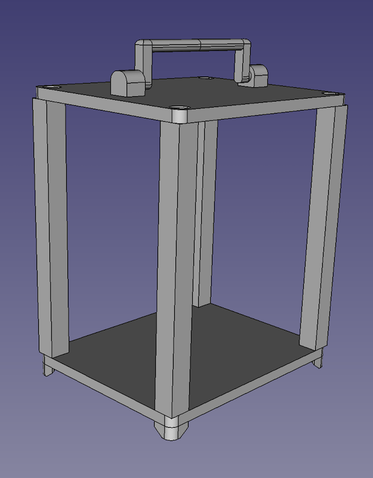

#### 24.01.2022
### 3D Printed Carriage Clock Part 3

[_3D Printed Carriage Clock Part 2_](2022-01-17-carriage-clock-pt2.md)

In the [last installment of my 3D printed carriage clock project](2022-01-17-carriage-clock-pt2.md) I discovered that there were a number of fitment issues with my design and had decided to start with a clean slate and a focus on refinement.  To that end it was no longer acceptable for the clock to simply look like a box; it needed to actually resemble the carriage clocks of old once it was put together.  Additionally I wanted each major component to be easily replaced in case any of my prints failed or the part itself broke during assembly.

The first newly designed part was the base.  Ignoring the poor quality of the picture, you should hopefully be able to make out the raised "feet" at all four corners along with the countersinks for screw heads.  Where the original design had a one-piece base plate and vertical beams, the new version eschews the unibody design.  (The movement mounting plate slot was also moved to an intermediary plate which you might be able to discern later.)

The top plate likewise ditched the integrated movement mounting plate slot which allowed for an easier print on my FDM-style printer.  Unfortunately, as you can see, the screws still aren't properly countersunk in the design.  But this go around the pivots for the carrying handle _are_ actually present and accounted for!

Jumping to the chase: a few hours later and combined with some hastily-cut acrylic sheets and...

The clock is complete!  Or at least complete enough for me to show it off to any friends who come over and want to see my workspace and all of the things I've built.  You'll notice that I reversed the direction that the access door swings open; this was to help it get out of the way for easier winding.  (I'm right handed.)

The handle does pivot freely meaning the clock can quite easily be hung up on a wall with the proper bracket, just like an "authentic" carriage clock.  Also notice the (finally!) flush-fitting screws.  That took me longer to achieve than it should have.

One potential improvement over antique carriage clocks is just how easy it is to peer into the movement of this one.  While the clock face is currently blank and could use some sort of markings and adornments, I'm quite happy with how precise everything came out with regards to spacing.  I should note that the stock hands arrived to me already bent out of shape so ignore the strange angle on that red seconds-hand.  Eventually I'll replace those with something of my own making.

For now that's as far as the clock project is going to go.  I do intend to finish it and a few copies to give away to family members.  Perhaps I'll even sell a couple on the internet!  But until then I have other projects that require attention while I get to work on regulating the escapement on this beautiful plastic clock.