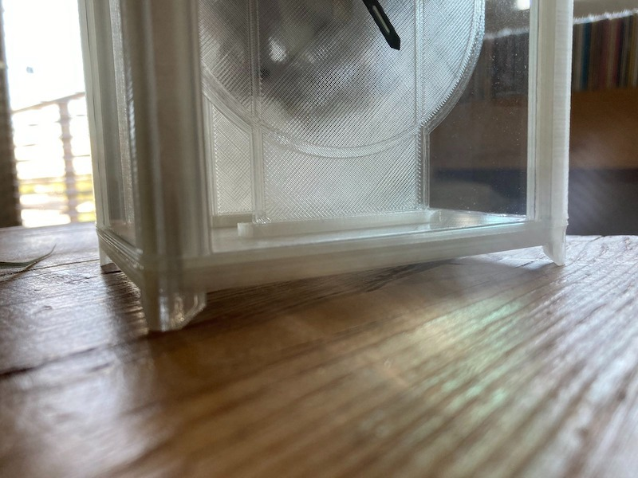

#### 19.03.2022
### [Current State of the 3D-Printed Carriage Clock](./2022-03-19-carriage-clock-currently.md)

Building on [the last installment of my writeup about the 3D printed carriage clock project](./2022-01-24-carriage-clock-pt3.md), I thought I'd share some photos of the current state of of the project for anyone who is curious to see some of the finer details.  What follows is a simple gallery of the clock as it existed before being packed into storage as part of my move across the country.  Fingers crossed that it will be in the same state when I unpack it within the next month or two!

