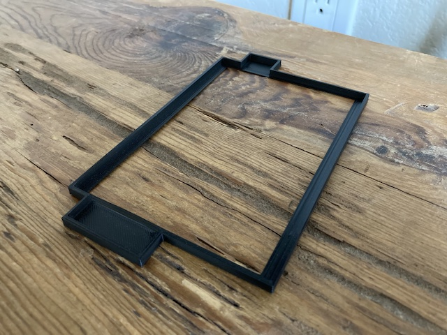
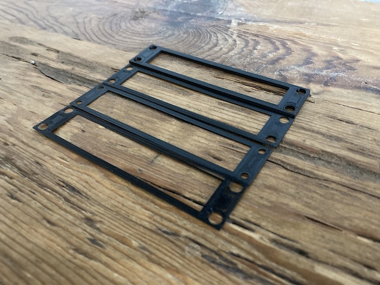
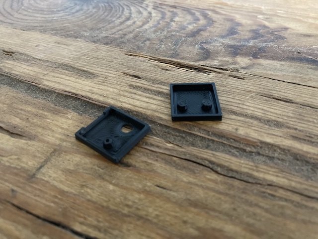
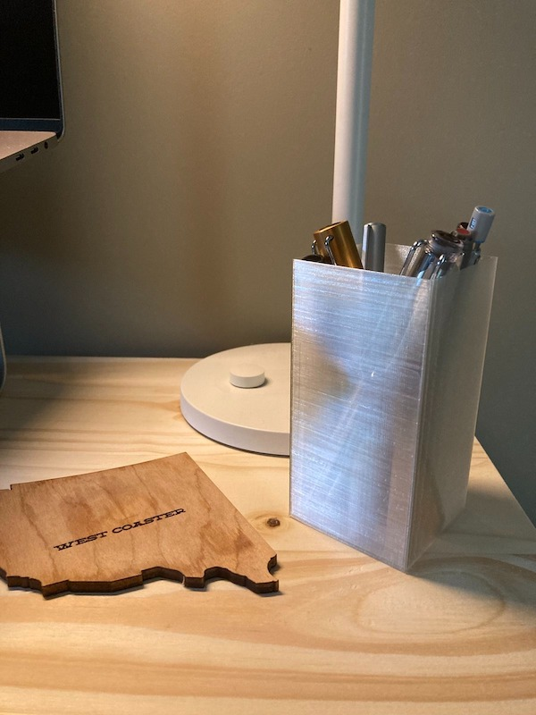

#### 18.07.2022
### [3D Printed Odds and Ends](./2022-07-18-3d-printed-odds-ends.md)

Back in November, as I was packing my apartment in prep for a move across the country, I stumbled across my box of 3D printed odds and ends.  Due largely in part to my reluctance to purchase even the cheapest of measurement calipers, I relied heavily on part "test fits" to make sure everything would come together as expected.  This was especially handy in the case of the [dipole antenna project](../2021/2021-07-17-dipole.md) which incorporated slotted parts, plastic "dowels", and a custom fit railing clamp as part of the full design.

However, as a result, I wound up with a bunch of small 3D printed objects that aren't especially useful for anything anymore besides to serve as a memento.  What follows are pictures of some of the items I found in that box of mementos, along with links to the projects from which they came to be.

> Test fit for a 3D printed enclosure for my HackRF One.  Still need to finish this project, though I did at least [take a peek inside the radio to secure the built-in battery](./2022-01-16-portapack-fix.md) and prevent it from rattling around.

> These are front-plate test fitments as part of the [VFD clock housing project](../2022/2022-01-15-vfd-clock-frame.md).

> Another part of the [VFD clock housing project](../2022/2022-01-15-vfd-clock-frame.md), these squares were my attempts at sizing the USB (power) connector board and retainer screw thread size before printing a full panel.

> This one was actually intentional: I had a little bit of transparent PLA left on the spool, but no idea just how much.  Since I wanted a pen holder for my desk anyway, I created a simple box model, started the printer, and let it go until the PLA all ran out.  Worked out perfect!