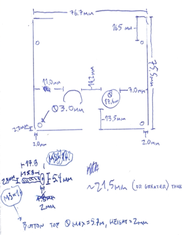

#### 26.07.2022
### [Tube Amplifier Project](./2022-07-26-tube-amplifier-project.md)

One of the projects I've been carrying around with me for the past few months, waiting for the day when I was reunited with my [very cool PINECIL soldering iron](https://pine64.com/product/pinecil-smart-mini-portable-soldering-iron/), has been a cheap tube-based(-ish) audio preamplifier kit.  Why would someone want such a thing when arguably much better solid-state versions exist nowadays?  Not sure.  But I thought it looked neat, so I ordered myself one and then it waited until two months ago when I was finally able to sit down and solder all of the components into place.

However, there was no housing included with the kit and I had intentionally opted against purchasing the made-to-fit acrylic housing sold by the manufacturer, instead desiring to design and print something of my own creation.  And that's what can be found in my latest 3D printing project here on GitHub:

- [tube-preamp-housing](https://github.com/ckuzma/tube-preamp-housing)